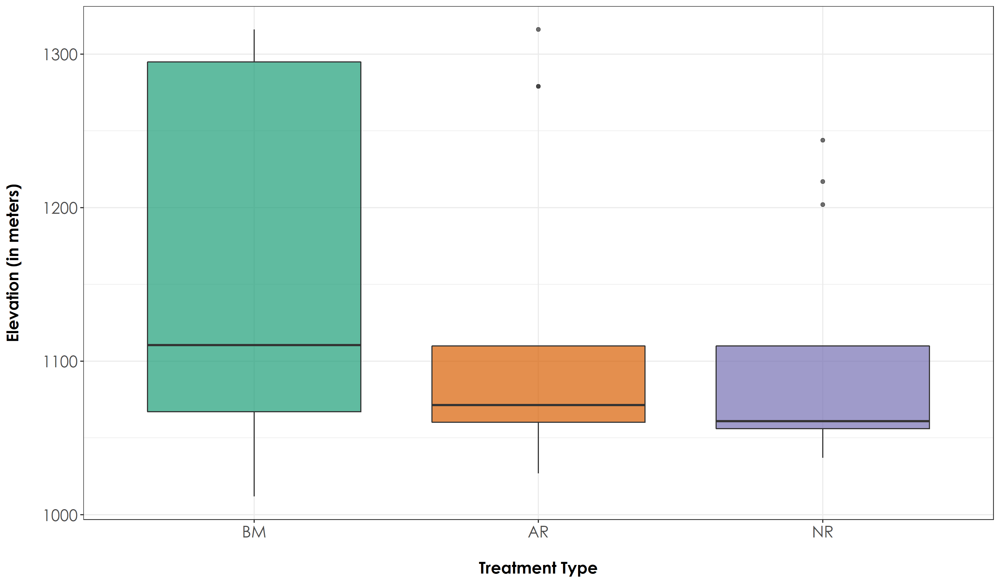

# Site selection  

In this script, we plot the elevation, distance to the nearest road, and distance between sites to show that the sites selected are comparable (we also followed site selection criteria outlined by Osuri et al., (2019) and Hariharan and Raman (2021) to ensure that sites are similar in terms of physiognomy and climate). 

## Install required libraries
```{r}
library(tidyverse)
library(dplyr)
library(stringr)
library(vegan)
library(ggplot2)
library(scico)
library(data.table)
library(extrafont)
library(sf)
library(raster)

# for plotting
library(scales)
library(ggplot2)
library(ggspatial)
library(colorspace)

# Source any custom/other internal functions necessary for analysis
source("code/01_internal-functions.R")
```

## Load list of sites
```{r read_site_lists}
# read from local file
sites <- read.csv("data/list-of-sites.csv") %>%
  filter(Site.code != "OLCAP5B") # removed this site as it was sampled in only one season and not across multiple seasons

# load a shapefile of the Western Ghats (here, I will use the boundary of the Nilgiris, Anamalais and Palanis)
# this file can be used for plotting (if necessary)
# hills <- st_read("data/spatial/hillsShapefile/Nil_Ana_Pal.shp")
# hills <- st_transform(hills, 32643)
```

## Extract elevation

Extract elevation at each site and examine differences in elevation across treatment types
```{r}
# convert to sf object and transform
sites <- st_as_sf(sites, coords = c("Longitude", "Latitude")) %>%
  `st_crs<-`(4326) %>%
  st_transform(32643)

# add elevation raster
alt <- raster("data/spatial/elevation/alt") # this layer is not added to github as a result of its large size and can be downloaded from SRTM (Farr et al. (2007))

# extract values from that raster (note: transformation of coordinate system)
elev <- extract(alt, sites)
sites <- cbind(sites, elev)

# Test if there are significant differences in elevation across treatment types
anovaElevAll <- aov(elev~Restoration.type, data = sites)

# Tukey test to study each pair of treatment - reveals no significant difference across treatment types
tukeyElevAll <- TukeyHSD(anovaElevAll)

# Create a boxplot of elevation estimates by group (Here: group refers to Restoration Type)

# reordering factors for plotting
sites$Restoration.type <- factor(sites$Restoration.type, levels = c("Benchmark", "Active", "Passive"))
# Add a custom set of colors
mycolors <- c(brewer.pal(name="Dark2", n = 3), brewer.pal(name="Paired", n = 3))

fig_elevAll <- ggplot(sites, aes(x=Restoration.type, y=elev, fill=Restoration.type)) +  geom_boxplot(alpha=0.7) + 
  scale_fill_manual("Treatment type",values=mycolors, labels=c("BM","AR","NR"))+ 
    theme_bw() +
    labs(x="\nTreatment Type", 
       y="Elevation (in meters)\n") +
  scale_x_discrete(labels = c('BM','AR','NR')) +
    theme(axis.title = element_text(family = "Century Gothic",
      size = 14, face = "bold"),
        axis.text = element_text(family="Century Gothic",size = 14),
        legend.position = "none")

# plot and save elevation
ggsave(fig_elevAll, filename = "figs/fig_elev.png", width=12, height=7,
       device = png(), units="in", dpi = 300); dev.off()
```



## Distance to nearest road

Calculate distance to nearest road for each site and examine differences across treatment types. 
```{r distance_to_road}
# add roads data
# Note: This shapefile was downloaded from Open Street Map at http://download.geofabrik.de/asia/india/southern-zone.html 
# This file is not uploaded to GitHub as it is extremely large and can be obtained from the link above
roads <- st_read("data/spatial/roadsShapefiles/osm_roads_southIndia.shp") %>%
  st_transform(32643)

# get index of the nearest road to a particular site
index <- st_nearest_feature(sites, roads)

# calculate distance between each site and the nearest road
distToRoad <- as.numeric(st_distance(sites, roads[index,], by_element=TRUE))
sites <- cbind(sites, distToRoad)

# Test if there are significant differences in distance to roads across treatment types
anovaDistAll <- aov(distToRoad~Restoration.type, data = sites)

# Tukey test to study each pair of treatment - no significant difference between AR-NR sites but a significant difference in distance to road between AR-BM and NR-BM sites
tukeyDistAll <- TukeyHSD(anovaDistAll)

# Create a boxplot of distance to road estimates by group (Here: group refers to Restoration Type)

# reordering factors for plotting
sites$Restoration.type <- factor(sites$Restoration.type, levels = c("Benchmark", "Active", "Passive"))

fig_distRoad <- ggplot(sites, aes(x=Restoration.type, y=distToRoad, fill=Restoration.type)) +  geom_boxplot(alpha=0.7) + 
  scale_fill_manual("Treatment type",values=mycolors, labels=c("BM","AR","NR"))+
    theme_bw() +
    labs(x="\nTreatment Type", 
       y="Distance to nearest road (in meters)\n") +
  scale_x_discrete(labels = c('BM','AR','NR')) +
    theme(axis.title = element_text(family = "Century Gothic",
      size = 14, face = "bold"),
        axis.text = element_text(family="Century Gothic",size = 14),
        legend.position = "none")

# plot and save above figure
ggsave(fig_distRoad, filename = "figs/fig_distRoad.png", width=12, height=7,
       device = png(), units="in", dpi = 300); dev.off()
```


## Distance between AR-NR site pairs

Calculate distances between actively restored and naturally regenerating sites that are paired. 
```{r}
# Please note that there are only 12 site pairs as two AR sites and one NR site did not have a site-pair because they were too close to another AR/NR site in terms of their acoustic radius. 

sitePairs <- sites %>% 
  rename(Site_ID = Site.code) %>%
  mutate(Site.code = str_extract(Site_ID, pattern = "\\w+\\d+")) %>%
  filter(!Restoration.type == "Benchmark") %>%
  filter(!Site.code == "THEN10") %>%
  filter(!Site.code =="VAR210") %>%
  filter(!Site.code == "INOA03")

AR <- sitePairs[sitePairs$Restoration.type=="Active",]
NR <- sitePairs[sitePairs$Restoration.type=="Passive",]

sitePairDist <- st_distance(AR$geometry, NR$geometry, by_element = T)

# The 12 site-pairs were at a minimum distance of 162 m to a maximum distance of 1.1 km.
```
