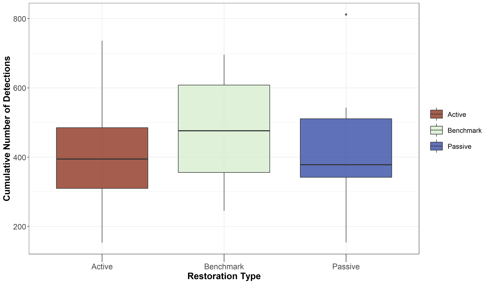
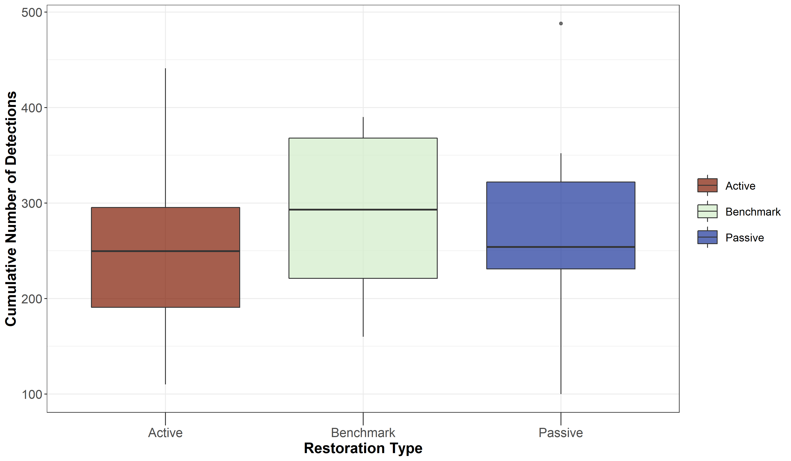
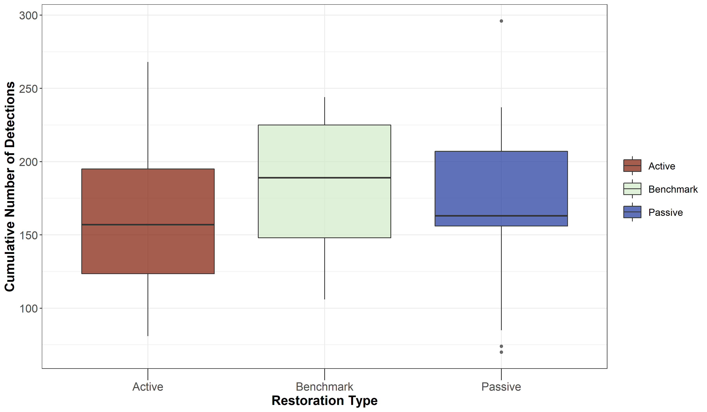
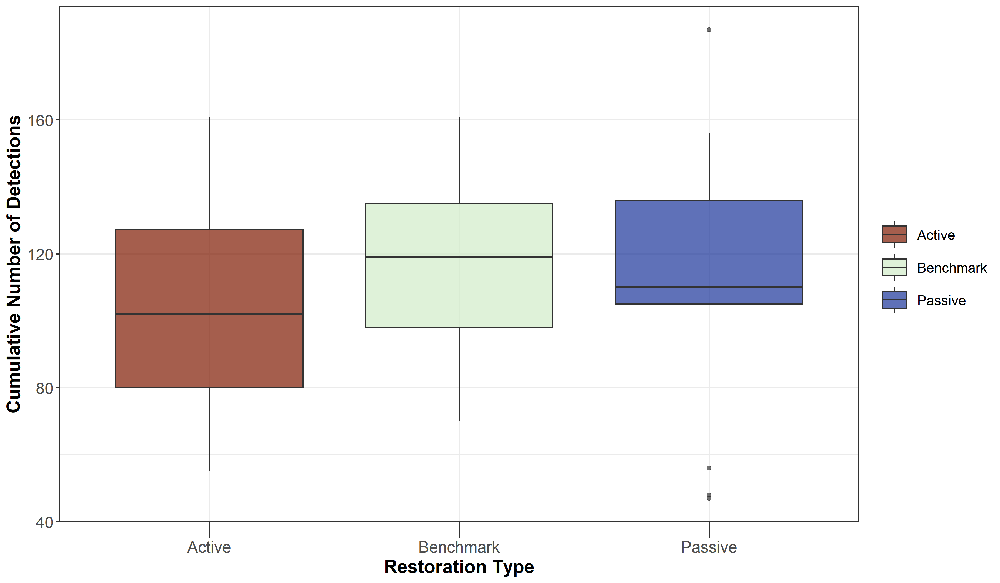
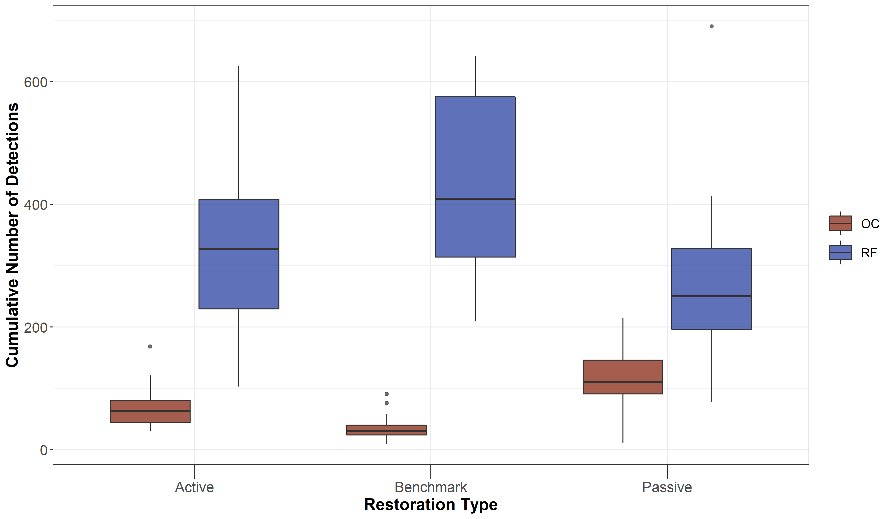
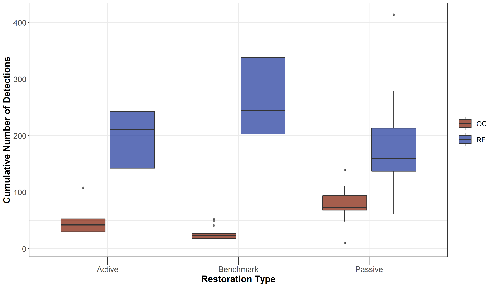
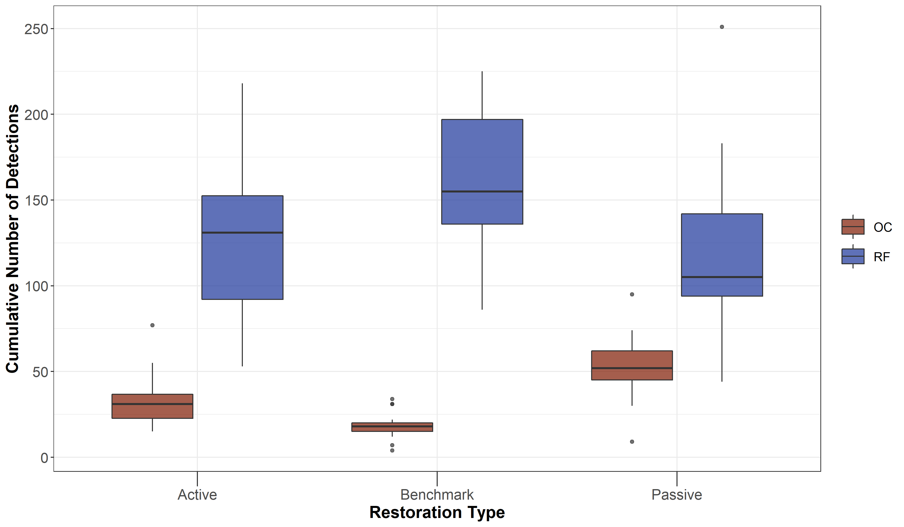
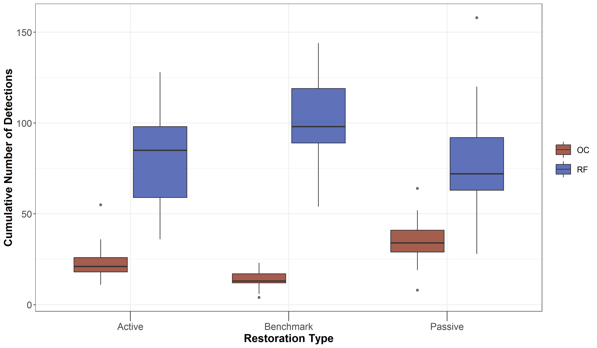

# Acoustic Detections

In this script, we will calculate:

a) Total Number of detections across sites (reported for varying time intervals 10s, 30s, 1-min, 2-min, 4-min). In the previous script, we essentially calculated overall species richness with a temporal unit of 16-min. However, it is important to identify the total number of detections of a particular species for a given temporal duration, which can inform levels of vocal activity (future scripts). 
b) Repeat the above three calculations, but using species traits - If a species is a rainforest specialist or an open-country generalist.

Install required libraries
```{r}
library(tidyverse)
library(dplyr)
library(stringr)
library(vegan)
library(ggplot2)
library(scico)
```

We will use the data that was subset previously for further analysis (This contains three non-consecutive visits to each site)
```{r}
# Attach the 2020_summer_annotation data 
datSubset <- read.csv("data/datSubset.csv")

# Load the species-trait-data
trait_dat <- read.csv("data/species-trait-dat.csv")
```

Given the data annotated so far, we will calculate the overall number of detections across different temporal periods, starting from 10s to 30-s, 1-min, 2-min and 4-min. We will first calculate the overall number of detections for the shortest possible temporal duration which could be annotated confidently - 10s. 

Other durations are chosen to confirm if the number of detections vary as a function of the temporal duration. 

Please note that: the data at the moment is imbalanced in terms of nVisits
```{r}
# Calculate the overall number of detections for each site where each temporal duration chosen is a 10s clip

nDetections_10s <- data %>%
  group_by(Site, Restoration.Type) %>%
  summarise_at(.vars = vars(c("IP":"CR")),.funs = sum) %>% 
  transform() %>% replace(is.na(.), 0)

# Calculate the overall number of detections for each site where each temporal duration chosen is a 30s clip (In this case, every third row is chosen after grouping by Site, Date and Time)

nDetections_30s <- data %>%
  mutate(Splits = case_when((Splits == "01-10" | Splits=="10-20" | Splits =="20-30") ~ "1",(Splits == "30-40" | Splits=="40-50" | Splits =="50-60") ~ "2",(Splits == "60-70" | Splits=="70-80" | Splits =="80-90") ~ "3",            (Splits == "90-100" | Splits=="100-110" | Splits =="110-120") ~ "4",             (Splits == "120-130" | Splits=="130-140" | Splits =="140-150") ~ "5",            (Splits == "150-160" | Splits=="160-170" | Splits =="170-180") ~ "6",           (Splits == "180-190" | Splits=="190-200" | Splits =="200-210") ~ "7",           (Splits == "210-220" | Splits=="220-230" | Splits =="230-240") ~"8")) %>% group_by(Site, Date, Time, Splits, Restoration.Type) %>%
  summarise_at(.vars = vars(c("IP":"CR")),.funs = sum)

# Convert nDetections>1 within a 30s period to 1 (since your temporal unit here is 30s)

nDetections_30s <- nDetections_30s %>%
  group_by(Site, Restoration.Type) %>%
  mutate_at(vars(c("IP":"CR")),~ replace(., . > 0, 1)) %>%
  summarise_at(.vars = vars(c("IP":"CR")),.funs = sum) %>%
  transform() %>% replace(is.na(.), 0)

# Calculate the overall number of detections for each site where each temporal duration chosen is a 60s clip (In this case, every sixth row is chosen after grouping by Site, Date and Time)

nDetections_1min <- data %>%
  mutate(Splits = case_when((Splits == "01-10" | Splits=="10-20" | Splits =="20-30" |
                            Splits == "30-40" | Splits=="40-50" | Splits =="50-60") ~ "1",
                         (Splits == "60-70" | Splits=="70-80" | Splits =="80-90" |
                         Splits == "90-100" | Splits=="100-110" | Splits =="110-120") ~ "2",
                         (Splits == "120-130" | Splits=="130-140" | Splits =="140-150" |
                         Splits == "150-160" | Splits=="160-170" | Splits =="170-180") ~ "3",
                         (Splits == "180-190" | Splits=="190-200" | Splits =="200-210" |
                         Splits == "210-220" | Splits=="220-230" | Splits =="230-240") ~"4")) %>% group_by(Site, Date, Time, Splits, Restoration.Type) %>%
  summarise_at(.vars = vars(c("IP":"CR")),.funs = sum)
  
# Convert nDetections>1 within a 1-min period to 1 (since your temporal unit here is 1-min)

nDetections_1min <- nDetections_1min %>%
  group_by(Site, Restoration.Type) %>%
  mutate_at(vars(c("IP":"CR")),~ replace(., . > 0, 1)) %>%
  summarise_at(.vars = vars(c("IP":"CR")),.funs = sum) %>%
  transform() %>% replace(is.na(.), 0)

# Calculate the overall number of detections for each site where each temporal duration chosen is a 120s clip (In this case, every twelfth row is chosen after grouping by Site, Date and Time)

nDetections_2min <- data %>%
  mutate(Splits = case_when((Splits == "01-10" | Splits=="10-20" | Splits =="20-30" |
                            Splits == "30-40" | Splits=="40-50" | Splits =="50-60" |
                         Splits == "60-70" | Splits=="70-80" | Splits =="80-90" |
                         Splits == "90-100" | Splits=="100-110" | Splits =="110-120") ~ "1",
                         (Splits == "120-130" | Splits=="130-140" | Splits =="140-150" |
                         Splits == "150-160" | Splits=="160-170" | Splits =="170-180" |
                         Splits == "180-190" | Splits=="190-200" | Splits =="200-210" |
                         Splits == "210-220" | Splits=="220-230" | Splits =="230-240") ~"2")) %>% group_by(Site, Date, Time, Splits, Restoration.Type) %>%
  summarise_at(.vars = vars(c("IP":"CR")),.funs = sum)
 
# Convert nDetections>1 within a 2-min period to 1 (since your temporal unit here is 2-min)

nDetections_2min <- nDetections_2min %>%
  group_by(Site, Restoration.Type) %>%
  mutate_at(vars(c("IP":"CR")),~ replace(., . > 0, 1)) %>%
  summarise_at(.vars = vars(c("IP":"CR")),.funs = sum) %>%
  transform() %>% replace(is.na(.), 0)

# Calculate the overall number of detections for each site where each temporal duration chosen is a 240s clip (In this case, every twentyfourth row is chosen after grouping by Site, Date and Time)

nDetections_4min <- data %>%
  group_by(Site, Date, Time, Restoration.Type) %>%
  summarise_at(.vars = vars(c("IP":"CR")),.funs = sum) 

# Convert nDetections>1 within a 4-min period to 1 (since your temporal unit here is 4-min)

nDetections_4min <- nDetections_4min %>%
  group_by(Site, Restoration.Type) %>%
  mutate_at(vars(c("IP":"CR")),~ replace(., . > 0, 1)) %>%
  summarise_at(.vars = vars(c("IP":"CR")),.funs = sum) %>%
  transform() %>% replace(is.na(.), 0)
```


How does the number of detections vary as a function of restoration type? (tested across different temporal durations)?

```{r}
sum_Detections10s <- nDetections_10s %>%
  rowwise() %>% 
  mutate(sumDetections = sum(c_across(IP:CR))) %>%
  dplyr::select(Site, Restoration.Type, sumDetections)

sum_Detections30s <- nDetections_30s %>%
  rowwise() %>% 
  mutate(sumDetections = sum(c_across(IP:CR))) %>%
  dplyr::select(Site, Restoration.Type, sumDetections)

sum_Detections1min <- nDetections_1min %>%
  rowwise() %>% 
  mutate(sumDetections = sum(c_across(IP:CR))) %>%
  dplyr::select(Site, Restoration.Type, sumDetections)

sum_Detections2min <- nDetections_2min %>%
  rowwise() %>% 
  mutate(sumDetections = sum(c_across(IP:CR))) %>%
  dplyr::select(Site, Restoration.Type, sumDetections)

sum_Detections4min <- nDetections_4min %>%
  rowwise() %>% 
  mutate(sumDetections = sum(c_across(IP:CR))) %>%
  dplyr::select(Site, Restoration.Type, sumDetections)

# Plotting the above (multiple plots for each temporal duration)
# Note: the cumulative number of detections across all species was obtained by summing every 16-min to 48-min set of detections across each site, including all species.

fig_sumDetections10s <- ggplot(sum_Detections10s, aes(x=Restoration.Type, y=sumDetections, fill=Restoration.Type)) +  
    geom_boxplot(alpha=0.7) + 
    scale_fill_scico_d(palette = "roma") +
    theme_bw() +
    labs(x="Restoration Type", 
       y="Cumulative Number of Detections") +
    theme(axis.title = element_text(size = 16, face = "bold"), 
        axis.ticks.length.x = unit(.5, "cm"),
        axis.text = element_text(size = 14),
        legend.title = element_blank(),
        legend.key.size = unit(1,"cm"),
        legend.text = element_text(size = 12))
  
fig_sumDetections30s <- ggplot(sum_Detections30s, aes(x=Restoration.Type, y=sumDetections, fill=Restoration.Type)) +  
    geom_boxplot(alpha=0.7) + 
    scale_fill_scico_d(palette = "roma") +
    theme_bw() +
    labs(x="Restoration Type", 
       y="Cumulative Number of Detections") +
    theme(axis.title = element_text(size = 16, face = "bold"), 
        axis.ticks.length.x = unit(.5, "cm"),
        axis.text = element_text(size = 14),
        legend.title = element_blank(),
        legend.key.size = unit(1,"cm"),
        legend.text = element_text(size = 12))

fig_sumDetections1min <- ggplot(sum_Detections1min, aes(x=Restoration.Type, y=sumDetections, fill=Restoration.Type)) +  
    geom_boxplot(alpha=0.7) + 
    scale_fill_scico_d(palette = "roma") +
    theme_bw() +
    labs(x="Restoration Type", 
       y="Cumulative Number of Detections") +
    theme(axis.title = element_text(size = 16, face = "bold"), 
        axis.ticks.length.x = unit(.5, "cm"),
        axis.text = element_text(size = 14),
        legend.title = element_blank(),
        legend.key.size = unit(1,"cm"),
        legend.text = element_text(size = 12))

fig_sumDetections2min <- ggplot(sum_Detections2min, aes(x=Restoration.Type, y=sumDetections, fill=Restoration.Type)) +  
    geom_boxplot(alpha=0.7) + 
    scale_fill_scico_d(palette = "roma") +
    theme_bw() +
    labs(x="Restoration Type", 
       y="Cumulative Number of Detections") +
    theme(axis.title = element_text(size = 16, face = "bold"), 
        axis.ticks.length.x = unit(.5, "cm"),
        axis.text = element_text(size = 14),
        legend.title = element_blank(),
        legend.key.size = unit(1,"cm"),
        legend.text = element_text(size = 12))

fig_sumDetections4min <- ggplot(sum_Detections4min, aes(x=Restoration.Type, y=sumDetections, fill=Restoration.Type)) +  
    geom_boxplot(alpha=0.7) + 
    scale_fill_scico_d(palette = "roma") +
    theme_bw() +
    labs(x="Restoration Type", 
       y="Cumulative Number of Detections") +
    theme(axis.title = element_text(size = 16, face = "bold"), 
        axis.ticks.length.x = unit(.5, "cm"),
        axis.text = element_text(size = 14),
        legend.title = element_blank(),
        legend.key.size = unit(1,"cm"),
        legend.text = element_text(size = 12))

# This plot suggests that Benchmark sites are acoustically more active than Passively restored or Actively restored sites, as expected

ggsave(fig_sumDetections10s, filename = "figs/fig_sumDetections10s.png", width=12, height=7,
       device = png(), units="in", dpi = 300); dev.off()
ggsave(fig_sumDetections30s, filename = "figs/fig_sumDetections30s.png", width=12, height=7,
       device = png(), units="in", dpi = 300); dev.off()
ggsave(fig_sumDetections1min, filename = "figs/fig_sumDetections1min.png", width=12, height=7,
       device = png(), units="in", dpi = 300); dev.off()
ggsave(fig_sumDetections2min, filename = "figs/fig_sumDetections2min.png", width=12, height=7,
       device = png(), units="in", dpi = 300); dev.off()
ggsave(fig_sumDetections4min, filename = "figs/fig_sumDetections4min.png", width=12, height=7,
       device = png(), units="in", dpi = 300); dev.off()

knitr::include_graphics("figs/fig_sumDetections10s.png")




```

How does the cumulative number of detections vary by treatment type, as a function of whether a species is a rainforest specialist or an open country generalist? (These calculations are repeated for different temporal durations to assess differences, if any)

```{r}
# First we merge the species trait dataset with the nDetections dataframe (across different temporal durations)

detections_trait10s <- nDetections_10s %>%
  pivot_longer(cols=IP:CR, names_to="Species_Code", values_to="count") %>%
  left_join(.,trait_dat, by=c("Species_Code"="species_annotation_codes")) %>%
  dplyr::select(-c(scientific_name)) 

detections_trait30s <- nDetections_30s %>%
  pivot_longer(cols=IP:CR, names_to="Species_Code", values_to="count") %>%
  left_join(.,trait_dat, by=c("Species_Code"="species_annotation_codes")) %>%
  dplyr::select(-c(scientific_name)) 

detections_trait1min <- nDetections_1min %>%
  pivot_longer(cols=IP:CR, names_to="Species_Code", values_to="count") %>%
  left_join(.,trait_dat, by=c("Species_Code"="species_annotation_codes")) %>%
  dplyr::select(-c(scientific_name)) 

detections_trait2min <- nDetections_2min %>%
  pivot_longer(cols=IP:CR, names_to="Species_Code", values_to="count") %>%
  left_join(.,trait_dat, by=c("Species_Code"="species_annotation_codes")) %>%
  dplyr::select(-c(scientific_name)) 

detections_trait4min <- nDetections_4min %>%
  pivot_longer(cols=IP:CR, names_to="Species_Code", values_to="count") %>%
  left_join(.,trait_dat, by=c("Species_Code"="species_annotation_codes")) %>%
  dplyr::select(-c(scientific_name)) 

# Calculate overall number of detections for each site as a function of rainforest species and open-country species

detections_trait10s <-  detections_trait10s %>%
  dplyr::select(Site, Restoration.Type, Species_Code, Habitat, count) %>%
  group_by(Site, Restoration.Type, Habitat) %>%
  summarise(sumDetections = sum(count))

detections_trait30s <-  detections_trait30s %>%
  dplyr::select(Site, Restoration.Type, Species_Code, Habitat, count) %>%
  group_by(Site, Restoration.Type, Habitat) %>%
  summarise(sumDetections = sum(count))

detections_trait1min <-  detections_trait1min %>%
  dplyr::select(Site, Restoration.Type, Species_Code, Habitat, count) %>%
  group_by(Site, Restoration.Type, Habitat) %>%
  summarise(sumDetections = sum(count))

detections_trait2min <-  detections_trait2min %>%
  dplyr::select(Site, Restoration.Type, Species_Code, Habitat, count) %>%
  group_by(Site, Restoration.Type, Habitat) %>%
  summarise(sumDetections = sum(count))

detections_trait4min <-  detections_trait4min %>%
  dplyr::select(Site, Restoration.Type, Species_Code, Habitat, count) %>%
  group_by(Site, Restoration.Type, Habitat) %>%
  summarise(sumDetections = sum(count))

# Plot the figures for different temporal durations

fig_detections_trait10s <- ggplot(detections_trait10s, aes(x=Restoration.Type, y=sumDetections, fill=Habitat)) +
    geom_boxplot(alpha=0.7) + 
    scale_fill_scico_d(palette = "roma") +
    theme_bw() +
    labs(x="Restoration Type", 
       y="Cumulative Number of Detections") +
    theme(axis.title = element_text(size = 16, face = "bold"), 
        axis.ticks.length.x = unit(.5, "cm"),
        axis.text = element_text(size = 14),
        legend.title = element_blank(),
        legend.key.size = unit(1,"cm"),
        legend.text = element_text(size = 12))

fig_detections_trait30s <- ggplot(detections_trait30s, aes(x=Restoration.Type, y=sumDetections, fill=Habitat)) +
    geom_boxplot(alpha=0.7) + 
    scale_fill_scico_d(palette = "roma") +
    theme_bw() +
    labs(x="Restoration Type", 
       y="Cumulative Number of Detections") +
    theme(axis.title = element_text(size = 16, face = "bold"), 
        axis.ticks.length.x = unit(.5, "cm"),
        axis.text = element_text(size = 14),
        legend.title = element_blank(),
        legend.key.size = unit(1,"cm"),
        legend.text = element_text(size = 12))

fig_detections_trait1min <- ggplot(detections_trait1min, aes(x=Restoration.Type, y=sumDetections, fill=Habitat)) +
    geom_boxplot(alpha=0.7) + 
    scale_fill_scico_d(palette = "roma") +
    theme_bw() +
    labs(x="Restoration Type", 
       y="Cumulative Number of Detections") +
    theme(axis.title = element_text(size = 16, face = "bold"), 
        axis.ticks.length.x = unit(.5, "cm"),
        axis.text = element_text(size = 14),
        legend.title = element_blank(),
        legend.key.size = unit(1,"cm"),
        legend.text = element_text(size = 12))

fig_detections_trait2min <- ggplot(detections_trait2min, aes(x=Restoration.Type, y=sumDetections, fill=Habitat)) +
    geom_boxplot(alpha=0.7) + 
    scale_fill_scico_d(palette = "roma") +
    theme_bw() +
    labs(x="Restoration Type", 
       y="Cumulative Number of Detections") +
    theme(axis.title = element_text(size = 16, face = "bold"), 
        axis.ticks.length.x = unit(.5, "cm"),
        axis.text = element_text(size = 14),
        legend.title = element_blank(),
        legend.key.size = unit(1,"cm"),
        legend.text = element_text(size = 12))

fig_detections_trait4min <- ggplot(detections_trait4min, aes(x=Restoration.Type, y=sumDetections, fill=Habitat)) +
    geom_boxplot(alpha=0.7) + 
    scale_fill_scico_d(palette = "roma") +
    theme_bw() +
    labs(x="Restoration Type", 
       y="Cumulative Number of Detections") +
    theme(axis.title = element_text(size = 16, face = "bold"), 
        axis.ticks.length.x = unit(.5, "cm"),
        axis.text = element_text(size = 14),
        legend.title = element_blank(),
        legend.key.size = unit(1,"cm"),
        legend.text = element_text(size = 12))

# Save the above plots

ggsave(fig_detections_trait10s, filename = "figs/fig_detections_trait10s.png", width=12, height=7,device = png(), units="in", dpi = 300); dev.off()
ggsave(fig_detections_trait30s, filename = "figs/fig_detections_trait30s.png", width=12, height=7,device = png(), units="in", dpi = 300); dev.off()
ggsave(fig_detections_trait1min, filename = "figs/fig_detections_trait1min.png", width=12, height=7,device = png(), units="in", dpi = 300); dev.off()
ggsave(fig_detections_trait2min, filename = "figs/fig_detections_trait2min.png", width=12, height=7,device = png(), units="in", dpi = 300); dev.off()
ggsave(fig_detections_trait4min, filename = "figs/fig_detections_trait4min.png", width=12, height=7,device = png(), units="in", dpi = 300); dev.off()

knitr::include_graphics("figs/fig_detections_trait10s.png")




```
