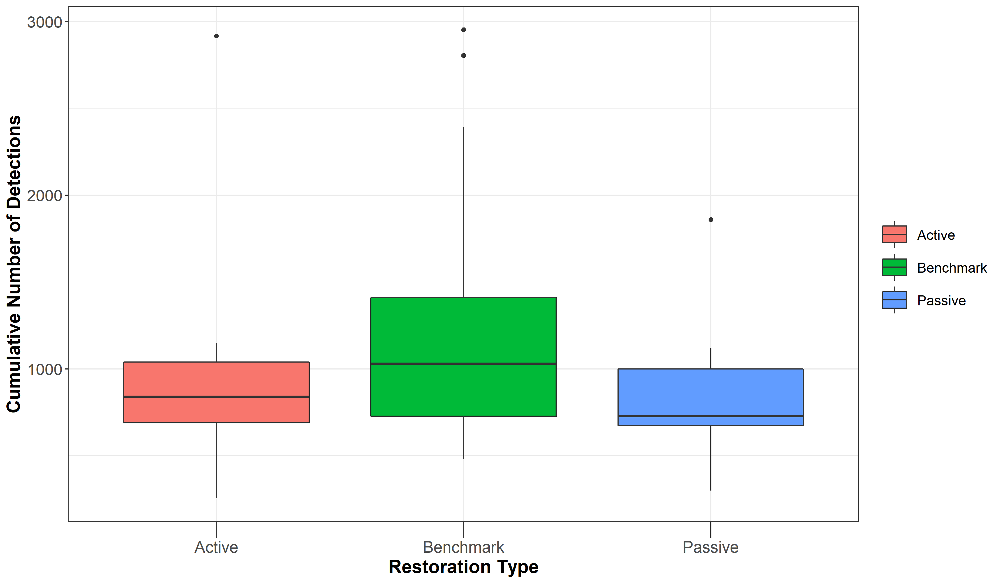
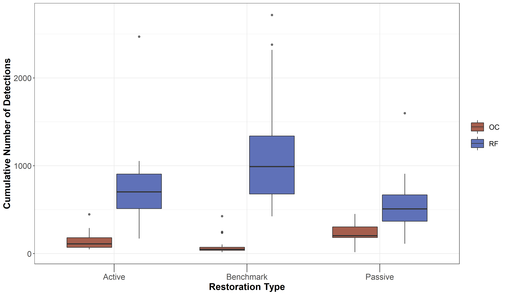

In this script, we will calculate:
a) Site-wise species richness and carry out ordinations to understand if species composition across sites are distinctly different. 


Install required libraries
```{r}
library(tidyverse)
library(dplyr)
library(stringr)
library(vegan)
library(ggplot2)
library("iNEXT")
library(rich)
library(scico)
```

To start with, we will compute species richness from 5 consecutive days for each site for each season (Ideally, we would want to compute richness for X number of non-consecutive days, following Campos-Cerqueira et al., 2019)

At the moment, data exists to calculate species richness for one season only (data collected between March 2020 - May 2020) and 3 visits to a site have been completed.

1. We will use a sheet of annotations, which contains 10s-clips from each site (A random 16-min was chosen between 6am and 10am for annotations and divided into 10s chunks)
```{r}
# Attach the 2020_summer_annotation data 
data <- read.csv("data/2020-summer-annotation-working document.csv")

# Site-wise sorting of the 16-min of data
# Split the file names into 4 columns : Site, Date, Time and Splits   
data <- separate(data, col = Filename, into = c("Site", "Date", "Time", "Splits"), sep = "_")
data

# Load the species-trait-data
trait_dat <- read.csv("data/species-trait-dat.csv")
```

Now group the data by site and restoration type and sum the number of detections across sites
```{r}
# At the moment 1-3 days at each site has been annotated
# Some sites have only 1 visit. See SEL sites (Selaliparai)

nSites_Days <- data %>%
  dplyr::select(Site, Date)%>%
  distinct() %>% arrange(Site) %>% count(Site)

# Calculate the overall number of detections for each site across 1-3 days of data (translates to 16min to 48min of data per site)

nDetections_Site <- data %>%
  group_by(Site, Restoration.Type) %>%
  summarise_at(.vars = vars(c("IP":"CR")),.funs = sum) %>% 
  transform() %>% replace(is.na(.), 0)

# How does the number of detections vary as a function of restoration type? 
# Since we expect higher species richness in benchmark sites, the number of acoustic detections/vocalizations should be higher in benchmark sites relative to actively restored and passive sites.

sum_DetectionsSite <- nDetections_Site %>%
  rowwise() %>% 
  mutate(sumDetections = sum(c_across(IP:CR))) %>%
  dplyr::select(Site, Restoration.Type, sumDetections)

# Plotting the above:
# Note: the cumulative number of detections across all species was obtained by summing every 16-min to 48-min set of detections across each site, including all species.

fig_sumDetections <- ggplot(sum_DetectionsSite, aes(x=Restoration.Type, y=sumDetections, fill=Restoration.Type)) +   geom_boxplot() + 
    theme_bw() +
    labs(x="Restoration Type", 
       y="Cumulative Number of Detections") +
    theme(axis.title = element_text(size = 16, face = "bold"), 
        axis.ticks.length.x = unit(.5, "cm"),
        axis.text = element_text(size = 14),
        legend.title = element_blank(),
        legend.key.size = unit(1,"cm"),
        legend.text = element_text(size = 12))

# This plot suggests that Benchmark sites are acoustically more active than Passively restored or Actively restored sites, as expected

ggsave(fig_sumDetections, filename = "figs/fig_sumDetections.png", width=12, height=7,
       device = png(), units="in", dpi = 300); dev.off()


```

Convert the detections to 1, since we are interested in calculating richness per site by converting values >1 to 1 for multiple visits to a site. In other words, we want to establish overall number of detections for a 16-min to 48-min window. 
```{r}
richness <- nDetections_Site  %>% 
  mutate_at(vars(c("IP":"CR")),~ replace(., . > 0, 1)) %>%
  rowwise() %>% 
  mutate(richness = sum(c_across(IP:CR))) %>%
  dplyr::select(Site, Restoration.Type, richness)

richness

# Create a boxplot of species richness by group (Here: group refers to Restoration Type)
# Temporary plots based on uneven visits to a site. Note it ranges from 1 to 3 visits.

fig_richness <- ggplot(richness, aes(x=Restoration.Type, y=richness, fill=Restoration.Type)) +
    geom_boxplot(alpha=0.7) + 
    scale_fill_scico_d(palette = "roma") +
    theme_bw() +
    labs(x="Restoration Type", 
       y="Species Richness") +
    theme(axis.title = element_text(size = 16, face = "bold"), 
        axis.ticks.length.x = unit(.5, "cm"),
        axis.text = element_text(size = 14),
        legend.title = element_blank(),
        legend.key.size = unit(1,"cm"),
        legend.text = element_text(size = 12))

ggsave(fig_richness, filename = "figs/fig_richness.png", width=12, height=7,
       device = png(), units="in", dpi = 300);dev.off()

knitr::include_graphics("figs/fig_richness.png")
```


Using species trait data to check if species richness varies by treatment type as a function of whether a species is a rainforest specialist vs. open-country specialist.
To do so: Add an additional column of species-trait data and group data based on the same.
```{r}

# First, we pivot the species-codes and then match the codes with trait_data and reformat the data to keep all detections>0 as 1 else they are 0

richness_trait <- nDetections_Site %>%
  pivot_longer(cols=IP:CR, names_to="Species_Code", values_to="count") %>%
  left_join(.,trait_dat, by=c("Species_Code"="species_annotation_codes")) %>%
  dplyr::select(-c(scientific_name)) %>%
  mutate(forRichness = case_when(count>0 ~ 1,
                                 count==0 ~ 0))

# Calculate overall richness for each site as a function of rainforest species and open-country species

richness_trait <-  richness_trait %>%
  dplyr::select(Site, Restoration.Type, Species_Code, Habitat, forRichness) %>%
  group_by(Site, Restoration.Type, Habitat) %>%
  summarise(Richness = sum(forRichness))

# Plot the above result
fig_richness_trait <- ggplot(richness_trait, aes(x=Restoration.Type, y=Richness, fill=Habitat)) +
    geom_boxplot(alpha=0.7) + 
    scale_fill_scico_d(palette = "roma") +
    theme_bw() +
    labs(x="Restoration Type", 
       y="Species Richness") +
    theme(axis.title = element_text(size = 16, face = "bold"), 
        axis.ticks.length.x = unit(.5, "cm"),
        axis.text = element_text(size = 14),
        legend.title = element_blank(),
        legend.key.size = unit(1,"cm"),
        legend.text = element_text(size = 12))

ggsave(fig_richness_trait, filename = "figs/fig_richness_trait.svg", width=12, height=7,
       device = svg(), units="in", dpi = 300); dev.off()

knitr::include_graphics("figs/fig_richness_trait.png")
```


Repeating the above set of calculations for number of detections as a function of whether a species is a rainforest specialist or an open country bird

```{r}
# First we sum the total number of detections by species trait 

detections_trait <- nDetections_Site %>%
  pivot_longer(cols=IP:CR, names_to="Species_Code", values_to="count") %>%
  left_join(.,trait_dat, by=c("Species_Code"="species_annotation_codes")) %>%
  dplyr::select(-c(scientific_name)) 

# Calculate overall number of detections for each site as a function of rainforest species and open-country species

detections_trait <-  detections_trait %>%
  dplyr::select(Site, Restoration.Type, Species_Code, Habitat, count) %>%
  group_by(Site, Restoration.Type, Habitat) %>%
  summarise(sumDetections = sum(count))

fig_detections_trait <- ggplot(detections_trait, aes(x=Restoration.Type, y=sumDetections, fill=Habitat)) +
    geom_boxplot(alpha=0.7) + 
    scale_fill_scico_d(palette = "roma") +
    theme_bw() +
    labs(x="Restoration Type", 
       y="Cumulative Number of Detections") +
    theme(axis.title = element_text(size = 16, face = "bold"), 
        axis.ticks.length.x = unit(.5, "cm"),
        axis.text = element_text(size = 14),
        legend.title = element_blank(),
        legend.key.size = unit(1,"cm"),
        legend.text = element_text(size = 12))

ggsave(fig_detections_trait, filename = "figs/fig_detections_trait.svg", width=12, height=7,
       device = svg(), units="in", dpi = 300); dev.off()



```


# Amrutha - can you annotate and work the rest based on the above edits? 

```{r}
# Use the nDetections_Site dataframe to carry out an ordination..
#subset the dataframe on which to base the ordination (df1)
df1 <- nDetections_Site[,3:108]

#The columns that contain the descriptive data (df2)
df2 <- data2[,1:2]
df2
#ordination by NMDS
NMDS <- metaMDS(df1, distance = "bray", k=6)

```


```{r}
#data visualization
#Extract the axes scores
datascores <- as.data.frame(scores(NMDS))  #extract the site scores

#Add/calculate spider diagram
scores <- cbind(as.data.frame(datascores), Site = df2["Restoration.Type"])
centroids <- aggregate(cbind(NMDS1, NMDS2, NMDS3, NMDS4, NMDS5, NMDS6) ~ Restoration.Type, data = scores, FUN = mean)
seg <- merge(scores, setNames(centroids, c('Restoration.Type','oNMDS1','oNMDS2')),
             by = 'Restoration.Type', sort = FALSE)

```


```{r}
#plot
output<- ggplot(scores, aes(x = NMDS1, y = NMDS2, colour = Restoration.Type)) +
  geom_segment(data = seg,
               mapping = aes(xend = oNMDS1, yend = oNMDS2)) + # add spiders
  geom_point(data = centroids, size = 4) +                    # add centroids
  geom_point() +                                              
  coord_fixed()+                                              
  theme_bw()+ 
  theme(legend.position="right",legend.text=element_text(size=10),legend.direction='vertical')
output


```

```{r}
#Bootstrapping and testing the differnces between the groups
fit <- adonis(df1 ~Restoration.Type, data = df2, permutations = 999, method = "bray")
fit

```

```{r}
#Check assumption of homogeneity of multivariate dispersion
distances_data <- vegdist(df1)
anova(betadisper(distances_data, df2$Restoration.Type))

```

```{r}
#subset data for the species accumulation curve
data1$site_date <- paste(data1$Site, data1$Date, sep="_")
data1$site_date

data4 <-data1 %>%group_by(site_date, Restoration.Type)%>%
summarise_at(.vars = vars(c("IP":"CR")),
.funs = sum)%>%transform() 
as.numeric(data1$GJ>0)
norm<-function(x)as.numeric(x>0)
data4 <- as.data.frame(unclass(data4))
data4[is.na(data4)] <- 0
data4

data5 <- cbind(data4["site_date"], apply(data4[3:108],2, function(x){as.numeric(x>0)}))
data5[is.na(data5)] <- 0
head(data5)

```

```{r}
#species richness in each site 
#data4["specnumber"] <- specnumber(data3, MARGIN = 1)
#data4
```


```{r}
#sitewise species richness for all species
pool.data5 <- poolaccum(data5)
plot(pool.data5)

```

```{r}
#species accumulation curve
#build the species accumulation curve & rarefaction curve (expected)
df1.specaccum <- specaccum(df1,method = "rarefaction")
#plot the curve with some predefined settings
plot(df1.specaccum,ci.type="poly", col="blue", lwd=2, ci.lty=0, ci.col="lightblue")

#build a expected curve (randomization for boxplot comparison)
df1.specaccum.rand <- specaccum(df1, "random")
#plot both curves ("observed" vs "randomized")
plot(df1.specaccum,ci.type="poly", col="blue", lwd=2, ci.lty=0, ci.col="lightblue")
boxplot(df1.specaccum.rand, col="yellow", add=TRUE, pch="+")

```

```{r}
# Species accumulation curve for the sitewise visits detections
overall = specaccum(df1, method = "random", permutations = 100)

# Subset each habitat into its own df
data4 %>% filter (Restoration.Type == "Benchmark") -> Benchmark
data4 %>% filter (Restoration.Type == "Passive") -> Passive
data4 %>% filter (Restoration.Type== "Active") -> Active

# Calculate spec.accu curve for each habitat
curve_Benchmark =specaccum(Benchmark[, 3:108], method = "random", permutations = 100)
curve_Passive =specaccum(Passive[, 3:108], method = "random", permutations = 100)
curve_Active =specaccum(Active[, 3:108], method = "random", permutations = 100)

#plot overall first
plot(overall, xlab = "Sites", ylab = "species")
#then plot the rest
plot(curve_Benchmark, add = TRUE, col = "green")
legend("bottomright", c("overall", "Benchmark", "Passive", "Active"), pch = c(19,19,19), col= c("black","green","red", "blue")) #col is COLOUR setting, so change it to something else if you want
plot(curve_Passive, add = TRUE, col = "red")
plot(curve_Active, add = TRUE, col = "blue")

```

