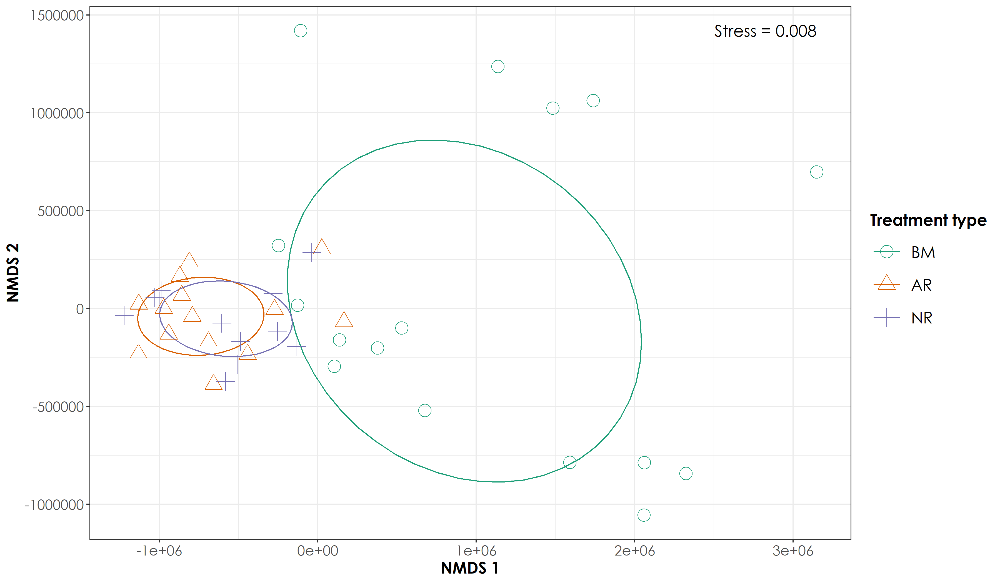

# Non-metric multidimensional scaling of acoustic space use data

Here, we will use ordinations as a method of analyzing how acoustic space use (defined in terms of frequency and time, across 24 hours in a day) varies between treatment types.  

### Load necessary libraries for analysis
```{r}
library(tidyverse)
library(dplyr)
library(stringr)
library(vegan)
library(ggplot2)
library(scico)
library(psych)
library(ecodist)
library(RColorBrewer)
library(ggforce)
library(ggalt)
library(extrafont)
# loadfonts(device = "win") # run this prior to creating publication figures 

# Source any custom/other internal functions necessary for analysis
source("code/01_internal-functions.R")
```

### Load the necessary data for nmds calculations
```{r}
# load the site-wise space use data
sitebyDayAsu <- read.csv("results/site-by-day-asu.csv")

# separate the columns
sitebyDayAsu <- separate(sitebyDayAsu, col = Site_Day, into = c("Site","Day"), sep = "_")

# load list of sites
sites <- read.csv("data/list-of-sites.csv") %>%
  dplyr::select("Site.code","Restoration.type") %>%
  filter(Site.code != "OLCAP5B")

# Add restoration type column to the space use data
sitebyDayAsu <- left_join(sitebyDayAsu,sites, by=c("Site"="Site.code"))

# Supplementary analysis: space use during diurnal and nocturnal periods
diurnal <- c("06:00-07:00","07:00-08:00","08:00-09:00",
          "09:00-10:00","10:00-11:00","11:00-12:00",
          "12:00-13:00","13:00-14:00","14:00-15:00",
          "15:00-16:00","16:00-17:00","17:00-18:00")
diurnalAsu <- sitebyDayAsu %>%
  filter(time_of_day %in% diurnal)

nocturnal <- c("18:00-19:00","19:00-20:00","20:00-21:00","21:00-22:00",
               "22:00-23:00","23:00-00:00","00:00-01:00","01:00-02:00",
               "02:00-03:00","03:00-04:00","04:00-05:00","05:00-06:00")
nocturnalAsu <- sitebyDayAsu %>%
  filter(time_of_day %in% nocturnal)
```

### Preparing a dataframe of space use to run ordinations
```{r}
# Please note that while creating this dataframe for ordinations, the overall acoustic space use (sum of f.cont.sum column) was calculated by frequency bin, irrespective of the time of day for a given site. In other words, for 24 hours of data, a single value of space use was obtained for a given frequency bin. The frequency bin was pivoted from long to wide and each column essentially corresponded to a frequency bin. Within that frequency bin, grouped for each site, an overall value of space use was computed. 

nmdsDat <- sitebyDayAsu %>% 
  dplyr::select(Site, freq, f.cont, Restoration.type) %>%
  group_by(Site, Restoration.type, freq) %>%
  summarise(totSpaceuse = sum(f.cont)) %>%
  arrange(Restoration.type) %>%
  pivot_wider (names_from = freq, values_from = totSpaceuse, values_fill = list(totSpaceuse=0))

nmdsDiurnal <- diurnalAsu %>%
  dplyr::select(Site, freq, f.cont, Restoration.type) %>%
  group_by(Site, Restoration.type, freq) %>%
  summarise(totSpaceuse = sum(f.cont)) %>%
  arrange(Restoration.type) %>%
  pivot_wider (names_from = freq, values_from = totSpaceuse, values_fill = list(totSpaceuse=0))

nmdsNocturnal <- nocturnalAsu %>% 
  dplyr::select(Site, freq, f.cont, Restoration.type) %>%
  group_by(Site, Restoration.type, freq) %>%
  summarise(totSpaceuse = sum(f.cont)) %>%
  arrange(Restoration.type) %>%
  pivot_wider (names_from = freq, values_from = totSpaceuse, values_fill = list(totSpaceuse=0))

# Convert to matrix form
nmdsDatMatrix <- as.matrix(nmdsDat[, 3:ncol(nmdsDat)])
nmdsDiurnalMatrix <- as.matrix(nmdsDiurnal[, 3:ncol(nmdsDiurnal)])
nmdsNocturnalMatrix <- as.matrix(nmdsNocturnal[, 3:ncol(nmdsNocturnal)])
```


```{r}
# Run a euclidean dissimilarity distance and use metaMDS function from vegan to run ordinations

disEuclidean <- vegdist(nmdsDatMatrix, method = "euclidean")
disEuclideanDiurnal <- vegdist(nmdsDiurnalMatrix, method = "euclidean")
disEuclideanNocturnal <- vegdist(nmdsNocturnalMatrix, method = "euclidean")

nmdsEuclidean <- vegdist (nmdsDatMatrix, method = "euclidean") %>% 
  metaMDS (nmdsEuclidean, k=6) # stress =  0.007478165
nmdsEuclideanDiurnal <- vegdist (nmdsDiurnalMatrix, method = "euclidean") %>% 
  metaMDS (nmdsEuclideanDiurnal, k=6) # stress = 0.003387608
nmdsEuclideanNocturnal <- vegdist (nmdsNocturnalMatrix, method = "euclidean") %>% 
  metaMDS (nmdsEuclideanNocturnal, k=6) # stress = 0.01572579

# extract nmds scores
nmdsScores <- as_tibble(scores(nmdsEuclidean, display = "site"))
nmdsScoresDiurnal <- as_tibble(scores(nmdsEuclideanDiurnal, display = "site"))
nmdsScoresNocturnal <- as_tibble(scores(nmdsEuclideanNocturnal, display = "site"))

# Write the scores to a separate .csv
write.csv(nmdsScores, "results/nmds-acousticSpaceUse.csv", row.names = F)

# With the above analysis, we note the stress is 0.008131476. However, if stress is high, we should reposition the points in 2 dimensions in the direction of decreasing stress, and repeat until stress is below some threshold.**A good rule of thumb: stress < 0.05 provides an excellent representation in reduced dimensions, < 0.1 is great, < 0.2 is good/ok, and stress < 0.3 provides a poor representation.** To reiterate: high stress is bad, low stress is good!

# write scores for diurnal and nocturnal data
write.csv(nmdsScoresDiurnal, "results/nmds-acousticSpaceUse-diurnal.csv", 
          row.names = F)
write.csv(nmdsScoresNocturnal, "results/nmds-acousticSpaceUse-nocturnal.csv", 
          row.names = F)
```


### Plotting the NMDS scores
```{r}
# First let's add the treatment type back to the nmds scores
nmdsScores$Restoration.type <- nmdsDat$Restoration.type
nmdsScoresDiurnal$Restoration.type <- nmdsDiurnal$Restoration.type
nmdsScoresNocturnal$Restoration.type <- nmdsNocturnal$Restoration.type

# Add a custom set of colors
mycolors <- c(brewer.pal(name="Dark2", n = 3), brewer.pal(name="Paired", n = 3))

# reordering factors for plotting
nmdsScores$Restoration.type <- factor(nmdsScores$Restoration.type, levels = c("Benchmark", "Active", "Passive"))
nmdsScoresDiurnal$Restoration.type <- factor(nmdsScoresDiurnal$Restoration.type, levels = c("Benchmark", "Active", "Passive"))
nmdsScoresNocturnal$Restoration.type <- factor(nmdsScoresNocturnal$Restoration.type, levels = c("Benchmark", "Active", "Passive"))

fig_nmds <- ggplot(data=nmdsScores) + 
  stat_ellipse(aes(x=NMDS1,y=NMDS2,colour=Restoration.type),level = 0.50) +
  geom_point(aes(x=NMDS1,y=NMDS2,shape=Restoration.type,colour=Restoration.type),size=5) + 
  theme_bw() +
  scale_x_continuous(name="NMDS 1") + 
  scale_y_continuous(name="NMDS 2") +
  scale_shape_manual("Treatment type",values= 1:length(unique(nmdsScores$Restoration.type)), labels=c("BM","AR","NR")) +
  scale_color_manual("Treatment type",values=mycolors, labels=c("BM","AR","NR"))+ 
  theme(axis.title = element_text(family="Century Gothic",
                                    size = 14, face = "bold"),
        axis.text = element_text(family="Century Gothic",
                                    size = 12),
        legend.title = element_text(family="Century Gothic",
                                    size = 14, face = "bold"),
        legend.key.size = unit(1,"cm"),
        legend.text = element_text(family="Century Gothic",size = 14)) +
   annotate(geom = "text", x = max(nmdsScores$NMDS1), y = max(nmdsScores$NMDS2),  label = "Stress = 0.008", hjust = 1, family = "Century Gothic", size=5)

fig_nmds_diurnal <- ggplot(data=nmdsScoresDiurnal) + 
  stat_ellipse(aes(x=NMDS1,y=NMDS2,colour=Restoration.type),level = 0.50) +
  geom_point(aes(x=NMDS1,y=NMDS2,shape=Restoration.type,colour=Restoration.type),size=5) + 
  theme_bw() +
  scale_x_continuous(name="NMDS 1") + 
  scale_y_continuous(name="NMDS 2") +
  scale_shape_manual("Treatment type",values= 1:length(unique(nmdsScoresDiurnal$Restoration.type)), labels=c("BM","AR","NR")) +
  scale_color_manual("Treatment type",values=mycolors, labels=c("BM","AR","NR"))+ 
  theme(axis.title = element_text(family="Century Gothic",
                                    size = 14, face = "bold"),
        axis.text = element_text(family="Century Gothic",
                                    size = 12),
        legend.title = element_text(family="Century Gothic",
                                    size = 14, face = "bold"),
        legend.key.size = unit(1,"cm"),
        legend.text = element_text(family="Century Gothic",size = 14)) +
   annotate(geom = "text", x = max(nmdsScoresDiurnal$NMDS1), y = max(nmdsScoresDiurnal$NMDS2),  label = "Stress = 0.003", hjust = 1, family = "Century Gothic", size=5)

fig_nmds_nocturnal <- ggplot(data=nmdsScoresNocturnal) + 
  stat_ellipse(aes(x=NMDS1,y=NMDS2,colour=Restoration.type),level = 0.50) +
  geom_point(aes(x=NMDS1,y=NMDS2,shape=Restoration.type,colour=Restoration.type),size=5) + 
  theme_bw() +
  scale_x_continuous(name="NMDS 1") + 
  scale_y_continuous(name="NMDS 2") +
  scale_shape_manual("Treatment type",values= 1:length(unique(nmdsScoresNocturnal$Restoration.type)), labels=c("BM","AR","NR")) +
  scale_color_manual("Treatment type",values=mycolors, labels=c("BM","AR","NR"))+ 
  theme(axis.title = element_text(family="Century Gothic",
                                    size = 14, face = "bold"),
        axis.text = element_text(family="Century Gothic",
                                    size = 12),
        legend.title = element_text(family="Century Gothic",
                                    size = 14, face = "bold"),
        legend.key.size = unit(1,"cm"),
        legend.text = element_text(family="Century Gothic",size = 14)) +
   annotate(geom = "text", x = max(nmdsScoresNocturnal$NMDS1), y = max(nmdsScoresNocturnal$NMDS2),  label = "Stress = 0.01", hjust = 1, family = "Century Gothic", size=5)

ggsave(fig_nmds, filename = "figs/fig_nmds_overallSpaceUse.png", width=12, height=7,device = png(), units="in", dpi = 300); dev.off()
ggsave(fig_nmds_diurnal, filename = "figs/fig_nmds_diurnalSpaceUse.png", width=12, height=7,device = png(), units="in", dpi = 300); dev.off()
ggsave(fig_nmds_nocturnal, filename = "figs/fig_nmds_nocturnalSpaceUse.png", width=12, height=7,device = png(), units="in", dpi = 300); dev.off()
```




### Testing multivariate homogeneity of group dispersions

One measure of multivariate dispersion (variance) for a group of samples is to calculate the average distance of group members to the group centroid or spatial median in multivariate space. To test if the dispersions (variances) of one or more groups are different, the distances of group members to the group centroid are subject to ANOVA.

Betadisper tests whether two or more groups (for example, restored and unrestored sites) are homogeneously dispersed in relation to their species in studied samples. This test can be done to see if one group has more compositional variance than another. Moreover, homogeneity of dispersion among groups is very advisable to have if you want to test if two or more groups have different compositions, which is tested by adonis. 
```{r}
nmdsVariance <- betadisper(disEuclidean, group = nmdsDat$Restoration.type)
nmdsVariance

anova(nmdsVariance)
permutest(nmdsVariance, pairwise = TRUE, permutations = 999)
TukeyHSD(nmdsVariance)

# For overall space use, there is a significant difference in within group variance between one group and another (For Benchmark-Active sites and Passive-Benchmark sites, but not between Active-Passive)

nmdsVarianceDiurnal <- betadisper(disEuclideanDiurnal, group = nmdsDiurnal$Restoration.type)
nmdsVarianceDiurnal

anova(nmdsVarianceDiurnal)
permutest(nmdsVarianceDiurnal, pairwise = TRUE, permutations = 999)
TukeyHSD(nmdsVarianceDiurnal)

# For diurnal space use, there is a significant difference in within group variance between one group and another (For Benchmark-Active sites and Passive-Benchmark sites, but not between Active-Passive)

nmdsVarianceNocturnal <- betadisper(disEuclideanNocturnal, group = nmdsNocturnal$Restoration.type)
nmdsVarianceNocturnal

anova(nmdsVarianceNocturnal)
permutest(nmdsVarianceNocturnal, pairwise = TRUE, permutations = 999)
TukeyHSD(nmdsVarianceNocturnal)

# For nocturnal space use, there is a significant difference in within group variance between one group and another (For Benchmark-Active sites and Passive-Benchmark sites, but not between Active-Passive)

# The above results suggests that there is heterogeneous variation and does not meet assumptions to run adonis
```


### Visualizing the multivariate homogeneity of group dispersions

The below lines of code have been adapted from: https://chrischizinski.github.io/rstats/adonis/
```{r}
# extract the centroids and the site points in multivariate space.  
centroids <-data.frame(grps=rownames(nmdsVariance$centroids),
                       data.frame(nmdsVariance$centroids))
vectors <- data.frame(group=nmdsVariance$group,
                      data.frame(nmdsVariance$vectors))

# to create the lines from the centroids to each point we will put it in a format that ggplot can handle
seg.data<-cbind(vectors[,1:3],centroids[rep(1:nrow(centroids),as.data.frame(table(vectors$group))$Freq),2:3])
names(seg.data)<-c("group","v.PCoA1","v.PCoA2","PCoA1","PCoA2")

# create the convex hulls of the outermost points
grp1.hull <- seg.data[seg.data$group=="Active",1:3][chull(seg.data[seg.data$group=="Active",2:3]),]
grp2.hull <- seg.data[seg.data$group=="Benchmark",1:3][chull(seg.data[seg.data$group=="Benchmark",2:3]),]
grp3.hull <- seg.data[seg.data$group=="Passive",1:3][chull(seg.data[seg.data$group=="Passive",2:3]),]
all.hull <- rbind(grp1.hull,grp2.hull,grp3.hull)

# plot the panel and convex hulls
fig_hull <- ggplot() + 
  geom_polygon(data= all.hull,aes(x=v.PCoA1,y=v.PCoA2),colour="black",alpha=0,linetype="dashed") +
  geom_segment(data=seg.data,aes(x=v.PCoA1,xend=PCoA1,y=v.PCoA2,yend=PCoA2),alpha=0.30) + 
  geom_point(data=centroids[,1:3], aes(x=PCoA1,y=PCoA2,shape=grps),size=4,colour="red") + 
  geom_point(data=seg.data, aes(x=v.PCoA1,y=v.PCoA2,shape=group),size=2) +
  labs(title="All",x="",y="") +
  #coord_cartesian(xlim = c(-0.2,0.2), ylim = c(-0.25,0.2)) +
  theme_bw() + 
  theme(legend.position="none")
```
