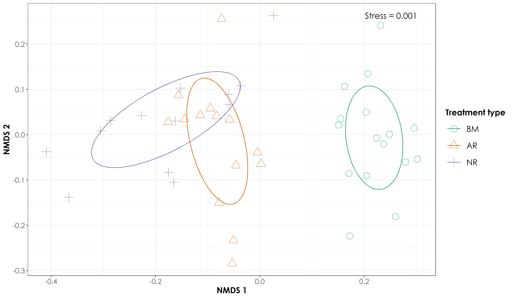

# Non-metric multidimensional scaling and indicator-species analysis

Here, we are interested not only in comparing univariate descriptors of communities, like diversity, but also in how the constituent species — or the composition — changes from one community to the next.

One common tool to do this is non-metric multidimensional scaling, or NMDS. The goal of NMDS is to collapse information from multiple dimensions (e.g, from multiple communities, sites, etc.) into just a few, so that they can be visualized and interpreted. Unlike other ordination techniques that rely on (primarily Euclidean) distances, such as Principal Coordinates Analysis, NMDS uses rank orders, and thus is an extremely flexible technique that can accommodate a variety of different kinds of data (The text above was copied from the link below). 

NMDS does not use the absolute abundances of species in communities, but rather their rank orders. The use of ranks omits some of the issues associated with using absolute distance (e.g., sensitivity to transformation), and as a result is much more flexible technique that accepts a variety of types of data. (It’s also where the “non-metric” part of the name comes from).

A wonderful tutorial is presented in this link: https://jonlefcheck.net/2012/10/24/nmds-tutorial-in-r/


Install required libraries
```{r}
library(tidyverse)
library(dplyr)
library(stringr)
library(vegan)
library(ggplot2)
library(scico)
library(psych)
library(ecodist)
library(RColorBrewer)
library(ggforce)
library(ggalt)
library(indicspecies)

# Source any custom/other internal functions necessary for analysis
source("code/01_internal-functions.R")
```


Load the necessary data for NMDS calculations
```{r}
# We load the subset data
datSubset <- read.csv("data/datSubset.csv")

# Load species-trait data to essentially check for associations by habitat type
trait_dat <- read.csv("data/species-trait-dat.csv")

# Site-summary (Number of detections across all sites)
datSummary <- datSubset %>%
  group_by(Site, Restoration.type) %>%
  transform() %>% replace(is.na(.), 0) %>%
  summarise_at(.vars = vars(c("IP":"HSWP")),.funs = sum)

# richness across sites (converting detections to 1)
richness <- datSummary %>% 
  mutate_at(vars(c("IP":"HSWP")),~ replace(., . > 0, 1)) %>%
  rowwise() %>% 
  mutate(richness = sum(c_across(IP:HSWP))) %>%
  dplyr::select(Site, Restoration.type, richness)
```


Preparing dataframe of traits and species to be used for NMDS later on
```{r}
# Calculate the overall number of detections for each site. Here, we include dates, since each visit can explain the extrapolation of species richness when jackknife estimates are extracted. 

nDetections_site_date <- datSubset %>%
  group_by(Site, Restoration.type, Date) %>%
  transform() %>% replace(is.na(.), 0) %>%
  summarise_at(.vars = vars(c("IP":"HSWP")),.funs = sum)

# Combine the nDetections and trait based data to obtain a dataframe for further analysis

nDetections_trait <- nDetections_site_date %>%
  pivot_longer(cols=IP:HSWP, names_to="Species_Code", values_to="count") %>%
  left_join(.,trait_dat, by=c("Species_Code"="species_annotation_codes")) %>%
  mutate(forRichness = case_when(count>0 ~ 1,count==0 ~ 0)) %>%
  rename(., nDetections = count)
```


Preparing a dataframe of detections to run ordinations
```{r}
# We will prepare a community matrix data that can be used to run dissimilarity indices

nmdsDat <- nDetections_trait %>% 
  dplyr::select(Site, Species_Code, nDetections, Restoration.type) %>% 
  group_by(Species_Code, Site, Restoration.type) %>% 
  summarise (totDetections = sum(nDetections)) %>% 
  arrange(Restoration.type) %>%
  pivot_wider (names_from = Species_Code, values_from = totDetections, values_fill = list(totDetections=0))

# Convert to matrix form
nmdsDatMatrix <- as.matrix(nmdsDat[, 3:ncol(nmdsDat)])
```


Run a bray-curtis dissimilarity index and identify least stressed configuration for the ordinations. Bray-curtis is a statistic used to quantify the compositional dissimilarity between two different sites, based on counts at each site. Ecologists use the Bray-Curtis dissimilarity calculation, which has a number of ideal properties:
1. It is invariant to changes in units.
2. It is unaffected by additions/removals of species that are not present in two communities.
3. It is unaffected by the addition of a new community.
4. It can recognize differences in total abundances when relative abundances are the same. 

Please note that this link provides more information on NMDS: http://strata.uga.edu/8370/lecturenotes/multidimensionalScaling.html
```{r}
# Run a bray-curtis dissimilarity index and use metaMDS function from vegan to run ordinations

disBrayCurtis <- vegdist(nmdsDatMatrix, method = "bray")

nmdsBrayCurtis <- vegdist (nmdsDatMatrix, method = "bray") %>% 
  metaMDS (nmdsBrayCurtis, k=6)

# extract nmds scores
nmdsScores <- as.tibble(scores(nmdsBrayCurtis))

# Write the scores to a separate .csv
write.csv(nmdsScores, "data/nmdsBrayCurtis-bird-detections.csv", row.names = F)

# With the above analysis, we note the stress is 0.06107898. However, if stress is high, we should reposition the points in 2 dimensions in the direction of decreasing stress, and repeat until stress is below some threshold.**A good rule of thumb: stress < 0.05 provides an excellent representation in reduced dimensions, < 0.1 is great, < 0.2 is good/ok, and stress < 0.3 provides a poor representation.** To reiterate: high stress is bad, low stress is good!
```


Plotting the NMDS scores using ggplot2
```{r}
# First let's add the treatment type back to the nmds scores
nmdsScores$Restoration.type <- nmdsDat$Restoration.type

# Add a custom set of colors
mycolors <- c(brewer.pal(name="Dark2", n = 3), brewer.pal(name="Paired", n = 3))

fig_nmds <- ggplot(data=nmdsScores) + 
  stat_ellipse(aes(x=NMDS1,y=NMDS2,colour=Restoration.type),level = 0.50) +
  geom_point(aes(x=NMDS1,y=NMDS2,shape=Restoration.type,colour=Restoration.type),size=4) + 
  theme_bw() +
  scale_x_continuous(name="NMDS 1") + 
  scale_y_continuous(name="NMDS 2") +
  scale_shape_manual(values= 1:length(unique(nmdsScores$Restoration.type)))+
  scale_color_manual(values=mycolors)+ theme(legend.key = element_blank(), legend.text = element_text(face = "italic"))

ggsave(fig_nmds, filename = "figs/fig_nmds_birdDetections.png", width=12, height=7,device = png(), units="in", dpi = 300); dev.off()


```

Testing multivariate homogeneity of group dispersions

One measure of multivariate dispersion (variance) for a group of samples is to calculate the average distance of group members to the group centroid or spatial median (both referred to as 'centroid' from now on unless stated otherwise) in multivariate space. To test if the dispersions (variances) of one or more groups are different, the distances of group members to the group centroid are subject to ANOVA.

Betadisper tests whether two or more groups (for example, restored and unrestored sites) are homogeneously dispersed in relation to their species in studied samples. This test can be done to see if one group has more compositional variance than another. Moreover, homogeneity of dispersion among groups is very advisable to have if you want to test if two or more groups have different compositions, which is tested by adonis. 
```{r}
nmdsVariance <- betadisper(disBrayCurtis, group = nmdsDat$Restoration.type)
nmdsVariance

anova(nmdsVariance)
permutest(nmdsVariance, pairwise = TRUE, permutations = 999)
TukeyHSD(nmdsVariance)

# These results suggest that there is no difference in variance between one group and another
```


Visualizing the multivariate homogeneity of group dispersions

The below lines of code have been adapted from: https://chrischizinski.github.io/rstats/adonis/
```{r}
# extract the centroids and the site points in multivariate space.  
centroids <-data.frame(grps=rownames(nmdsVariance$centroids),
                       data.frame(nmdsVariance$centroids))
vectors <- data.frame(group=nmdsVariance$group,
                      data.frame(nmdsVariance$vectors))

# to create the lines from the centroids to each point we will put it in a format that ggplot can handle
seg.data<-cbind(vectors[,1:3],centroids[rep(1:nrow(centroids),as.data.frame(table(vectors$group))$Freq),2:3])
names(seg.data)<-c("group","v.PCoA1","v.PCoA2","PCoA1","PCoA2")

# create the convex hulls of the outermost points
grp1.hull <- seg.data[seg.data$group=="Active",1:3][chull(seg.data[seg.data$group=="Active",2:3]),]
grp2.hull <- seg.data[seg.data$group=="Benchmark",1:3][chull(seg.data[seg.data$group=="Benchmark",2:3]),]
grp3.hull <- seg.data[seg.data$group=="Passive",1:3][chull(seg.data[seg.data$group=="Passive",2:3]),]
all.hull <- rbind(grp1.hull,grp2.hull,grp3.hull)

# plot the panel and convex hulls
fig_hull <- ggplot() + 
  geom_polygon(data= all.hull,aes(x=v.PCoA1,y=v.PCoA2),colour="black",alpha=0,linetype="dashed") +
  geom_segment(data=seg.data,aes(x=v.PCoA1,xend=PCoA1,y=v.PCoA2,yend=PCoA2),alpha=0.30) + 
  geom_point(data=centroids[,1:3], aes(x=PCoA1,y=PCoA2,shape=grps),size=4,colour="red") + 
  geom_point(data=seg.data, aes(x=v.PCoA1,y=v.PCoA2,shape=group),size=2) +
  labs(title="All",x="",y="") +
  #coord_cartesian(xlim = c(-0.2,0.2), ylim = c(-0.25,0.2)) +
  theme_bw() + 
  theme(legend.position="none")
```


Testing compositional dissimilarity between groups

We will do this by using the vegan::adonis() function which allows you to do permutational multivariate analysis of variance using distance matrices. In the above figure, the NMDS confidence ellipses suggest that there is a significant difference between benchmark and passive-active sites, but no difference between active and passive sites. Adonis works by first finding the centroids for each group and then calculates the squared deviations of each of site to that centroid. Then significance tests are performed using F-tests based on sequential sums of squares from permutations of the raw data. Please note that adonis analyzes and partitions sums of squares using distance matrices. It can be seen as an ANOVA using distance matrices (analogous to MANOVA - multivariate analysis of variance). Therefore, it is used to test if two or more groups have similar compositions.

```{r}
# We will use the NMDS scores for axis 1 and axis 2 to test for compositional dissimilarity
groups <- nmdsScores$Restoration.type

adonisNMDS <- adonis(nmdsDatMatrix ~ groups, method="bray",perm=999)
adonisNMDS

# The results suggest that there are significant compositional differences between groups.
```


Indicator species analysis

This analysis aims to identify what species are “indicators” of groups of samples or treatment type. For instance: 

• A perfect indicator species will only occur in one group.
• Generalist species will occur across multiple groups and
therefore not a good indicator.
• Rare species are not sampled often, also not a good
indicator.
• Indicator values range from 0 to 1 but may also be
expressed as a percentage.
• Each species is assigned an indicator value for each
group and the significance of values can be assessed through permutations

For more information, visit this link: https://ichthyology.usm.edu/courses/multivariate/apr_11.pdf

Please note that when the aim is to determine which species can be used as indicators of certain site group, an approach commonly used in ecology is the Indicator
Value [Dufrˆene and Legendre, 1997]. These authors defined an Indicator
Value (IndVal) index to measure the association between a species and a
site group. The method of Dufrˆene and Legendre [1997] calculates the IndVal index between the species and each site group and then looks for the
group corresponding to the highest association value. Finally, the statistical
significance of this relationship is tested using a permutation test.

Diagnostic (or indicator) species are an important tool in vegetation science, because these species can be used to characterize and indicate specific plant community types. A statistic commonly used to determine the association (also known
as fidelity, not to be confounded with the indicator value component) between species and vegetation types is Pearson’s phi coefficient of association
[Chytr´y et al., 2002]. This coefficient is a measure of the correlation between two binary vectors. The abundance-based counterpart of the phi coefficient is called the point biserial correlation coefficient (which is defined as "r.g")

See: https://cran.r-project.org/web/packages/indicspecies/vignettes/indicspeciesTutorial.pdf

```{r}
# Running the multi-pattern analysis across combinations of groups
indicSpec <- multipatt(nmdsDat[, 3:ncol(nmdsDat)], nmdsDat$Restoration.type, func = "r.g", control = how(nperm=999))

# looking at associations with stratum/pairs of strata
summary(indicSpec)
```


Separate analysis: Instead of using bird detections, using richness to run nmds ordinations
```{r}
nmdsDatRichness <- datSummary %>% 
  mutate_at(vars(c("IP":"HSWP")),~ replace(., . > 0, 1))

# Convert to matrix form
nmdsDatMatrixRichness <- as.matrix(nmdsDatRichness[, 3:ncol(nmdsDatRichness)])

# Run a bray-curtis dissimilarity index and use metaMDS function from vegan to run ordinations

disBrayCurtisRichness <- vegdist(nmdsDatMatrixRichness, method = "bray")

nmdsBrayCurtisRichness <- vegdist(nmdsDatMatrixRichness, method = "bray") %>%   metaMDS (nmdsBrayCurtisRichness, k=6)

# extract nmds scores
nmdsScoresRichness <- as.tibble(scores(nmdsBrayCurtisRichness))

# plot the data
# First let's add the treatment type back to the nmds scores
nmdsScoresRichness$Restoration.type <- nmdsDatRichness$Restoration.type

# Add a custom set of colors
mycolors <- c(brewer.pal(name="Dark2", n = 3), brewer.pal(name="Paired", n = 3))

fig_nmds_richness <- ggplot(data=nmdsScoresRichness) + 
  stat_ellipse(aes(x=NMDS1,y=NMDS2,colour=Restoration.type),level = 0.50) +
  geom_point(aes(x=NMDS1,y=NMDS2,shape=Restoration.type,colour=Restoration.type),size=4) + 
  theme_bw() +
  scale_x_continuous(name="NMDS 1") + 
  scale_y_continuous(name="NMDS 2") +
  scale_shape_manual(values= 1:length(unique(nmdsScoresRichness$Restoration.type)))+
  scale_color_manual(values=mycolors)+ theme(legend.key = element_blank(), legend.text = element_text(face = "italic"))

ggsave(fig_nmds_richness, filename = "figs/fig_nmds_birdRichness.png", width=12, height=7,device = png(), units="in", dpi = 300); dev.off()
```


Running indicator species analysis on species richness dataset above, rather than bird detections to see if the results change
```{r}
# Running betadisper and adonis tests
nmdsVarianceRichness <- betadisper(disBrayCurtisRichness, group = nmdsDatRichness$Restoration.type)
nmdsVarianceRichness

anova(nmdsVarianceRichness)
permutest(nmdsVarianceRichness, pairwise = TRUE, permutations = 999)
TukeyHSD(nmdsVarianceRichness)

# These results suggest that there is no difference in variance between one group and another

# Adonis
# We will use the NMDS scores for axis 1 and axis 2 to test for compositional dissimilarity
groups <- nmdsScoresRichness$Restoration.type

adonisNMDS <- adonis(nmdsDatMatrixRichness ~ groups, method="bray",perm=999)
adonisNMDS

# Running the multi-pattern analysis across combinations of groups
indicSpecRichness <- multipatt(nmdsDatRichness[, 3:ncol(nmdsDatRichness)], nmdsDatRichness$Restoration.type, func = "r.g", control = how(nperm=999))

# looking at associations with stratum/pairs of strata
summary(indicSpecRichness)
```


