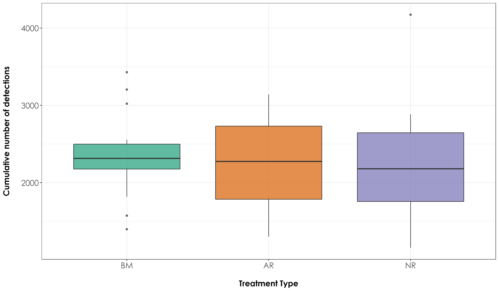

# Acoustic Detections

In this script, we will calculate:

a) Total Number of detections across sites (reported for varying time intervals 10s, 30s, 1-min, 2-min, 4-min).
b) Repeat the above calculations, but using species traits - If a species is a rainforest specialist or an open-country generalist.

## Install required libraries
```{r}
library(tidyverse)
library(dplyr)
library(stringr)
library(vegan)
library(ggplot2)
library(scico)
library(extrafont)
```

## Load data

We will use the data that was subset previously for further analysis.
```{r}
# Attach the annotated data 
datSubset <- read.csv("data/datSubset.csv")

# Load the species-trait-data
trait_dat <- read.csv("data/species-trait-dat.csv")
```

## Overall number of detections

Given the data annotated so far, we will calculate the overall number of detections across different temporal periods, starting from 10s to 30-s, 1-min, 2-min and 4-min. We will first calculate the overall number of detections for the shortest possible temporal duration which could be annotated confidently - 10s. 

Other durations are chosen to confirm if the number of detections vary as a function of the temporal duration. 

Please note that: the data at the moment is imbalanced in terms of nVisits
```{r}
# Calculate the overall number of detections for each site where each temporal duration chosen is a 10s clip

nDetections_10s <- datSubset %>%
  group_by(Site, Restoration.type) %>%
  transform() %>% replace(is.na(.), 0) %>% 
  summarise_at(.vars = vars(c("IP":"HSWP")),.funs = sum) 
  
# Calculate the overall number of detections for each site where each temporal duration chosen is a 30s clip (In this case, every third row is chosen after grouping by Site, Date and Time)

nDetections_30s <- datSubset %>%
  mutate(Splits = case_when((Splits == "01-10" | Splits=="10-20" | Splits =="20-30") ~ "1",(Splits == "30-40" | Splits=="40-50" | Splits =="50-60") ~ "2",(Splits == "60-70" | Splits=="70-80" | Splits =="80-90") ~ "3", (Splits == "90-100" | Splits=="100-110" | Splits =="110-120") ~ "4",(Splits == "120-130" | Splits=="130-140" | Splits =="140-150") ~ "5",(Splits == "150-160" | Splits=="160-170" | Splits =="170-180") ~ "6",(Splits == "180-190" | Splits=="190-200" | Splits =="200-210") ~ "7", (Splits == "210-220" | Splits=="220-230" | Splits =="230-240") ~"8")) %>% group_by(Site, Date, Time, Splits, Restoration.type) %>%
  summarise_at(.vars = vars(c("IP":"HSWP")),.funs = sum)

# Convert nDetections >1 within a 30s period to 1 (since your temporal unit here is 30s)

nDetections_30s <- nDetections_30s %>%
  group_by(Site, Restoration.type) %>%
  transform() %>% replace(is.na(.), 0) %>%
  mutate_at(vars(c("IP":"HSWP")),~ replace(., . > 0, 1)) %>%
  summarise_at(.vars = vars(c("IP":"HSWP")),.funs = sum)
  
# Calculate the overall number of detections for each site where each temporal duration chosen is a 60s clip (In this case, every sixth row is chosen after grouping by Site, Date and Time)

nDetections_1min <- datSubset %>%
  mutate(Splits = case_when((Splits == "01-10" | Splits=="10-20" | Splits =="20-30" |
                            Splits == "30-40" | Splits=="40-50" | Splits =="50-60") ~ "1", (Splits == "60-70" | Splits=="70-80" | Splits =="80-90" |
                         Splits == "90-100" | Splits=="100-110" | Splits =="110-120") ~ "2",
                         (Splits == "120-130" | Splits=="130-140" | Splits =="140-150" |
                         Splits == "150-160" | Splits=="160-170" | Splits =="170-180") ~ "3",
                         (Splits == "180-190" | Splits=="190-200" | Splits =="200-210" |
                         Splits == "210-220" | Splits=="220-230" | Splits =="230-240") ~"4")) %>% group_by(Site, Date, Time, Splits, Restoration.type) %>%
  summarise_at(.vars = vars(c("IP":"HSWP")),.funs = sum)
  
# Convert nDetections>1 within a 1-min period to 1 (since your temporal unit here is 1-min)

nDetections_1min <- nDetections_1min %>%
  group_by(Site, Restoration.type) %>%
  transform() %>% replace(is.na(.), 0) %>%
  mutate_at(vars(c("IP":"HSWP")),~ replace(., . > 0, 1)) %>%
  summarise_at(.vars = vars(c("IP":"HSWP")),.funs = sum) 
  
# Calculate the overall number of detections for each site where each temporal duration chosen is a 120s clip (In this case, every twelfth row is chosen after grouping by Site, Date and Time)

nDetections_2min <- datSubset %>%
  mutate(Splits = case_when((Splits == "01-10" | Splits=="10-20" | Splits =="20-30" |
                            Splits == "30-40" | Splits=="40-50" | Splits =="50-60" |
                         Splits == "60-70" | Splits=="70-80" | Splits =="80-90" |
                         Splits == "90-100" | Splits=="100-110" | Splits =="110-120") ~ "1",
                         (Splits == "120-130" | Splits=="130-140" | Splits =="140-150" |
                         Splits == "150-160" | Splits=="160-170" | Splits =="170-180" |
                         Splits == "180-190" | Splits=="190-200" | Splits =="200-210" |
                         Splits == "210-220" | Splits=="220-230" | Splits =="230-240") ~"2")) %>% group_by(Site, Date, Time, Splits, Restoration.type) %>%
  summarise_at(.vars = vars(c("IP":"HSWP")),.funs = sum)
 
# Convert nDetections>1 within a 2-min period to 1 (since your temporal unit here is 2-min)

nDetections_2min <- nDetections_2min %>%
  group_by(Site, Restoration.type) %>%
  transform() %>% replace(is.na(.), 0) %>%
  mutate_at(vars(c("IP":"HSWP")),~ replace(., . > 0, 1)) %>%
  summarise_at(.vars = vars(c("IP":"HSWP")),.funs = sum) 
  
# Calculate the overall number of detections for each site where each temporal duration chosen is a 240s clip (In this case, every twentyfourth row is chosen after grouping by Site, Date and Time)

nDetections_4min <- datSubset %>%
  group_by(Site, Date, Time, Restoration.type) %>%
  summarise_at(.vars = vars(c("IP":"HSWP")),.funs = sum) 

# Convert nDetections>1 within a 4-min period to 1 (since your temporal unit here is 4-min)

nDetections_4min <- nDetections_4min %>%
  group_by(Site, Restoration.type) %>%
  transform() %>% replace(is.na(.), 0) %>%
  mutate_at(vars(c("IP":"HSWP")),~ replace(., . > 0, 1)) %>%
  summarise_at(.vars = vars(c("IP":"HSWP")),.funs = sum)
```

## Detections by treatment type

How does the number of detections vary as a function of restoration type? (tested across different temporal durations)?
```{r}
# Testing if there is significant differences in overall number of detections across treatment types (this has been done only for the smallest temporal duration ~10s, while total number of detections have been estimated for different temporal durations)

sum_Detections10s <- nDetections_10s %>%
  rowwise() %>% 
  mutate(sumDetections = sum(c_across(IP:HSWP))) %>%
  dplyr::select(Site, Restoration.type, sumDetections)

# Test if there are significant differences in detections across treatment types
anovaAllDetect <- aov(sumDetections~Restoration.type, data = sum_Detections10s)

# Tukey test to study each pair of treatment - reveals no signficant difference across treatment types
tukeyAllDetect <- TukeyHSD(anovaAllDetect)

# Estimating total number of detections for different temporal durations

sum_Detections30s <- nDetections_30s %>%
  rowwise() %>% 
  mutate(sumDetections = sum(c_across(IP:HSWP))) %>%
  dplyr::select(Site, Restoration.type, sumDetections)

sum_Detections1min <- nDetections_1min %>%
  rowwise() %>% 
  mutate(sumDetections = sum(c_across(IP:HSWP))) %>%
  dplyr::select(Site, Restoration.type, sumDetections)

sum_Detections2min <- nDetections_2min %>%
  rowwise() %>% 
  mutate(sumDetections = sum(c_across(IP:HSWP))) %>%
  dplyr::select(Site, Restoration.type, sumDetections)

sum_Detections4min <- nDetections_4min %>%
  rowwise() %>% 
  mutate(sumDetections = sum(c_across(IP:HSWP))) %>%
  dplyr::select(Site, Restoration.type, sumDetections)

# Plotting the above (multiple plots for each temporal duration)
# Note: the cumulative number of detections aHSWPoss all species was obtained by summing every 16-min to 48-min set of detections aHSWPoss each site, including all species.

# reordering factors for plotting
sum_Detections10s$Restoration.type <- factor(sum_Detections10s$Restoration.type, levels = c("Benchmark", "Active", "Passive"))

fig_sumDetections10s <- ggplot(sum_Detections10s, aes(x=Restoration.type, y=sumDetections, fill=Restoration.type)) +  
    geom_boxplot(alpha=0.7) + 
    scale_fill_scico_d(palette = "roma") +
    theme_bw() +
     labs(x="\nTreatment Type", 
       y="Cumulative number of detections\n") +
  scale_x_discrete(labels = c('BM','AR','NR')) +
    theme(axis.title = element_text(family = "Century Gothic",
      size = 14, face = "bold"),
        axis.text = element_text(family="Century Gothic",size = 14),
        legend.position = "none")

ggsave(fig_sumDetections10s, filename = "figs/fig_sumDetections10s.png", width=12, height=7, device = png(), units="in", dpi = 300); dev.off()
```



## Detections by species traits

How does the cumulative number of detections vary by treatment type, as a function of whether a species is a rainforest specialist or an open country generalist? (These calculations are repeated for different temporal durations to assess differences, if any)
```{r}
# First we merge the species trait dataset with the nDetections dataframe (across different temporal durations)

detections_trait10s <- nDetections_10s %>%
  pivot_longer(cols=IP:HSWP, names_to="Species_Code", values_to="count") %>%
  left_join(.,trait_dat, by=c("Species_Code"="species_annotation_codes")) 

detections_trait30s <- nDetections_30s %>%
  pivot_longer(cols=IP:HSWP, names_to="Species_Code", values_to="count") %>%
  left_join(.,trait_dat, by=c("Species_Code"="species_annotation_codes"))

detections_trait1min <- nDetections_1min %>%
  pivot_longer(cols=IP:HSWP, names_to="Species_Code", values_to="count") %>%
  left_join(.,trait_dat, by=c("Species_Code"="species_annotation_codes")) 

detections_trait2min <- nDetections_2min %>%
  pivot_longer(cols=IP:HSWP, names_to="Species_Code", values_to="count") %>%
  left_join(.,trait_dat, by=c("Species_Code"="species_annotation_codes")) 

detections_trait4min <- nDetections_4min %>%
  pivot_longer(cols=IP:HSWP, names_to="Species_Code", values_to="count") %>%
  left_join(.,trait_dat, by=c("Species_Code"="species_annotation_codes")) 

# Calculate overall number of detections for each site as a function of rainforest species and open-country species and test for differences across treatment types (Calculated only for the smallest temporal duration - 10s)

detections_trait10s <-  detections_trait10s %>%
  dplyr::select(Site, Restoration.type, Species_Code, Habitat, count) %>%
  group_by(Site, Restoration.type, Habitat) %>%
  summarise(sumDetections = sum(count)) %>%
  drop_na()

# Split the above data into rainforest species and open country
detections_10s_rainforest <- detections_trait10s %>%
  filter(Habitat=="RF")
detections_10s_openCountry <- detections_trait10s %>% 
  filter(Habitat=="OC")

# Test if there are significant differences in detections across treatment types as a function of species trait
anova_rainforestDet <- aov(sumDetections~Restoration.type, data = detections_10s_rainforest)
anova_opencountryDet <- aov(sumDetections~Restoration.type, data = detections_10s_openCountry)

# Tukey test to study each pair of treatment - reveals no signficant difference across treatment types
tukey_rainforestDet <- TukeyHSD(anova_rainforestDet)
tukey_opencountryDet <- TukeyHSD(anova_opencountryDet)

# The above results for rainforest birds reveal a significant difference in rainforest bird detections between benchmark sites and active sites and benchmark sites and passive sites. 
# For open-country birds, there is a significant difference between every pair of treatment type.

# Calculating overall number of detections for other temporal durations as a function of species trait
detections_trait30s <-  detections_trait30s %>%
  dplyr::select(Site, Restoration.type, Species_Code, Habitat, count) %>%
  group_by(Site, Restoration.type, Habitat) %>%
  summarise(sumDetections = sum(count))

detections_trait1min <-  detections_trait1min %>%
  dplyr::select(Site, Restoration.type, Species_Code, Habitat, count) %>%
  group_by(Site, Restoration.type, Habitat) %>%
  summarise(sumDetections = sum(count))

detections_trait2min <-  detections_trait2min %>%
  dplyr::select(Site, Restoration.type, Species_Code, Habitat, count) %>%
  group_by(Site, Restoration.type, Habitat) %>%
  summarise(sumDetections = sum(count))

detections_trait4min <-  detections_trait4min %>%
  dplyr::select(Site, Restoration.type, Species_Code, Habitat, count) %>%
  group_by(Site, Restoration.type, Habitat) %>%
  summarise(sumDetections = sum(count))

# Plot the figures

# reordering factors for plotting
detections_trait10s$Restoration.type <- factor(detections_trait10s$Restoration.type, levels = c("Benchmark", "Active", "Passive"))

fig_detections_trait10s <- ggplot(detections_trait10s, aes(x=Restoration.type, y=sumDetections, fill=Habitat)) +
    geom_boxplot(alpha=0.7) + 
    scale_fill_scico_d(palette = "roma",
                     labels=c("Open-country","Rainforest")) +
    theme_bw() +
    labs(x="\nTreatment Type", 
       y="Cumulative number of detections\n") +
  scale_x_discrete(labels = c('BM','AR','NR')) +
    theme(axis.title = element_text(family="Century Gothic",
                                    size = 14, face = "bold"), 
        axis.text = element_text(family="Century Gothic",size = 14),
        legend.title = element_text(family="Century Gothic",
                                    size = 14, face = "bold"),
        legend.key.size = unit(1,"cm"),
        legend.text = element_text(family="Century Gothic",size = 14))

# Save the above plot
ggsave(fig_detections_trait10s, filename = "figs/fig_detections_trait10s.png", width=12, height=7,device = png(), units="in", dpi = 300); dev.off()
```


