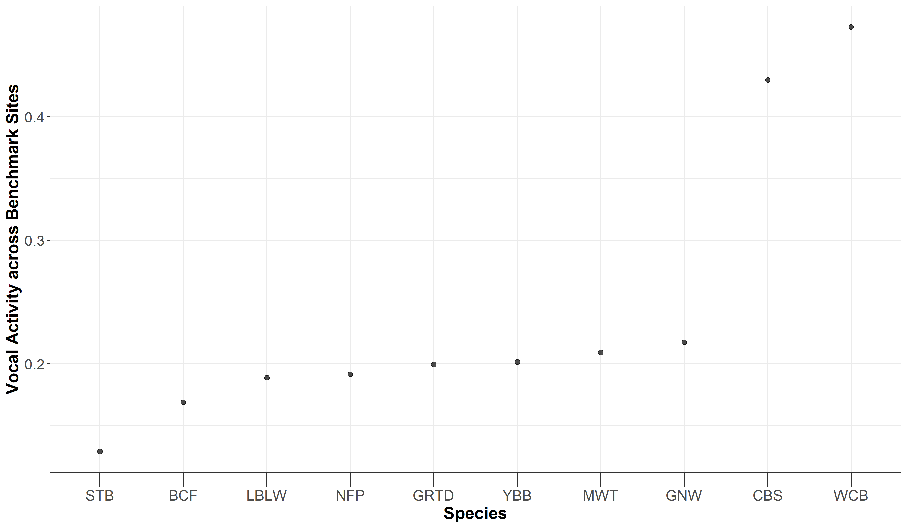
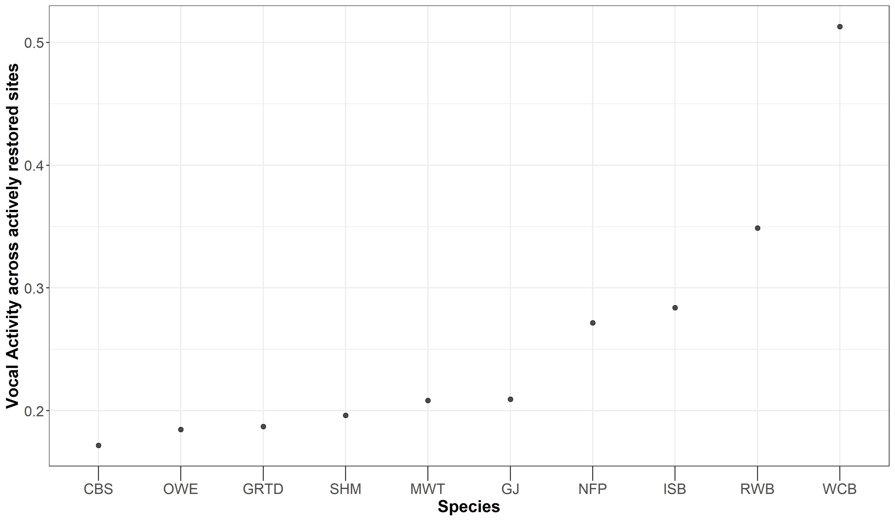
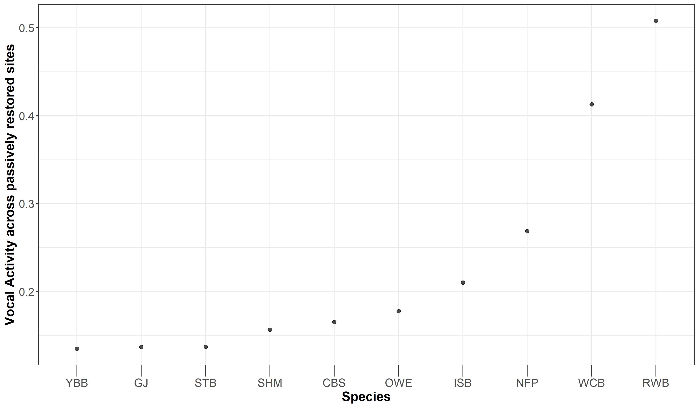

# A measure of Vocal Activity 

In this script, we will:

Calculate measures of overall vocal activity for each species

To do this, we define a measure of vocal activity as = (Cumulative number of detections of a given species)/(Overall number of acoustic clips annotated).  
We then classify a particular species as having High Vocal Activity, Moderate Vocal Activity and Low Vocal Activity if the above ratio is > 0.7, (0.4 to 0.7) and <0.4 respectively.  

We then assess if there is variation in vocal activity (as measured by number of species that are highly vocal, moderately vocal and less vocal) across treatment types. 

b) Rainforest specialist vs open-country generalist. 

b) Test if 
Highly vocal, moderately vocal and less vocal (calculated at the smallest possible temporal unit: 10s). 

Install required libraries
```{r}
library(tidyverse)
library(dplyr)
library(stringr)
library(vegan)
library(ggplot2)
library(scico)

# Source any custom/other internal functions necessary for analysis
source("code/01_internal-functions.R")
```

We will use a excel sheet of annotations, which contains 10s-clips from each site (A random 16-min was chosen between 6am and 10am and divided into 10s chunks for the ease of annotations)
```{r}
# Attach the 2020_summer_annotation data 
datSubset <- read.csv("data/datSubset.csv")

# Load the species-trait-data
trait_dat <- read.csv("data/species-trait-dat.csv")
```

Given the data annotated so far, we will calculate the overall number of detections across the smallest possible temporal duration, since there isn't a significant variation in cumulative detections as a function of the temporal duration (See acoustic-detections.Rmd). 

Please note that: the data at the moment is imbalanced in terms of nVisits
```{r}
# Calculate the overall number of detections for each site where each temporal duration chosen is a 10s clip

nDetections_10s <- datSubset %>%
  group_by(Site, Restoration.type) %>%
  transform() %>% replace(is.na(.), 0) %>% 
  summarise_at(.vars = vars(c("IP":"HSWP")),.funs = sum) 
```

Calculate the cumulative number of detections for each species and arrive at a measure of vocal activity irrespective of the treatment type in which a species was recorded in. 
```{r}

# Get rid of species with no detections across the entire data

final_spp <- nDetections_10s[,c(-1,-2)][,-(which(colSums(nDetections_10s[,c(-1,-2)])==0))]

# Add the first two columns back to the above column

nDetections <- as_tibble(data.frame(nDetections_10s[,c(1,2)],final_spp))
  
# Get the total number of clips and the number of clips annotated across each treatment type

n_clips_total <- 24672
n_clips_benchmark <- sum(datSubset$Restoration.type=="Benchmark")
n_clips_active <- sum(datSubset$Restoration.type=="Active")
n_clips_passive <- sum(datSubset$Restoration.type=="Passive")


# Calculate the cumulative number of detections for each species by treatment type

sumDet_Active <- nDetections %>%
  filter(Restoration.type=="Active") %>% # Select treatment type
  ungroup() %>%
  dplyr::select(-c(Site,Restoration.type)) %>% 
  summarise(across(everything(),sum)) %>%
  pivot_longer(1:115, names_to="Species", values_to="Count")

sumDet_Passive <- nDetections %>%
  filter(Restoration.type=="Passive") %>% # Select treatment type
  ungroup() %>%
  dplyr::select(-c(Site,Restoration.type)) %>% 
  summarise(across(everything(),sum))%>%
  pivot_longer(1:115, names_to="Species", values_to="Count")

sumDet_Benchmark <- nDetections %>%
  filter(Restoration.type=="Benchmark") %>% # Select treatment type
  ungroup() %>%
  dplyr::select(-c(Site,Restoration.type)) %>% 
  summarise(across(everything(),sum))%>%
  pivot_longer(1:115, names_to="Species", values_to="Count")

# Measures of vocal activity

# Note: Based on discussion with Akshay, scale the proportion of clips in which a species was detected to ensure that we could compare vocal activity for multiple species across treatment types

vocal_Benchmark <- sumDet_Benchmark %>%
  mutate(propDetected = Count/n_clips_benchmark) %>%
  # mutate(propDetected=range01(propDetected)) %>% 
  mutate(vocalActivity = case_when(propDetected > 0.5 ~ "High",
            propDetected > 0.2 & propDetected < 0.5 ~ "Moderate",
            propDetected < 0.2 ~ "Low")) %>%
  mutate(Restoration.Type = "Benchmark") %>%
  arrange(desc(Count))

vocal_Active <- sumDet_Active %>%
  mutate(propDetected = Count/n_clips_active) %>%
  # mutate(propDetected=range01(propDetected)) %>% 
  mutate(vocalActivity = case_when(propDetected > 0.5 ~ "High",
            propDetected > 0.2 & propDetected < 0.5 ~ "Moderate",
            propDetected < 0.2 ~ "Low")) %>%
  mutate(Restoration.Type = "Active") %>%
  arrange(desc(Count))

vocal_Passive <- sumDet_Passive %>%
  mutate(propDetected = Count/n_clips_passive) %>%
  # mutate(propDetected=range01(propDetected)) %>% 
  mutate(vocalActivity = case_when(propDetected > 0.5 ~ "High",
            propDetected > 0.2 & propDetected < 0.5 ~ "Moderate",
            propDetected < 0.2 ~ "Low")) %>%
  mutate(Restoration.Type = "Passive") %>%
  arrange(desc(Count))

```

Plot the top ten detections for each species
```{r}

# Creating a temporary plot of vocal activity as a function of the proportion of overall detections of a particular species by treatment type

fig_vocalAct_Benchmark <- ggplot(vocal_Benchmark[1:10,], aes(x=reorder(Species,propDetected), y=propDetected)) +  geom_point(alpha=0.7, size=2) + 
    scale_fill_scico_d(palette = "roma") +
    theme_bw() +
    labs(x="Species", 
       y="Vocal Activity across Benchmark Sites") +
    theme(axis.title = element_text(size = 16, face = "bold"), 
        axis.ticks.length.x = unit(.5, "cm"),
        axis.text = element_text(size = 14),
        legend.title = element_blank(),
        legend.key.size = unit(1,"cm"),
        legend.text = element_text(size = 12))

fig_vocalAct_Active <- ggplot(vocal_Active[1:10,], aes(x=reorder(Species,propDetected), y=propDetected)) +  geom_point(alpha=0.7, size=2) + 
    scale_fill_scico_d(palette = "roma") +
    theme_bw() +
    labs(x="Species", 
       y="Vocal Activity across actively restored sites") +
    theme(axis.title = element_text(size = 16, face = "bold"), 
        axis.ticks.length.x = unit(.5, "cm"),
        axis.text = element_text(size = 14),
        legend.title = element_blank(),
        legend.key.size = unit(1,"cm"),
        legend.text = element_text(size = 12))

fig_vocalAct_Passive <- ggplot(vocal_Passive[1:10,], aes(x=reorder(Species,propDetected), y=propDetected)) +  geom_point(alpha=0.7, size=2) + 
    scale_fill_scico_d(palette = "roma") +
    theme_bw() +
    labs(x="Species", 
       y="Vocal Activity across passively restored sites") +
    theme(axis.title = element_text(size = 16, face = "bold"), 
        axis.ticks.length.x = unit(.5, "cm"),
        axis.text = element_text(size = 14),
        legend.title = element_blank(),
        legend.key.size = unit(1,"cm"),
        legend.text = element_text(size = 12))

# Save the plots

ggsave(fig_vocalAct_Benchmark, filename = "figs/fig_vocalAct_Benchmark.png", width=12, height=7,device = png(), units="in", dpi = 300); dev.off()
ggsave(fig_vocalAct_Active, filename = "figs/fig_vocalAct_Active.png", width=12, height=7,device = png(), units="in", dpi = 300); dev.off()
ggsave(fig_vocalAct_Passive, filename = "figs/fig_vocalAct_Passive.png", width=12, height=7,device = png(), units="in", dpi = 300); dev.off()





```


