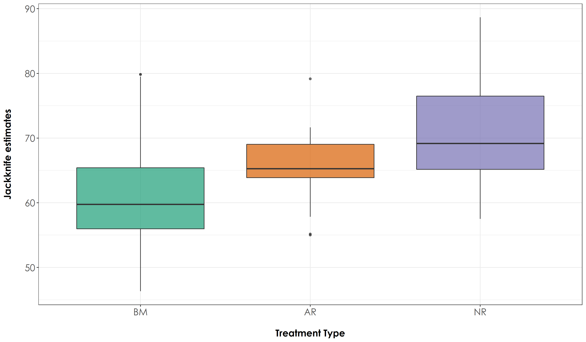

# Jackknife estimates

In this script, we will extract jackknife scores, which essentially extrapolates species richness for a given species pool. This calculation is based on the number of sites and the number of visits to each site and the number of singletons/doubletons (detecting a species only once/site and twice/site respectively).

## Install required libraries
```{r}
library(tidyverse)
library(dplyr)
library(stringr)
library(vegan)
library(ggplot2)
library(scico)
library(psych)

# Source any custom/other internal functions necessary for analysis
source("code/01_internal-functions.R")
```

## Load the necessary data to calculate Jackknife scores
```{r}
# We load the subset data
datSubset <- read.csv("results/datSubset.csv")

# Load species-trait data to essentially check for associations by habitat type
trait_dat <- read.csv("data/species-trait-dat.csv")

# Site-summary (Number of detections across all sites)
datSummary <- datSubset %>%
  group_by(Site, Restoration.type) %>%
  transform() %>% replace(is.na(.), 0) %>%
  summarise_at(.vars = vars(c("IP":"HSWP")),.funs = sum)
```


## Preparing dataframe to extract jacknife scores
```{r}
# Calculate the overall number of detections for each site across 6 days of data (translates to ~96-min of data per site; each detection corresponding to a temporal unit of 10 seconds). Here, we include dates, since each visit can explain the extrapolation of species richness when jackknife estimates are extracted. 

nDetections_site_date <- datSubset %>%
  group_by(Site, Restoration.type, Date) %>%
  transform() %>% replace(is.na(.), 0) %>%
  summarise_at(.vars = vars(c("IP":"HSWP")),.funs = sum)
  
# Combine the nDetections and trait based data to obtain a dataframe for jackknife estimates

nDetections_trait <- nDetections_site_date %>%
  pivot_longer(cols=IP:HSWP, names_to="Species_Code", values_to="count") %>%
  left_join(.,trait_dat, by=c("Species_Code"="species_annotation_codes")) %>%
  mutate(forRichness = case_when(count>0 ~ 1,count==0 ~ 0)) %>%
  rename(., nDetections = count)

# Extract jackknife scores
# To do the same, we first prepare the dataframe in a manner where we have a matrix of Site by Date by Species name

jacknifeAll <- nDetections_trait %>%
  dplyr::select(Site, Date, Species_Code, nDetections, Restoration.type) %>%
  group_by(Site, Date, Restoration.type, Species_Code) %>%
  summarise(totDetections = sum(nDetections)) %>%
  pivot_wider(names_from = Species_Code, values_from = totDetections, values_fill = list(totDetections=0))

# Prepare a dataframe of rainforest species for jacknifing

jacknife_rainForest <- nDetections_trait %>%
  filter(Habitat=="RF") %>%
  dplyr::select(Site, Date, Species_Code, nDetections, Restoration.type) %>%
  group_by(Site, Date, Restoration.type, Species_Code) %>%
  summarise(totDetections = sum(nDetections)) %>%
  pivot_wider(names_from = Species_Code, values_from = totDetections, values_fill = list(totDetections=0))

# Prepare a dataframe of open-country species for jacknifing

jacknife_openCountry <- nDetections_trait %>%
  filter(Habitat=="OC") %>%
  dplyr::select(Site, Date, Species_Code, nDetections, Restoration.type) %>%
  group_by(Site, Date, Restoration.type, Species_Code) %>%
  summarise(totDetections = sum(nDetections)) %>%
  pivot_wider(names_from = Species_Code, values_from = totDetections, values_fill = list(totDetections=0))
```

## Save scores locally
```{r}
jackAllScore <- specpool(jacknifeAll[,4:ncol(jacknifeAll)],
                       pool = jacknifeAll$Site) %>%
  rownames_to_column("Site") %>%
  add_column (Restoration.type = datSummary$Restoration.type)

# write out results
write.csv(jackAllScore, "data/jackAll.csv", row.names=F)

jack_rainForestScore <- specpool(jacknife_rainForest[,4:ncol(jacknife_rainForest)],
                       pool = jacknife_rainForest$Site) %>%
  rownames_to_column("Site") %>%
  add_column (Restoration.type = datSummary$Restoration.type) %>%
  mutate(Habitat = "RF")

# write out results
write.csv(jack_rainForestScore,"data/jackRainforest.csv", row.names = F)

jack_openCountryScore <-specpool(jacknife_openCountry[,4:ncol(jacknife_openCountry)],
                       pool = jacknife_openCountry$Site) %>%
  rownames_to_column("Site") %>%
  add_column (Restoration.type = datSummary$Restoration.type) %>%
  mutate(Habitat = "OC")

# write out results
write.csv(jack_openCountryScore, "data/jackOpencountry.csv", row.names = F)
```

## Looking at correlations between jacknife scores and bootstrap estimates
```{r}
# This plot suggests an almost 1:1 correlation between jacknife estimates and bootstrap scores
plot(jackAllScore$jack1, jackAllScore$boot)
```

## Testing for differences between treatment types

Plotting jacknife estimates and testing for any significant differences between treatment types
```{r}
# Test if there are significant differences in jacknife estimates across treatment types
anovaJackAll <- aov(jack1~Restoration.type, data = jackAllScore)

# Tukey test to study each pair of treatment - reveals no signficant difference across treatment types
tukeyJackAll <- TukeyHSD(anovaJackAll)

# The above result suggests that there is no significant different in jacknife scores between treatment types

# Create a boxplot of jacknife estimates by group (Here: group refers to Restoration Type)

# reordering factors for plotting
jackAllScore$Restoration.type <- factor(jackAllScore$Restoration.type, levels = c("Benchmark", "Active", "Passive"))

fig_jackAll <- ggplot(jackAllScore, aes(x=Restoration.type, y=jack1, fill=Restoration.type)) +  geom_boxplot(alpha=0.7) + 
    scale_fill_scico_d(palette = "roma") +
    theme_bw() +
    labs(x="\nTreatment Type", 
       y="Jackknife estimates\n") +
  scale_x_discrete(labels = c('BM','AR','NR')) +
    theme(axis.title = element_text(family = "Century Gothic",
      size = 14, face = "bold"),
        axis.text = element_text(family="Century Gothic",size = 14),
        legend.position = "none")

ggsave(fig_jackAll, filename = "figs/fig_jackAll.png", width=12, height=7,
       device = png(), units="in", dpi = 300); dev.off()
```


## Jacknife scores by species traits

Let's test for significant differences in jacknife estimates as a function of species trait
```{r}
anovaJack_rainForest <- aov(jack1~Restoration.type, data = jack_rainForestScore)
anovaJack_openCountry <- aov(jack1~Restoration.type, data = jack_openCountryScore)

# Tukey test to study each pair of treatment 
tukeyJack_rainForest <- TukeyHSD(anovaJack_rainForest)
tukeyJack_openCountry <- TukeyHSD(anovaJack_openCountry)

# For rainforest species - there is no significant difference in jacknife estimates between any treatment types, while for open-country birds; there is a significant difference in jacknife estimates across active-benchmark and passive-benchmark

# Plot the above results

jackTrait <- bind_rows(jack_rainForestScore, jack_openCountryScore)

# reordering factors for plotting
jackTrait$Restoration.type <- factor(jackTrait$Restoration.type, levels = c("Benchmark", "Active", "Passive"))

# Rainforest species
fig_jackTrait <- ggplot(jackTrait, aes(x=Restoration.type, y=jack1, fill=Habitat)) +
    geom_boxplot(alpha=0.7) + 
    scale_fill_scico_d(palette = "roma",
                     labels=c("Open-country","Rainforest")) +
     theme_bw() +
    labs(x="\nTreatment Type", 
       y="Jackknife estimates\n") +
  scale_x_discrete(labels = c('BM','AR','NR')) +
    theme(axis.title = element_text(family="Century Gothic",
                                    size = 14, face = "bold"), 
        axis.text = element_text(family="Century Gothic",size = 14),
        legend.title = element_text(family="Century Gothic",
                                    size = 14, face = "bold"),
        legend.key.size = unit(1,"cm"),
        legend.text = element_text(family="Century Gothic",size = 14))

ggsave(fig_jackTrait, filename = "figs/fig_jackTrait.png", width=12, height=7,device = png(), units="in", dpi = 300); dev.off()

# Please note that this figure is required to create the Fig 4a in the next script.
```

