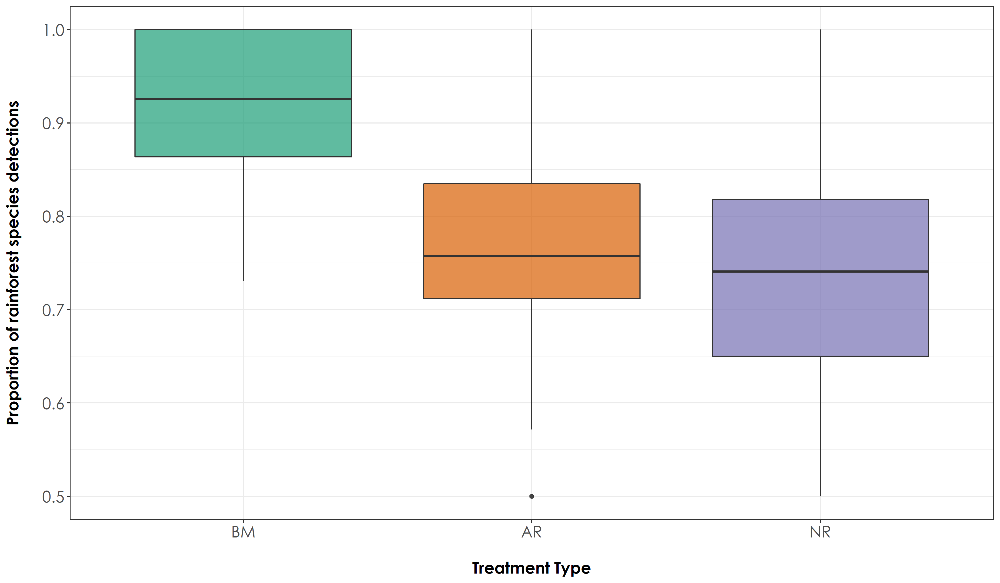

# Species proportions

In this script, we will calculate the proportion of rainforest and open-country bird species that was detected across the three treatment types for a given period of time. Species richness may only give us a broader understanding of the overall levels of diversity, but getting at a measure of abundance (where we calculate the proportion of rainforest and open-country birds that were vocal in a given habitat type for a given period of time) may provide insights on the use of a particular habitat - an important question that needs to be answered, given that we would like to understand if fauna are using actively restored habitats.  

### Install required libraries
```{r}
library(tidyverse)
library(dplyr)
library(stringr)
library(vegan)
library(ggplot2)
library(scico)
library(data.table)
library(extrafont)

# Source any custom/other internal functions necessary for analysis
source("code/01_internal-functions.R")
```

### Load the necessary data to calculate proportions
```{r}
# We load the subset data
datSubset <- read.csv("results/datSubset.csv")

# Load species-trait data to essentially check for associations by habitat type
trait_dat <- read.csv("data/species-trait-dat.csv")

# Site-summary (Number of detections across all sites)
datSummary <- datSubset %>%
  group_by(Site, Restoration.type) %>%
  transform() %>% replace(is.na(.), 0) %>%
  summarise_at(.vars = vars(c("IP":"HSWP")),.funs = sum)
```

### Proportion of acoustic detections across all 10-s chunks for every site-date combination
```{r}
# Calculate the overall number of detections for each site across 6 days of data (translates to ~96-min of data per site; each detection corresponding to a temporal unit of 10 seconds). Here, we include dates, since each visit can explain the detections/proportion of detections for future modeling.   

nDetections_site_date <- datSubset %>%
  group_by(Site, Restoration.type, Date) %>%
  transform() %>% replace(is.na(.), 0) %>%
  summarise_at(.vars = vars(c("IP":"HSWP")),.funs = sum)

# Combine the nDetections and trait based data

nDetections_trait <- nDetections_site_date %>%
  pivot_longer(cols=IP:HSWP, names_to="Species_Code", values_to="count") %>%
  left_join(.,trait_dat, by=c("Species_Code"="species_annotation_codes")) %>%
  mutate(forProp = case_when(count>0 ~ 1,count==0 ~ 0)) %>%
  rename(., nDetections = count)

# Extract proportion of acoustic detections
totRainDetections <- nDetections_trait %>%
  filter(habitat=="RF") %>%
  group_by(Site, Date, Restoration.type) %>%
  summarise(totRFDetections = sum(nDetections))

totOpenDetections <- nDetections_trait %>%
  filter(habitat=="OC") %>%
  group_by(Site, Date, Restoration.type) %>%
  summarise(totOCDetections = sum(nDetections))

# proportion of acoustic detections (note: sampling unit =  10-s)
prop <- left_join(totRainDetections, totOpenDetections, 
                   by=c("Site","Date","Restoration.type")) %>%
  mutate(propRF = (totRFDetections)/(totRFDetections + totOCDetections)) %>%
  mutate(propOC = (1 - propRF))

# write the above results
write.csv(prop, "results/acoustic-detections.csv", row.names = F)
```

### Testing for differences in species acoustic detections across treatment types

Plotting proportion of rainforest and open -country species detections and testing for any significant differences between treatment types
```{r}
# Test if there are significant differences in the proportion of rainforest species across treatment types
anovaPropRF <- aov(propRF~Restoration.type, data = prop)
tukeyPropRF <- TukeyHSD(anovaPropRF)

# Test if there are significant differences in the proportion of open country species across treatment types
anovaPropOC <- aov(propOC~Restoration.type, data = prop)
tukeyPropOC <- TukeyHSD(anovaPropOC)

# The above result suggests that there is a significant difference in the proportion of detections of rainforest  and open-country species across treatment types

# reordering factors for plotting
prop$Restoration.type <- factor(prop$Restoration.type, levels = c("Benchmark", "Active", "Passive"))
# Add a custom set of colors
mycolors <- c(brewer.pal(name="Dark2", n = 3), brewer.pal(name="Paired", n = 3))

fig_propRF <- ggplot(prop, aes(x=Restoration.type, y=propRF, fill=Restoration.type)) +  geom_boxplot(alpha=0.7) + 
    scale_fill_manual("Treatment type",values=mycolors, labels=c("BM","AR","NR")) +
    theme_bw() +
    labs(x="\nTreatment Type", 
       y="Proportion of rainforest species detections\n") +
  scale_x_discrete(labels = c('BM','AR','NR')) +
    theme(axis.title = element_text(family = "Century Gothic",
      size = 14, face = "bold"),
        axis.text = element_text(family="Century Gothic",size = 14),
        legend.position = "none")

ggsave(fig_propRF, filename = "figs/fig_acousticDetections_propRF.png", width=12, height=7, device = png(), units="in", dpi = 300); dev.off()

fig_propOC <- ggplot(prop, aes(x=Restoration.type, y=propOC, fill=Restoration.type)) +  geom_boxplot(alpha=0.7) + 
    scale_fill_manual("Treatment type",values=mycolors, labels=c("BM","AR","NR")) +
    theme_bw() +
    labs(x="\nTreatment Type", 
       y="Proportion of open-country species detections\n") +
  scale_x_discrete(labels = c('BM','AR','NR')) +
    theme(axis.title = element_text(family = "Century Gothic",
      size = 14, face = "bold"),
        axis.text = element_text(family="Century Gothic",size = 14),
        legend.position = "none")

ggsave(fig_propOC, filename = "figs/fig_acousticDetections_propOC.png", width=12, height=7, device = png(), units="in", dpi = 300); dev.off()
```


### Proportion of detections across acoustic point counts

Here, we repeat the above analysis with a different sampling unit, where the total number of detections of a species was estimated for each point count rather than across 10-s chunks. In other words, if a species was detected thrice vocally, it was marked as a single detection in that point count. 
```{r}
# Rather than summing the total number of detections across all 10-s clips for every 16-min, here we calculate the proportion of times a species was detected in six visits. 

# Extract proportion of rainforest species detections across six visits
totRainVisits <- nDetections_trait %>%
  filter(habitat=="RF") %>%
  group_by(Site, Date, Restoration.type) %>%
  summarise(totRF = sum(forProp))

totOpenVisits <- nDetections_trait %>%
  filter(habitat=="OC") %>%
  group_by(Site, Date, Restoration.type) %>%
  summarise(totOC = sum(forProp))

# proportion of acoustic detections (note: sampling unit =  1 point count)
propVisit <- left_join(totRainVisits, totOpenVisits, 
                   by=c("Site","Date","Restoration.type")) %>%
  mutate(propRF = (totRF)/(totRF + totOC)) %>%
  mutate(propOC = (1 - propRF))

# write the above results to a file
write.csv(propVisit, "results/acoustic-detections-across-visits.csv", row.names = F)
```

### Testing for differences in rainforest and open-country species detections across acoustic point counts
```{r}
# Test if there are significant differences in the proportion of rainforest species across treatment types
anovaRF <- aov(propRF~Restoration.type, data = propVisit)
tukeyRF <- TukeyHSD(anovaRF)

# Test if there are significant differences in the proportion of rainforest species across treatment types
anovaOC <- aov(propOC~Restoration.type, data = propVisit)
tukeyOC <- TukeyHSD(anovaOC)

# The above result suggests that there is a significant difference in the proportion of detections of rainforest and open-country species across all treatment types at the level of an acoustic point count. 

# Create a boxplot of proportion estimates by group (Here: group refers to Restoration Type)

# reordering factors for plotting
propVisit$Restoration.type <- factor(propVisit$Restoration.type, levels = c("Benchmark", "Active", "Passive"))

fig_RF <- ggplot(propVisit, aes(x=Restoration.type, y=propRF, fill=Restoration.type)) +  geom_boxplot(alpha=0.7) + 
    scale_fill_manual("Treatment type",values=mycolors, labels=c("BM","AR","NR")) +
    theme_bw() +
    labs(x="\nTreatment Type", 
       y="Proportion of rainforest species detections\n") +
  scale_x_discrete(labels = c('BM','AR','NR')) +
    theme(axis.title = element_text(family = "Century Gothic",
      size = 14, face = "bold"),
        axis.text = element_text(family="Century Gothic",size = 14),
        legend.position = "none")

ggsave(fig_RF, filename = "figs/fig_acousticPointCount_propRF.png", width=12, height=7, device = png(), units="in", dpi = 300); dev.off()

fig_OC <- ggplot(propVisit, aes(x=Restoration.type, y=propOC, fill=Restoration.type)) +  geom_boxplot(alpha=0.7) + 
    scale_fill_manual("Treatment type",values=mycolors, labels=c("BM","AR","NR")) +
    theme_bw() +
    labs(x="\nTreatment Type", 
       y="Proportion of open-country species detections\n") +
  scale_x_discrete(labels = c('BM','AR','NR')) +
    theme(axis.title = element_text(family = "Century Gothic",
      size = 14, face = "bold"),
        axis.text = element_text(family="Century Gothic",size = 14),
        legend.position = "none")

ggsave(fig_OC, filename = "figs/fig_acousticPointCount_propOC.png", width=12, height=7, device = png(), units="in", dpi = 300); dev.off()
```



