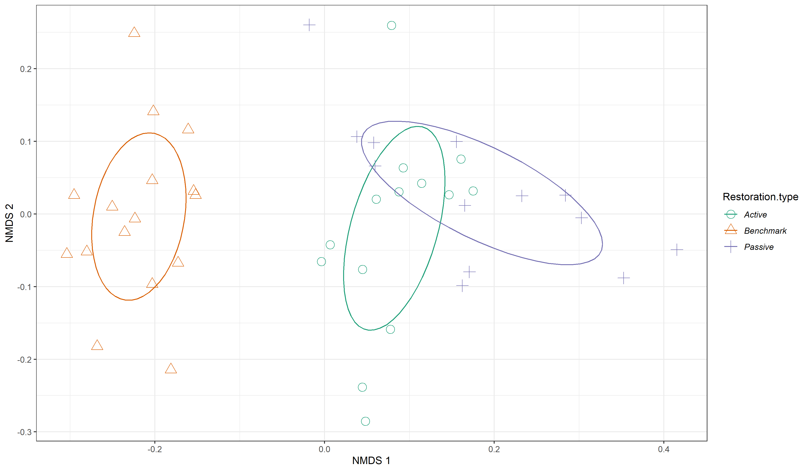
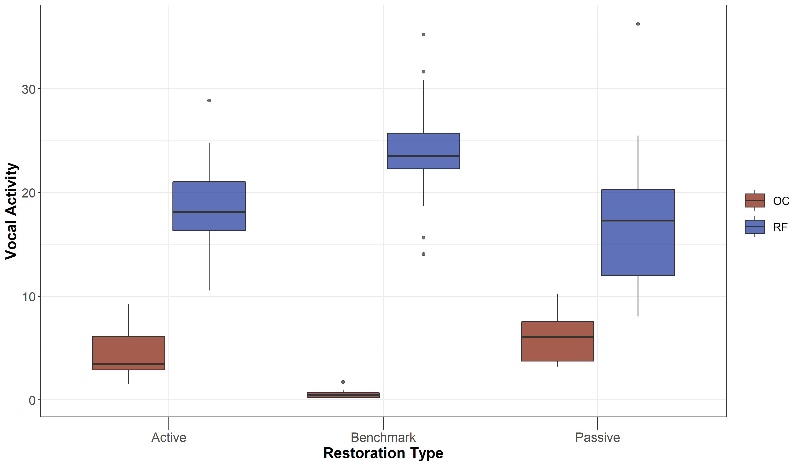
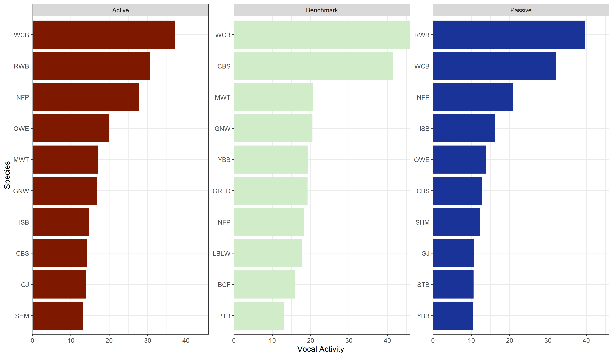

# A measure of Vocal Activity 

In this script, we will:

Calculate measures of overall vocal activity for each species

To do this, we define a measure of vocal activity as = (Cumulative number of detections of a given species)/(Overall number of acoustic clips annotated for that treatment type).

Please note: Cue rate = Measure of vocalizations per unit time

We can assess:

a) If overall vocal activity as defined above varies as a function of treatment type. 

b) If vocal activity varies as a function of a species being a rainforest specialist vs open-country generalist across treatment types.


Install required libraries
```{r}
library(tidyverse)
library(dplyr)
library(stringr)
library(vegan)
library(ggplot2)
library(scico)
library(tidytext)

# Source any custom/other internal functions necessary for analysis
source("code/01_internal-functions.R")
```

We will use a excel sheet of annotations, which contains 10s-clips from each site (A random 16-min was chosen between 6am and 10am and divided into 10s chunks for the ease of annotations)
```{r}
# Attach the annotation data 
datSubset <- read.csv("data/datSubset.csv")

# Load the species-trait-data
trait_dat <- read.csv("data/species-trait-dat.csv")
```

Given the data annotated so far, we will calculate the overall number of detections across the smallest possible temporal duration, since there isn't a significant variation in cumulative detections as a function of the temporal duration (See acoustic-detections.Rmd). 

Please note that: the data at the moment is imbalanced in terms of nVisits
```{r}
# Calculate the overall number of detections for each site where each temporal duration chosen is a 10s clip
nDetections <- datSubset %>%
  group_by(Site, Restoration.type) %>%
  transform() %>% replace(is.na(.), 0) %>% 
  summarise_at(.vars = vars(c("IP":"HSWP")),.funs = sum) 
```

Calculate the cumulative number of detections for each species and arrive at a measure of vocal activity irrespective of the treatment type in which a species was recorded in. Vocal activity (or using the definition of cue rate) = (Number of detections of that species)/(total time over which the recording was made).

In other words, if a white-cheeked barbet was detected ~40 times over 400 seconds, then its vocal activity would be (40/400) = 0.1
```{r}
# number of visits to each unique site in seconds:
# This gives you a sense of sampling effort in seconds and minutes at each site

nSites_visits <- datSubset %>%
  dplyr::select(Site, Date)%>%
  distinct() %>% arrange(Site) %>% count(Site) %>%
  mutate(timeInSeconds = (n*16*60)) %>%
  mutate(timeInMinutes = (n*16))

# merge the above dataframe with the detections dataframe and calculate vocal activity in minutes

vocalActivity <- nDetections %>%
  full_join(nSites_visits, by=c("Site")) %>%
  mutate_at(.vars = vars(c("IP":"HSWP")), ~.x/timeInMinutes)

totalCallingRate <- vocalActivity %>%
   rowwise() %>% 
   summarise(totCallingRate = sum(c_across(IP:HSWP)))

write.csv(totalCallingRate,"data/total-calling-rate-per-site.csv", row.names = F)
```


Preparing a dataframe of vocal activity to run ordinations
```{r}
# Remove columns not needed for ordination analysis
nmdsDat <- vocalActivity %>%
  dplyr::select(-n, -timeInSeconds, -timeInMinutes)

# Convert to matrix form
nmdsDatMatrix <- as.matrix(nmdsDat[, 3:ncol(nmdsDat)])

# Run a bray-curtis dissimilarity index and use metaMDS function from vegan to run ordinations

disBrayCurtis <- vegdist(nmdsDatMatrix, method = "bray")

nmdsBrayCurtis <- vegdist (nmdsDatMatrix, method = "bray") %>% 
  metaMDS (nmdsBrayCurtis, k=6)

# extract nmds scores
nmdsScores <- as.tibble(scores(nmdsBrayCurtis))

# Write the scores to a separate .csv
write.csv(nmdsScores, "data/nmdsBrayCurtis-vocal-activity.csv", row.names = F)

# With the above analysis, we note the stress is 0.06172835. However, if stress is high, we should reposition the points in 2 dimensions in the direction of decreasing stress, and repeat until stress is below some threshold.**A good rule of thumb: stress < 0.05 provides an excellent representation in reduced dimensions, < 0.1 is great, < 0.2 is good/ok, and stress < 0.3 provides a poor representation.** To reiterate: high stress is bad, low stress is good!
```


Plotting the NMDS scores using ggplot2
```{r}
# First let's add the treatment type back to the nmds scores
nmdsScores$Restoration.type <- nmdsDat$Restoration.type

# Add a custom set of colors
mycolors <- c(brewer.pal(name="Dark2", n = 3), brewer.pal(name="Paired", n = 3))

fig_nmds <- ggplot(data=nmdsScores) + 
  stat_ellipse(aes(x=NMDS1,y=NMDS2,colour=Restoration.type),level = 0.50) +
  geom_point(aes(x=NMDS1,y=NMDS2,shape=Restoration.type,colour=Restoration.type),size=4) + 
  theme_bw() +
  scale_x_continuous(name="NMDS 1") + 
  scale_y_continuous(name="NMDS 2") +
  scale_shape_manual(values= 1:length(unique(nmdsScores$Restoration.type)))+
  scale_color_manual(values=mycolors)+ theme(legend.key = element_blank(), legend.text = element_text(face = "italic"))

ggsave(fig_nmds, filename = "figs/fig_nmds_vocalActivity.png", width=12, height=7,device = png(), units="in", dpi = 300); dev.off()


```


Using species trait data to check if vocal activity varies by treatment type as a function of whether a species is a rainforest specialist vs. open-country specialist.To do so: Add an additional column of species-trait data and group data based on the same.
```{r}
# First, we pivot the species-codes and then match the codes with trait_data and reformat the data to keep all detections>0 as 1 else they are 0

vocal_trait <- vocalActivity %>%
  pivot_longer(cols=IP:HSWP, names_to="Species_Code", values_to="vocalActivity") %>%
  left_join(.,trait_dat, by=c("Species_Code"="species_annotation_codes"))

# Calculate overall vocal activity/cue rate for each site as a function of rainforest species and open-country species

sum_vocal_trait <-  vocal_trait %>%
  dplyr::select(Site, Restoration.type, Species_Code, Habitat, vocalActivity)%>%
  group_by(Site, Restoration.type, Habitat) %>%
  summarise(overallVocalActivity = sum(vocalActivity))

# Let's subset data for vocal activity as a function of rainforest specialists and open-country generalists and test for significant differences (if any)
vocal_rainforest <- sum_vocal_trait %>%
  filter(Habitat=="RF")
vocal_opencountry <- sum_vocal_trait %>%
  filter(Habitat=="OC")

# Test if there are significant differences in vocal activity across treatment types as a function of species trait
anova_rainforest <- aov(overallVocalActivity~Restoration.type, data = vocal_rainforest)
anova_opencountry <- aov(overallVocalActivity~Restoration.type, data = vocal_opencountry)

# Tukey test to study each pair of treatment

# For rainforest birds, there is a significant difference in vocal activity between benchmark-passive sites
tukey_rainforest <- TukeyHSD(anova_rainforest)

# For open-country birds, there is a significant difference in vocal activity across each treatment pair
tukey_opencountry <- TukeyHSD(anova_opencountry)

# Plot the above result
fig_vocal_trait <- ggplot(sum_vocal_trait, aes(x=Restoration.type, y=overallVocalActivity, fill=Habitat)) +
    geom_boxplot(alpha=0.7) + 
  scale_fill_scico_d(palette = "roma") +
    theme_bw() +
    labs(x="Restoration Type", 
       y="Vocal Activity") +
    theme(axis.title = element_text(size = 16, face = "bold"), 
        axis.ticks.length.x = unit(.5, "cm"),
        axis.text = element_text(size = 14),
        legend.title = element_blank(),
        legend.key.size = unit(1,"cm"),
        legend.text = element_text(size = 12))

ggsave(fig_vocal_trait, filename = "figs/fig_vocalActivity_trait.png", width=12, height=7,device = png(), units="in", dpi = 300); dev.off()


```


What are the most vocal species at each site?
```{r}
sum_vocal_species <- vocal_trait %>%
  group_by(Restoration.type, Species_Code) %>%
  summarise(vocalActivity = sum(vocalActivity))

# Top ten species (most vocal ones) across each restoration type
top10_vocal <- sum_vocal_species %>%
  group_by(Restoration.type) %>%
  top_n(10, vocalActivity)
```


Plot the above results of the top ten vocal species by restoration type
```{r}
fig_vocalAct <- top10_vocal %>%
  mutate(Species_Code = reorder_within(Species_Code, vocalActivity,
                                       Restoration.type)) %>%
    ggplot(aes(Species_Code, vocalActivity, fill = Restoration.type)) +
    geom_col(show.legend = FALSE) +
    facet_wrap(~Restoration.type, scales = "free_y") +
    coord_flip() +
    scale_x_reordered() +
    scale_y_continuous(expand = c(0,0)) + 
    scale_fill_scico_d(palette = "roma") +
    theme_bw() +
    labs(x="Species", 
       y="Vocal Activity") 

# Save the plot

ggsave(fig_vocalAct, filename = "figs/fig_vocalAct.png", width=12, height=7,device = png(), units="in", dpi = 300); dev.off()



```
