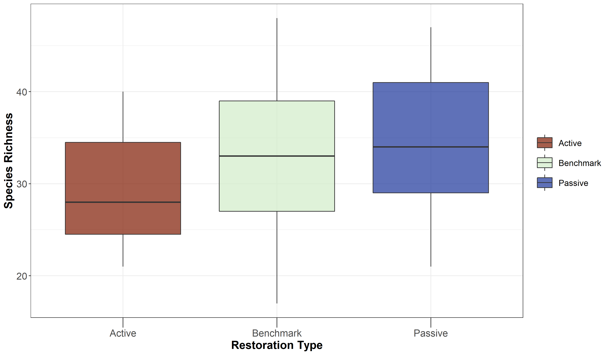
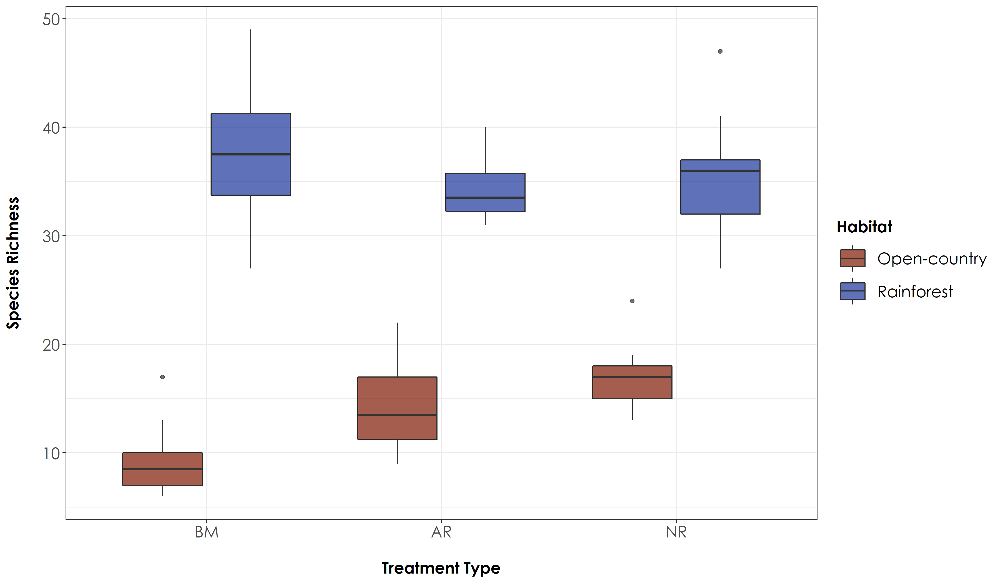
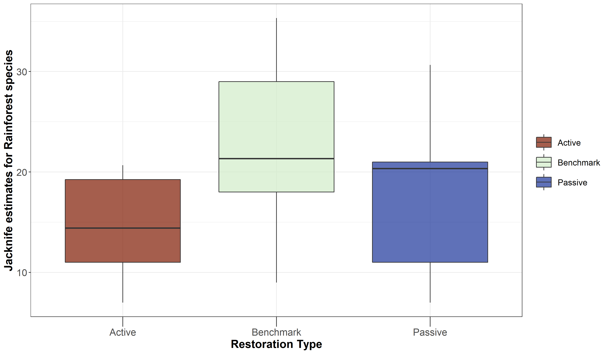
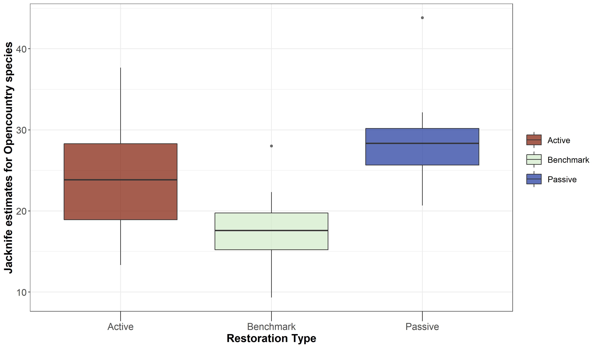
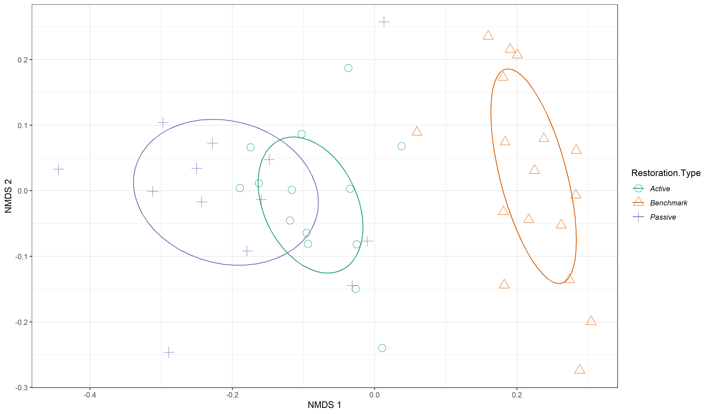
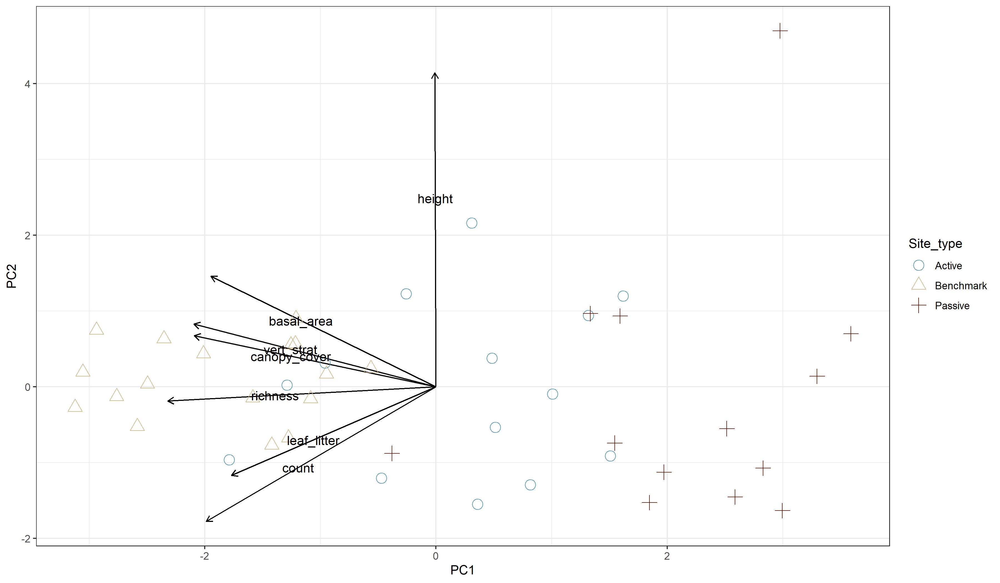

--- 
knit: "bookdown::render_book"
title: "Source code for _Using acoustics to evaluate the impact of forest restoration on bird communities in the Western Ghats_"
author:
    - Vijay Ramesh
    - Akshay VA
    - VV Robin
    - Ruth DeFries
date: "`r Sys.Date()`"
site: bookdown::bookdown_site
output: 
  bookdown::gitbook:
    fig_caption: yes
  bookdown::pdf_document2:
    documentclass: scrreprt
    toc-depth: 1
    secnumdepth: 2
    geometry: "left=4cm, right=3cm, top=2.5cm, bottom=2.5cm"
bibliography: 
biblio-style: apalike
link-citations: yes
github-repo: vjjan91/acoustics-westernGhats
---
```{r include=FALSE, cache=FALSE}
knitr::opts_knit$set(root.dir = here::here())
set.seed(1)
options(digits = 3)

knitr::opts_chunk$set(
  comment = "#>",
  collapse = TRUE,
  cache = FALSE,
  eval = FALSE,
  warning = FALSE,
  error = FALSE,
  message = FALSE,
  out.width = "\\textwidth",
  attr.source = ".numberLines",
  fig.align = "center",
  fig.width = 7,
  fig.asp = 0.618, # 1 / phi
  fig.show = "hold",
  python.reticulate = FALSE
)
options(knitr.kable.NA = "")
options(dplyr.print_min = 6, dplyr.print_max = 6)
```

# Introduction

This is the readable version that showcases analyses carried out to test the impacts of forest restoration on bird communities in the Anamalai hills of the Western Ghats biodiversity hotspot. 

## Attribution

Please contact the following in case of interest in the project.

- Vijay Ramesh (lead author)
    - PhD student, Columbia University

## Data access

The data used in this work will be archived and made public upon publication.

## Data processing

The data processing for this project is described in the following sections. Navigate through them using the links in the sidebar.

<!--chapter:end:index.Rmd-->

---
editor_options: 
  chunk_output_type: console
---
```{r include=FALSE, cache=FALSE}
knitr::opts_knit$set(root.dir = here::here())
set.seed(1)
options(digits = 3)

knitr::opts_chunk$set(
  comment = "#>",
  collapse = TRUE,
  cache = FALSE,
  eval = FALSE,
  warning = FALSE,
  error = FALSE,
  message = FALSE,
  out.width = "\\textwidth",
  attr.source = ".numberLines",
  fig.align = "center",
  fig.width = 7,
  fig.asp = 0.618, # 1 / phi
  fig.show = "hold",
  python.reticulate = FALSE
)
options(knitr.kable.NA = "")
options(dplyr.print_min = 6, dplyr.print_max = 6)
```

# Splitting large .wav files into smaller chunks

Here, we will first split the raw data which was collected for 24 hours at a site, for 7 days at a stretch. Deployment schedule was set to record for 4-minutes and switched off for 1-min. For the sake of analysis and future work, I will split the data into 10s chunks, which will be annotated manually using Raven Pro. 
```{r}
# Loading required libraries
library(warbleR)
library(seewave)
library(dplyr)
library(stringr)
library(tools)

# Source any custom/other internal functions necessary for analysis
source("code/01_internal-functions.R")
```

Now, we will use warbleR::split.wavs() to split a large file

Steps: 1. Load a list of .wav files in a given folder (will have to be done site by site)
2. Select only files between 6am and 10am (to begin with)
3. Select only a random consecutive 16 min of data (to begin with)
3. Split file into chunks of a given duration.
4. Give unique names to each split file

```{r}
# List the path that contains all folders, which contain the audiomoth data
path <- "C:\\data\\"

# Listing the folders within which .WAV files are stored
folders <- dir(path, recursive=F,full.names=T)

# Now get only those files that begin at 6am and end at 10am
files <- list()

for(i in 1:length(folders)){

setwd(folders[i])

# List the files within each folder and renaming the files with the prefix - SITE_ID
a <- list.files(paste0(path,basename(folders)[i],"\\"), full.names = T)
file.rename(from = a, to=paste0(basename(folders)[i],"_",basename(a)))

# Extract the strings for .wav files between 6am and 10am
time_str <- list.files(paste0(path,basename(folders)[i],"\\"),full.names = T) %>%
                    tools::file_path_sans_ext() %>% str_extract('\\d+$')
time_str <- time_str[time_str>="060000" & time_str <="100000"]

  for(j in 1:length(unique(time_str))){
    
    b <- list.files(paste0(path,basename(folders)[i],"\\"),full.names = T,
                    pattern = time_str[j])
    files <- c(files,b)
    }
}

# These are the list of files we need
files <- unlist(files)

# Now we choose a random consecutive 16 min of data between 6am and 10am
# Get a list of unique dates (since we will be generating a random 16min for every date across every site)

site_date <- str_extract(basename(files),'\\w+_\\d+_')
unique(site_date) # Give you unique date and sites for which we need to generate 16 min of data

subset_files <- list()

for(i in 1:length(unique(site_date))){
  
  a <- files[str_detect(files,unique(site_date)[i])]
  subset_dat <- extractRandWindow(a,4)
  subset_dat <- na.exclude(subset_dat) # If there are less than 4 files
  subset_files <- c(subset_files, subset_dat)
}

final_subset <- unlist(subset_files)

# Subset those files and copy it to a separate folder
dir.create(paste0(path,"subset"))
file.copy(from = final_subset, to="C:\\data\\subset\\")

```

Split the files and provide unique names to each file
```{r}
# Note: the path you choose to store data is upto the user.
subset_path <- "C:\\data\\subset\\"

# Split the files into n-second chunks
split_wavs(path=subset_path, sgmt.dur = 10, parallel=4)

# Get files that need to be renamed
split_files <- list.files(subset_path, full.names = T, pattern = "-")

# Note the number of chunks will vary as a function of segment duration
# 240 seconds = 24 chunks each of 10s

setwd(subset_path)

chunks <- c("01-10","10-20","20-30",
            "30-40","40-50","50-60",
            "60-70","70-80","80-90",
            "90-100","100-110","110-120",
            "120-130","130-140","140-150",
            "150-160","160-170","170-180",
            "180-190","190-200","200-210",
            "210-220","220-230","230-240")

for(i in 1:length(chunks)){
  c <- split_files[endsWith(split_files,paste0("-",i,".wav"))]
  d <- str_replace(c,paste0("-",i),paste0("_",chunks[i]))
  file.rename(from=c, to=d)
}

# Remove the original files
orig_files <- list.files(subset_path, full.names = T, pattern = ".WAV$")
file.remove(orig_files)
```

Now, go ahead and begin the process of manual annotation :)

<!--chapter:end:01_split-large-wavs.Rmd-->

---
editor_options: 
  chunk_output_type: console
---
```{r include=FALSE, cache=FALSE}
knitr::opts_knit$set(root.dir = here::here())
set.seed(1)
options(digits = 3)

knitr::opts_chunk$set(
  comment = "#>",
  collapse = TRUE,
  cache = FALSE,
  eval = FALSE,
  warning = FALSE,
  error = FALSE,
  message = FALSE,
  out.width = "\\textwidth",
  attr.source = ".numberLines",
  fig.align = "center",
  fig.width = 7,
  fig.asp = 0.618, # 1 / phi
  fig.show = "hold",
  python.reticulate = FALSE
)
options(knitr.kable.NA = "")
options(dplyr.print_min = 6, dplyr.print_max = 6)
```

# Species Richness Calculations

In this script, we will calculate:

a) Site-wise species richness to understand if species composition across treatment types are distinctly different. 
b) Repeat the above three calculations, but using species traits - If a species is a rainforest specialist or an open-country generalist.

Install required libraries
```{r}
library(tidyverse)
library(dplyr)
library(stringr)
library(vegan)
library(ggplot2)
library(scico)
library(data.table)
library(ggpubr)

# Source any custom/other internal functions necessary for analysis
source("code/01_internal-functions.R")
```

To start with, we will compute species richness from 3 non-consecutive days for each site for each season (following Campos-Cerqueira et al., 2019)

We will use a excel sheet of annotations, which contains 10s-clips from each site (A random 16-min was chosen between 6am and 10am and divided into 10s chunks for the ease of annotations)
```{r}
# Attach the 2020_summer_annotation data 
data <- read.csv("data/2020-summer-annotation-working-document.csv")

# Site-wise sorting of the 16-min of data
# Split the file names into 4 columns : Site, Date, Time and Splits   
data <- separate(data, col = Filename, into = c("Site", "Date", "Time", "Splits"), sep = "_")
data

# Load the species-trait-data
trait_dat <- read.csv("data/species-trait-dat.csv")
```

How many visits (counted as number of unique days) to a site has been annotated? Please note that some sites have more than 3 visits to a site, and hence we ensure that we choose only three non-consecutive visits to a given site
```{r}
# At the moment 1-3 days at each site has been annotated
# Some sites have only 1 visit. See SEL sites (Selaliparai)
# Some sites even have 4 visits, but we will choose 3 random visits only

# Number of visits to a particular site
nSites_Days <- data %>%
  dplyr::select(Site, Date)%>%
  distinct() %>% arrange(Site) %>% count(Site)

# Unique date site combination to give you a sense of sampling
uniqueSiteDate <- data %>%
  group_by(Site) %>%
  distinct(Date)

# Convert date column to YMD format using lubridate::ymd()
uniqueSiteDate$Date <- lubridate::ymd(uniqueSiteDate$Date)

# The below lines of code were written following a query on stackOverflow to select three non-consecutive visits to any site
# Link: https://stackoverflow.com/questions/67212152/select-non-consecutive-dates-for-every-grouped-element-in-r

nonConVisits <- uniqueSiteDate%>% 
  ungroup() %>% 
  group_split(Site) %>% 
  map_df(., ~ .x %>% ungroup() %>%
           arrange(Date) %>%
           mutate(n = 1) %>%
           complete(Date = seq.Date(first(Date), last(Date), by = 'days')) %>%
           group_by(n = cumsum(is.na(n))) %>%
           filter(!is.na(Site)) %>%
           filter(row_number() %% 2 == 1) %>%
           ungroup() %>%
           sample_n(min(n(), 3))
         ) %>%
  select(-n)

# Change the structure of the date column back to character for using one of the join functions
nonConVisits$Date <- str_remove_all(as.character(nonConVisits$Date),"-")

# Left-join with the original dataframe to subset the data for analysis
datSubset <- left_join(nonConVisits,data)

# Save this data as a .csv for future analysis (later scripts)
write.csv(datSubset,"data/datSubset.csv", row.names = F)
```

Now group the data by site and restoration type and sum the number of detections across sites. At the moment, we will calculate the overall number of detections for each 10s clip, which will be used to estimate species richness below.
```{r}
# Calculate the overall number of detections for each site across 1-3 days of data (translates to 16min to 48min of data per site)
# We would like to obtain a max of 3 visits to a site only (some sites have 4 visits)

nDetections_Site <- datSubset %>%
  group_by(Site, Restoration.Type) %>%
  transform() %>% replace(is.na(.), 0) %>%
  summarise_at(.vars = vars(c("IP":"CR")),.funs = sum) 
  
```

Convert the detections to 1, since we are interested in calculating richness per site by converting values >1 to 1 for multiple visits to a site. In other words, we want to establish overall species richness for a 16-min to 48-min window.
```{r}
richness <- nDetections_Site  %>% 
  mutate_at(vars(c("IP":"CR")),~ replace(., . > 0, 1)) %>%
  rowwise() %>% 
  mutate(richness = sum(c_across(IP:CR))) %>%
  dplyr::select(Site, Restoration.Type, richness)

# Test if there are significant differences in richness across treatment types
anovaAll <- aov(richness~Restoration.Type, data = richness)

# Tukey test to study each pair of treatment - reveals no signficant difference across treatment types
tukeyAll <- TukeyHSD(anovaAll)

# The above result suggests that there are no differences in overall species richness across treatment types

# Create a boxplot of species richness by group (Here: group refers to Restoration Type)
# Temporary plots based on uneven visits to a site. Note it ranges from 1 to 3 visits.

fig_richness <- ggplot(richness, aes(x=Restoration.Type, y=richness, fill=Restoration.Type)) +  geom_boxplot(alpha=0.7) + 
    scale_fill_scico_d(palette = "roma") +
    theme_bw() +
    labs(x="Restoration Type", 
       y="Species Richness") +
    theme(axis.title = element_text(size = 16, face = "bold"), 
        axis.ticks.length.x = unit(.5, "cm"),
        axis.text = element_text(size = 14),
        legend.title = element_blank(),
        legend.key.size = unit(1,"cm"),
        legend.text = element_text(size = 12))

ggsave(fig_richness, filename = "figs/fig_richness.png", width=12, height=7,
       device = png(), units="in", dpi = 300);dev.off()



# We observe that the overall species richness is relatively higher in passively restored forest patches, followed by benchmark (protected area) forest patches and actively restored forest patches (But these differences are not significant)
```

Using species trait data to check if species richness varies by treatment type as a function of whether a species is a rainforest specialist vs. open-country specialist.
To do so: Add an additional column of species-trait data and group data based on the same.
```{r}
# First, we pivot the species-codes and then match the codes with trait_data and reformat the data to keep all detections>0 as 1 else they are 0

richness_trait <- nDetections_Site %>%
  pivot_longer(cols=IP:CR, names_to="Species_Code", values_to="count") %>%
  left_join(.,trait_dat, by=c("Species_Code"="species_annotation_codes")) %>%
  mutate(forRichness = case_when(count>0 ~ 1,
                                 count==0 ~ 0))

# Calculate overall richness for each site as a function of rainforest species and open-country species

richness_trait <-  richness_trait %>%
  dplyr::select(Site, Restoration.Type, Species_Code, Habitat, forRichness) %>%
  group_by(Site, Restoration.Type, Habitat) %>%
  summarise(richness = sum(forRichness))

# Let's subset data for richness as a function of rainforest specialists and open-country generalists and test for significant differences (if any)
richness_rainforest <- richness_trait %>%
  filter(Habitat=="RF")

richness_opencountry <- richness_trait %>%
  filter(Habitat=="OC")

# Test if there are significant differences in richness across treatment types as a function of species trait
anova_rainforest <- aov(richness~Restoration.Type, data = richness_rainforest)
anova_opencountry <- aov(richness~Restoration.Type, data = richness_opencountry)

# Tukey test to study each pair of treatment - reveals no signficant difference across treatment types
tukey_rainforest <- TukeyHSD(anova_rainforest)
tukey_opencountry <- TukeyHSD(anova_opencountry)

# Plot the above result
fig_richness_trait <- ggplot(richness_trait, aes(x=Restoration.Type, y=richness, fill=Habitat)) +
    geom_boxplot(alpha=0.7) + 
    scale_fill_scico_d(palette = "roma") +
    theme_bw() +
    labs(x="Restoration Type", 
       y="Species Richness") +
    theme(axis.title = element_text(size = 16, face = "bold"), 
        axis.ticks.length.x = unit(.5, "cm"),
        axis.text = element_text(size = 14),
        legend.title = element_blank(),
        legend.key.size = unit(1,"cm"),
        legend.text = element_text(size = 12))

ggsave(fig_richness_trait, filename = "figs/fig_richness_trait.png", width=12, height=7,device = png(), units="in", dpi = 300); dev.off()


```

To make final plots, please use a combination of ggpubr and cowplot (TO BE DONE)
```{r}
mycolours <- c("#440154FF", "#21908CFF", "orange")

trial <- ggplot(richness_rainforest, aes(x=Restoration.Type, y=richness, fill = Restoration.Type)) + 
  geom_boxplot(alpha = 0.75) + 
  theme_bw() +
  scale_x_discrete(labels = c('BM','AR','NR')) +
  rremove("x.text") +
  rremove("ylab") +
  rremove("xlab") +
  ylim (NA, 52) +
  labs (x = "Rainforest species") +
  scale_fill_manual(values = mycolours, name = "Strata", labels = c('BM','AR','NR')) + stat_summary(geom = 'text', label = c("a", "b", "b"), fun = max, vjust = -1)

```


<!--chapter:end:02-species-richness.Rmd-->

---
editor_options: 
  chunk_output_type: console
---
```{r include=FALSE, cache=FALSE}
knitr::opts_knit$set(root.dir = here::here())
set.seed(1)
options(digits = 3)

knitr::opts_chunk$set(
  comment = "#>",
  collapse = TRUE,
  cache = FALSE,
  eval = FALSE,
  warning = FALSE,
  error = FALSE,
  message = FALSE,
  out.width = "\\textwidth",
  attr.source = ".numberLines",
  fig.align = "center",
  fig.width = 7,
  fig.asp = 0.618, # 1 / phi
  fig.show = "hold",
  python.reticulate = FALSE
)
options(knitr.kable.NA = "")
options(dplyr.print_min = 6, dplyr.print_max = 6)
```

# Acoustic Detections

In this script, we will calculate:

a) Total Number of detections across sites (reported for varying time intervals 10s, 30s, 1-min, 2-min, 4-min). In the previous script, we essentially calculated overall species richness with a temporal unit of 16-min. However, it is important to identify the total number of detections of a particular species for a given temporal duration, which can inform levels of vocal activity (future scripts). 
b) Repeat the above three calculations, but using species traits - If a species is a rainforest specialist or an open-country generalist.

Install required libraries
```{r}
library(tidyverse)
library(dplyr)
library(stringr)
library(vegan)
library(ggplot2)
library(scico)
```

We will use the data that was subset previously for further analysis (This contains three non-consecutive visits to each site)
```{r}
# Attach the 2020_summer_annotation data 
datSubset <- read.csv("data/datSubset.csv")

# Load the species-trait-data
trait_dat <- read.csv("data/species-trait-dat.csv")
```

Given the data annotated so far, we will calculate the overall number of detections across different temporal periods, starting from 10s to 30-s, 1-min, 2-min and 4-min. We will first calculate the overall number of detections for the shortest possible temporal duration which could be annotated confidently - 10s. 

Other durations are chosen to confirm if the number of detections vary as a function of the temporal duration. 

Please note that: the data at the moment is imbalanced in terms of nVisits
```{r}
# Calculate the overall number of detections for each site where each temporal duration chosen is a 10s clip

nDetections_10s <- datSubset %>%
  group_by(Site, Restoration.Type) %>%
  transform() %>% replace(is.na(.), 0) %>% 
  summarise_at(.vars = vars(c("IP":"CR")),.funs = sum) 
  
# Calculate the overall number of detections for each site where each temporal duration chosen is a 30s clip (In this case, every third row is chosen after grouping by Site, Date and Time)

nDetections_30s <- datSubset %>%
  mutate(Splits = case_when((Splits == "01-10" | Splits=="10-20" | Splits =="20-30") ~ "1",(Splits == "30-40" | Splits=="40-50" | Splits =="50-60") ~ "2",(Splits == "60-70" | Splits=="70-80" | Splits =="80-90") ~ "3",            (Splits == "90-100" | Splits=="100-110" | Splits =="110-120") ~ "4",             (Splits == "120-130" | Splits=="130-140" | Splits =="140-150") ~ "5",            (Splits == "150-160" | Splits=="160-170" | Splits =="170-180") ~ "6",           (Splits == "180-190" | Splits=="190-200" | Splits =="200-210") ~ "7",           (Splits == "210-220" | Splits=="220-230" | Splits =="230-240") ~"8")) %>% group_by(Site, Date, Time, Splits, Restoration.Type) %>%
  summarise_at(.vars = vars(c("IP":"CR")),.funs = sum)

# Convert nDetections >1 within a 30s period to 1 (since your temporal unit here is 30s)

nDetections_30s <- nDetections_30s %>%
  group_by(Site, Restoration.Type) %>%
  transform() %>% replace(is.na(.), 0) %>%
  mutate_at(vars(c("IP":"CR")),~ replace(., . > 0, 1)) %>%
  summarise_at(.vars = vars(c("IP":"CR")),.funs = sum)
  
# Calculate the overall number of detections for each site where each temporal duration chosen is a 60s clip (In this case, every sixth row is chosen after grouping by Site, Date and Time)

nDetections_1min <- datSubset %>%
  mutate(Splits = case_when((Splits == "01-10" | Splits=="10-20" | Splits =="20-30" |
                            Splits == "30-40" | Splits=="40-50" | Splits =="50-60") ~ "1", (Splits == "60-70" | Splits=="70-80" | Splits =="80-90" |
                         Splits == "90-100" | Splits=="100-110" | Splits =="110-120") ~ "2",
                         (Splits == "120-130" | Splits=="130-140" | Splits =="140-150" |
                         Splits == "150-160" | Splits=="160-170" | Splits =="170-180") ~ "3",
                         (Splits == "180-190" | Splits=="190-200" | Splits =="200-210" |
                         Splits == "210-220" | Splits=="220-230" | Splits =="230-240") ~"4")) %>% group_by(Site, Date, Time, Splits, Restoration.Type) %>%
  summarise_at(.vars = vars(c("IP":"CR")),.funs = sum)
  
# Convert nDetections>1 within a 1-min period to 1 (since your temporal unit here is 1-min)

nDetections_1min <- nDetections_1min %>%
  group_by(Site, Restoration.Type) %>%
  transform() %>% replace(is.na(.), 0) %>%
  mutate_at(vars(c("IP":"CR")),~ replace(., . > 0, 1)) %>%
  summarise_at(.vars = vars(c("IP":"CR")),.funs = sum) 
  
# Calculate the overall number of detections for each site where each temporal duration chosen is a 120s clip (In this case, every twelfth row is chosen after grouping by Site, Date and Time)

nDetections_2min <- datSubset %>%
  mutate(Splits = case_when((Splits == "01-10" | Splits=="10-20" | Splits =="20-30" |
                            Splits == "30-40" | Splits=="40-50" | Splits =="50-60" |
                         Splits == "60-70" | Splits=="70-80" | Splits =="80-90" |
                         Splits == "90-100" | Splits=="100-110" | Splits =="110-120") ~ "1",
                         (Splits == "120-130" | Splits=="130-140" | Splits =="140-150" |
                         Splits == "150-160" | Splits=="160-170" | Splits =="170-180" |
                         Splits == "180-190" | Splits=="190-200" | Splits =="200-210" |
                         Splits == "210-220" | Splits=="220-230" | Splits =="230-240") ~"2")) %>% group_by(Site, Date, Time, Splits, Restoration.Type) %>%
  summarise_at(.vars = vars(c("IP":"CR")),.funs = sum)
 
# Convert nDetections>1 within a 2-min period to 1 (since your temporal unit here is 2-min)

nDetections_2min <- nDetections_2min %>%
  group_by(Site, Restoration.Type) %>%
  transform() %>% replace(is.na(.), 0) %>%
  mutate_at(vars(c("IP":"CR")),~ replace(., . > 0, 1)) %>%
  summarise_at(.vars = vars(c("IP":"CR")),.funs = sum) 
  
# Calculate the overall number of detections for each site where each temporal duration chosen is a 240s clip (In this case, every twentyfourth row is chosen after grouping by Site, Date and Time)

nDetections_4min <- datSubset %>%
  group_by(Site, Date, Time, Restoration.Type) %>%
  summarise_at(.vars = vars(c("IP":"CR")),.funs = sum) 

# Convert nDetections>1 within a 4-min period to 1 (since your temporal unit here is 4-min)

nDetections_4min <- nDetections_4min %>%
  group_by(Site, Restoration.Type) %>%
  transform() %>% replace(is.na(.), 0) %>%
  mutate_at(vars(c("IP":"CR")),~ replace(., . > 0, 1)) %>%
  summarise_at(.vars = vars(c("IP":"CR")),.funs = sum)
  
```


How does the number of detections vary as a function of restoration type? (tested across different temporal durations)?
```{r}
# Testing if there is significant differences in overall number of detections across treatment types (this has been done only for the smallest temporal duration ~10s, while total number of detections have been estimated for different temporal durations)

sum_Detections10s <- nDetections_10s %>%
  rowwise() %>% 
  mutate(sumDetections = sum(c_across(IP:CR))) %>%
  dplyr::select(Site, Restoration.Type, sumDetections)

# Test if there are significant differences in detections across treatment types
anovaAllDetect <- aov(sumDetections~Restoration.Type, data = sum_Detections10s)

# Tukey test to study each pair of treatment - reveals no signficant difference across treatment types
tukeyAllDetect <- TukeyHSD(anovaAllDetect)

# Estimating total number of detections for different temporal durations

sum_Detections30s <- nDetections_30s %>%
  rowwise() %>% 
  mutate(sumDetections = sum(c_across(IP:CR))) %>%
  dplyr::select(Site, Restoration.Type, sumDetections)

sum_Detections1min <- nDetections_1min %>%
  rowwise() %>% 
  mutate(sumDetections = sum(c_across(IP:CR))) %>%
  dplyr::select(Site, Restoration.Type, sumDetections)

sum_Detections2min <- nDetections_2min %>%
  rowwise() %>% 
  mutate(sumDetections = sum(c_across(IP:CR))) %>%
  dplyr::select(Site, Restoration.Type, sumDetections)

sum_Detections4min <- nDetections_4min %>%
  rowwise() %>% 
  mutate(sumDetections = sum(c_across(IP:CR))) %>%
  dplyr::select(Site, Restoration.Type, sumDetections)

# Plotting the above (multiple plots for each temporal duration)
# Note: the cumulative number of detections across all species was obtained by summing every 16-min to 48-min set of detections across each site, including all species.

fig_sumDetections10s <- ggplot(sum_Detections10s, aes(x=Restoration.Type, y=sumDetections, fill=Restoration.Type)) +  
    geom_boxplot(alpha=0.7) + 
    scale_fill_scico_d(palette = "roma") +
    theme_bw() +
    labs(x="Restoration Type", 
       y="Cumulative Number of Detections") +
    theme(axis.title = element_text(size = 16, face = "bold"), 
        axis.ticks.length.x = unit(.5, "cm"),
        axis.text = element_text(size = 14),
        legend.title = element_blank(),
        legend.key.size = unit(1,"cm"),
        legend.text = element_text(size = 12))
  
# This plot suggests that Benchmark sites are acoustically more active than Passively restored or Actively restored sites, as expected

ggsave(fig_sumDetections10s, filename = "figs/fig_sumDetections10s.png", width=12, height=7, device = png(), units="in", dpi = 300); dev.off()

knitr::include_graphics("figs/fig_sumDetections10s.png")
```

How does the cumulative number of detections vary by treatment type, as a function of whether a species is a rainforest specialist or an open country generalist? (These calculations are repeated for different temporal durations to assess differences, if any)

```{r}
# First we merge the species trait dataset with the nDetections dataframe (across different temporal durations)

detections_trait10s <- nDetections_10s %>%
  pivot_longer(cols=IP:CR, names_to="Species_Code", values_to="count") %>%
  left_join(.,trait_dat, by=c("Species_Code"="species_annotation_codes")) 

detections_trait30s <- nDetections_30s %>%
  pivot_longer(cols=IP:CR, names_to="Species_Code", values_to="count") %>%
  left_join(.,trait_dat, by=c("Species_Code"="species_annotation_codes"))

detections_trait1min <- nDetections_1min %>%
  pivot_longer(cols=IP:CR, names_to="Species_Code", values_to="count") %>%
  left_join(.,trait_dat, by=c("Species_Code"="species_annotation_codes")) 

detections_trait2min <- nDetections_2min %>%
  pivot_longer(cols=IP:CR, names_to="Species_Code", values_to="count") %>%
  left_join(.,trait_dat, by=c("Species_Code"="species_annotation_codes")) 

detections_trait4min <- nDetections_4min %>%
  pivot_longer(cols=IP:CR, names_to="Species_Code", values_to="count") %>%
  left_join(.,trait_dat, by=c("Species_Code"="species_annotation_codes")) 

# Calculate overall number of detections for each site as a function of rainforest species and open-country species and test for differences across treatment types (Calculated only for the smallest temporal duration - 10s)

detections_trait10s <-  detections_trait10s %>%
  dplyr::select(Site, Restoration.Type, Species_Code, Habitat, count) %>%
  group_by(Site, Restoration.Type, Habitat) %>%
  summarise(sumDetections = sum(count))

# Split the above data into rainforest species and open country
detections_10s_rainforest <- detections_trait10s %>%
  filter(Habitat=="RF")
detections_10s_openCountry <- detections_trait10s %>% 
  filter(Habitat=="OC")

# Test if there are significant differences in detections across treatment types as a function of species trait
anova_rainforestDet <- aov(sumDetections~Restoration.Type, data = detections_10s_rainforest)
anova_opencountryDet <- aov(sumDetections~Restoration.Type, data = detections_10s_openCountry)

# Tukey test to study each pair of treatment - reveals no signficant difference across treatment types
tukey_rainforestDet <- TukeyHSD(anova_rainforestDet)
tukey_opencountryDet <- TukeyHSD(anova_opencountryDet)

# Calculating overall number of detections for other temporal durations as a function of species trait
detections_trait30s <-  detections_trait30s %>%
  dplyr::select(Site, Restoration.Type, Species_Code, Habitat, count) %>%
  group_by(Site, Restoration.Type, Habitat) %>%
  summarise(sumDetections = sum(count))

detections_trait1min <-  detections_trait1min %>%
  dplyr::select(Site, Restoration.Type, Species_Code, Habitat, count) %>%
  group_by(Site, Restoration.Type, Habitat) %>%
  summarise(sumDetections = sum(count))

detections_trait2min <-  detections_trait2min %>%
  dplyr::select(Site, Restoration.Type, Species_Code, Habitat, count) %>%
  group_by(Site, Restoration.Type, Habitat) %>%
  summarise(sumDetections = sum(count))

detections_trait4min <-  detections_trait4min %>%
  dplyr::select(Site, Restoration.Type, Species_Code, Habitat, count) %>%
  group_by(Site, Restoration.Type, Habitat) %>%
  summarise(sumDetections = sum(count))

# Plot the figures
fig_detections_trait10s <- ggplot(detections_trait10s, aes(x=Restoration.Type, y=sumDetections, fill=Habitat)) +
    geom_boxplot(alpha=0.7) + 
    scale_fill_scico_d(palette = "roma") +
    theme_bw() +
    labs(x="Restoration Type", 
       y="Cumulative Number of Detections") +
    theme(axis.title = element_text(size = 16, face = "bold"), 
        axis.ticks.length.x = unit(.5, "cm"),
        axis.text = element_text(size = 14),
        legend.title = element_blank(),
        legend.key.size = unit(1,"cm"),
        legend.text = element_text(size = 12))


# Save the above plot
ggsave(fig_detections_trait10s, filename = "figs/fig_detections_trait10s.png", width=12, height=7,device = png(), units="in", dpi = 300); dev.off()
knitr::include_graphics("figs/fig_detections_trait10s.png")
```


<!--chapter:end:03_acoustic-detections.Rmd-->

---
editor_options: 
  chunk_output_type: console
---
```{r include=FALSE, cache=FALSE}
knitr::opts_knit$set(root.dir = here::here())
set.seed(1)
options(digits = 3)

knitr::opts_chunk$set(
  comment = "#>",
  collapse = TRUE,
  cache = FALSE,
  eval = FALSE,
  warning = FALSE,
  error = FALSE,
  message = FALSE,
  out.width = "\\textwidth",
  attr.source = ".numberLines",
  fig.align = "center",
  fig.width = 7,
  fig.asp = 0.618, # 1 / phi
  fig.show = "hold",
  python.reticulate = FALSE
)
options(knitr.kable.NA = "")
options(dplyr.print_min = 6, dplyr.print_max = 6)
```

# Jackknife estimates

In this script, we will extract jackknife scores, which essentially extrapolates species richness for a given species pool. This calculation is based on the number of sites and the number of visits to each site and the number of singletons/doubletons (detecting a species only once/site and twice/site respectively).


Install required libraries
```{r}
library(tidyverse)
library(dplyr)
library(stringr)
library(vegan)
library(ggplot2)
library(scico)
library(psych)

# Source any custom/other internal functions necessary for analysis
source("code/01_internal-functions.R")
```

Load the necessary data to calculate Jackknife scores
```{r}
# We load the subset data
datSubset <- read.csv("data/datSubset.csv")

# Load species-trait data to essentially check for associations by habitat type
trait_dat <- read.csv("data/species-trait-dat.csv")

# Site-summary (Number of detections across all sites)
datSummary <- datSubset %>%
  group_by(Site, Restoration.Type) %>%
  transform() %>% replace(is.na(.), 0) %>%
  summarise_at(.vars = vars(c("IP":"CR")),.funs = sum)
```


Preparing dataframe for jacknifing and extracting jacknife scores
```{r}
# Calculate the overall number of detections for each site across X days of data (translates to 16min to 48min of data per site; each detection corresponding to a temporal unit of 10 seconds). Here, we include dates, since each visit can explain the extrapolation of species richness when jackknife estimates are extracted. 

nDetections_site_date <- datSubset %>%
  group_by(Site, Restoration.Type, Date) %>%
  transform() %>% replace(is.na(.), 0) %>%
  summarise_at(.vars = vars(c("IP":"CR")),.funs = sum)
  
# Combine the nDetections and trait based data to obtain a dataframe for jackknife estimates

nDetections_trait <- nDetections_site_date %>%
  pivot_longer(cols=IP:CR, names_to="Species_Code", values_to="count") %>%
  left_join(.,trait_dat, by=c("Species_Code"="species_annotation_codes")) %>%
  mutate(forRichness = case_when(count>0 ~ 1,count==0 ~ 0)) %>%
  rename(., nDetections = count)

# Extract jackknife scores
# To do the same, we first prepare the dataframe in a manner where we have a matrix of Site by Date by Species name

jacknifeAll <- nDetections_trait %>%
  select(Site, Date, Species_Code, nDetections, Restoration.Type) %>%
  group_by(Site, Date, Restoration.Type, Species_Code) %>%
  summarise(totDetections = sum(nDetections)) %>%
  pivot_wider(names_from = Species_Code, values_from = totDetections, values_fill = list(totDetections=0))

# Prepare a dataframe of rainforest species for jacknifing

jacknife_rainForest <- nDetections_trait %>%
  filter(Habitat=="RF") %>%
  select(Site, Date, Species_Code, nDetections, Restoration.Type) %>%
  group_by(Site, Date, Restoration.Type, Species_Code) %>%
  summarise(totDetections = sum(nDetections)) %>%
  pivot_wider(names_from = Species_Code, values_from = totDetections, values_fill = list(totDetections=0))

# Prepare a dataframe of open-country species for jacknifing

jacknife_openCountry <- nDetections_trait %>%
  filter(Habitat=="OC") %>%
  select(Site, Date, Species_Code, nDetections, Restoration.Type) %>%
  group_by(Site, Date, Restoration.Type, Species_Code) %>%
  summarise(totDetections = sum(nDetections)) %>%
  pivot_wider(names_from = Species_Code, values_from = totDetections, values_fill = list(totDetections=0))
```

Extract jacknife scores
```{r}
jackAllScore <- specpool(jacknifeAll[,4:ncol(jacknifeAll)],
                       pool = jacknifeAll$Site) %>%
  rownames_to_column("Site") %>%
  add_column (Restoration.Type = datSummary$Restoration.Type)

# write out results
write.csv(jackAllScore, "data/jackAll.csv", row.names=F)

jack_rainForestScore <- specpool(jacknife_rainForest[,4:ncol(jacknife_rainForest)],
                       pool = jacknife_rainForest$Site) %>%
  rownames_to_column("Site") %>%
  add_column (Restoration.Type = datSummary$Restoration.Type)

# write out results
write.csv(jack_rainForestScore,"data/jackRainforest.csv", row.names = F)

jack_openCountryScore <-specpool(jacknife_openCountry[,4:ncol(jacknife_openCountry)],
                       pool = jacknife_openCountry$Site) %>%
  rownames_to_column("Site") %>%
  add_column (Restoration.Type = datSummary$Restoration.Type)

# write out results
write.csv(jack_openCountryScore, "data/jackOpencountry.csv", row.names = F)
```

Looking at correlations between jacknife scores and bootstrap estimates
```{r}
# This plot suggests an almost 1:1 correlation between jacknife estimates and bootstrap scores
plot(jackAllScore$jack1, jackAllScore$boot)
```

Plotting jacknife estimates and testing for any significant differences between treatment types
```{r}
# Test if there are significant differences in jacknife estimates across treatment types
anovaJackAll <- aov(jack1~Restoration.Type, data = jackAllScore)

# Tukey test to study each pair of treatment - reveals no signficant difference across treatment types
tukeyJackAll <- TukeyHSD(anovaJackAll)

# The above result suggests that there are no differences in overall jacknife estimates across treatment types

# Create a boxplot of jacknife estimates by group (Here: group refers to Restoration Type)
# Temporary plots based on uneven visits to a site. Note it ranges from 1 to 3 visits.

fig_jackAll <- ggplot(jackAllScore, aes(x=Restoration.Type, y=jack1, fill=Restoration.Type)) +  geom_boxplot(alpha=0.7) + 
    scale_fill_scico_d(palette = "roma") +
    theme_bw() +
    labs(x="Restoration Type", 
       y="Jacknife scores") +
    theme(axis.title = element_text(size = 16, face = "bold"), 
        axis.ticks.length.x = unit(.5, "cm"),
        axis.text = element_text(size = 14),
        legend.title = element_blank(),
        legend.key.size = unit(1,"cm"),
        legend.text = element_text(size = 12))

ggsave(fig_jackAll, filename = "figs/fig_jackAll.png", width=12, height=7,
       device = png(), units="in", dpi = 300); dev.off()

knitr::include_graphics("figs/fig_jackAll.png")

# We observe that the overall jacknife estimates is similar across passively restored forest patches and benchmark (protected area) forest patches while actively restored forest patches have lower jacknife estimates(But these differences are not significant)
```

Let's test for significant differences in jacknife estimates as a function of species trait
```{r}
anovaJack_rainForest <- aov(jack1~Restoration.Type, data = jack_rainForestScore)
anovaJack_openCountry <- aov(jack1~Restoration.Type, data = jack_openCountryScore)

# Tukey test to study each pair of treatment 
tukeyJack_rainForest <- TukeyHSD(anovaJack_rainForest)
tukeyJack_openCountry <- TukeyHSD(anovaJack_openCountry)

# For rainforest species - there is a significant difference in jacknife estimates between benchmark and active sites, while there is no difference in jacknife estimates across strata for open country species of birds

# Plot the above results
# Rainforest species
fig_jack_rainForest <- ggplot(jack_rainForestScore, aes(x=Restoration.Type, y=jack1, fill=Restoration.Type)) +
    geom_boxplot(alpha=0.7) + 
    scale_fill_scico_d(palette = "roma") +
    theme_bw() +
    labs(x="Restoration Type", 
       y="Jacknife estimates for Rainforest species") +
    theme(axis.title = element_text(size = 16, face = "bold"), 
        axis.ticks.length.x = unit(.5, "cm"),
        axis.text = element_text(size = 14),
        legend.title = element_blank(),
        legend.key.size = unit(1,"cm"),
        legend.text = element_text(size = 12))

ggsave(fig_jack_rainForest, filename = "figs/fig_jack_rainForest.png", width=12, height=7,device = png(), units="in", dpi = 300); dev.off()



# Opencountry species
fig_jack_openCountry <- ggplot(jack_openCountryScore, aes(x=Restoration.Type, y=jack1, fill=Restoration.Type)) +
    geom_boxplot(alpha=0.7) + 
    scale_fill_scico_d(palette = "roma") +
    theme_bw() +
    labs(x="Restoration Type", 
       y="Jacknife estimates for Opencountry species") +
    theme(axis.title = element_text(size = 16, face = "bold"), 
        axis.ticks.length.x = unit(.5, "cm"),
        axis.text = element_text(size = 14),
        legend.title = element_blank(),
        legend.key.size = unit(1,"cm"),
        legend.text = element_text(size = 12))

ggsave(fig_jack_openCountry, filename = "figs/fig_jack_openCountry.png", width=12, height=7,device = png(), units="in", dpi = 300); dev.off()


```


<!--chapter:end:04_jackknife-scores.Rmd-->

---
editor_options: 
  chunk_output_type: console
---
```{r include=FALSE, cache=FALSE}
knitr::opts_knit$set(root.dir = here::here())
set.seed(1)
options(digits = 3)

knitr::opts_chunk$set(
  comment = "#>",
  collapse = TRUE,
  cache = FALSE,
  eval = FALSE,
  warning = FALSE,
  error = FALSE,
  message = FALSE,
  out.width = "\\textwidth",
  attr.source = ".numberLines",
  fig.align = "center",
  fig.width = 7,
  fig.asp = 0.618, # 1 / phi
  fig.show = "hold",
  python.reticulate = FALSE
)
options(knitr.kable.NA = "")
options(dplyr.print_min = 6, dplyr.print_max = 6)
```

# Non-metric multidimensional scaling and indicator-species analysis

Here, we are interested not only in comparing univariate descriptors of communities, like diversity, but also in how the constituent species — or the composition — changes from one community to the next.

One common tool to do this is non-metric multidimensional scaling, or NMDS. The goal of NMDS is to collapse information from multiple dimensions (e.g, from multiple communities, sites, etc.) into just a few, so that they can be visualized and interpreted. Unlike other ordination techniques that rely on (primarily Euclidean) distances, such as Principal Coordinates Analysis, NMDS uses rank orders, and thus is an extremely flexible technique that can accommodate a variety of different kinds of data (The text above was copied from the link below). 

NMDS does not use the absolute abundances of species in communities, but rather their rank orders. The use of ranks omits some of the issues associated with using absolute distance (e.g., sensitivity to transformation), and as a result is much more flexible technique that accepts a variety of types of data. (It’s also where the “non-metric” part of the name comes from).

A wonderful tutorial is presented in this link: https://jonlefcheck.net/2012/10/24/nmds-tutorial-in-r/


Install required libraries
```{r}
library(tidyverse)
library(dplyr)
library(stringr)
library(vegan)
library(ggplot2)
library(scico)
library(psych)
library(ecodist)
library(RColorBrewer)
library(ggforce)
library(ggalt)
library(indicspecies)

# Source any custom/other internal functions necessary for analysis
source("code/01_internal-functions.R")
```


Load the necessary data for NMDS calculations
```{r}
# We load the subset data
datSubset <- read.csv("data/datSubset.csv")

# Load species-trait data to essentially check for associations by habitat type
trait_dat <- read.csv("data/species-trait-dat.csv")

# Site-summary (Number of detections across all sites)
datSummary <- datSubset %>%
  group_by(Site, Restoration.Type) %>%
  transform() %>% replace(is.na(.), 0) %>%
  summarise_at(.vars = vars(c("IP":"CR")),.funs = sum)
```


Preparing dataframe of traits and species to be used for NMDS later on
```{r}
# Calculate the overall number of detections for each site across X days of data (translates to 16min to 48min of data per site; each detection corresponding to a temporal unit of 10 seconds). Here, we include dates, since each visit can explain the extrapolation of species richness when jackknife estimates are extracted. 

nDetections_site_date <- datSubset %>%
  group_by(Site, Restoration.Type, Date) %>%
  transform() %>% replace(is.na(.), 0) %>%
  summarise_at(.vars = vars(c("IP":"CR")),.funs = sum)
  
# Combine the nDetections and trait based data to obtain a dataframe for further analysis

nDetections_trait <- nDetections_site_date %>%
  pivot_longer(cols=IP:CR, names_to="Species_Code", values_to="count") %>%
  left_join(.,trait_dat, by=c("Species_Code"="species_annotation_codes")) %>%
  mutate(forRichness = case_when(count>0 ~ 1,count==0 ~ 0)) %>%
  rename(., nDetections = count)
```


Preparing a dataframe of detections to run ordinations
```{r}
# We will prepare a community matrix data that can be used to run dissimilarity indices

nmdsDat <- nDetections_trait %>% 
  dplyr::select(Site, Species_Code, nDetections, Restoration.Type) %>% 
  group_by(Species_Code, Site, Restoration.Type) %>% 
  summarise (totDetections = sum(nDetections)) %>% 
  arrange(Restoration.Type) %>%
  pivot_wider (names_from = Species_Code, values_from = totDetections, values_fill = list(totDetections=0))

# Convert to matrix form
nmdsDatMatrix <- as.matrix(nmdsDat[, 3:ncol(nmdsDat)])
```


Run a bray-curtis dissimilarity matrix and identify least stressed configuration for the ordinations. Bray-curtis is a statistic used to quantify the compositional dissimilarity between two different sites, based on counts at each site. Ecologists use the Bray-Curtis dissimilarity calculation, which has a number of ideal properties:
1. It is invariant to changes in units.
2. It is unaffected by additions/removals of species that are not present in two communities.
3. It is unaffected by the addition of a new community.
4. It can recognize differences in total abundances when relative abundances are the same. 

Please note that this link provides more information on NMDS: http://strata.uga.edu/8370/lecturenotes/multidimensionalScaling.html
```{r}
# Run a bray-curtis dissimilarity index and use metaMDS function from vegan to run ordinations

disBrayCurtis <- vegdist(nmdsDatMatrix, method = "bray")

nmdsBrayCurtis <- vegdist (nmdsDatMatrix, method = "bray") %>% 
  metaMDS (nmdsBrayCurtis, k=6)

# extract nmds scores
nmdsScores <- as.tibble(scores(nmdsBrayCurtis))

# Write the scores to a separate .csv
write.csv(nmdsScores, "data/nmdsBrayCurtis.csv", row.names = F)

# With the above analysis, we note the stress is 0.07316083. However, if stress is high, we should reposition the points in 2 dimensions in the direction of decreasing stress, and repeat until stress is below some threshold.**A good rule of thumb: stress < 0.05 provides an excellent representation in reduced dimensions, < 0.1 is great, < 0.2 is good/ok, and stress < 0.3 provides a poor representation.** To reiterate: high stress is bad, low stress is good!
```


Plotting the NMDS scores using ggplot2
```{r}
# First let's add the treatment type back to the nmds scores
nmdsScores$Restoration.Type <- nmdsDat$Restoration.Type

# Add a custom set of colors
mycolors <- c(brewer.pal(name="Dark2", n = 3), brewer.pal(name="Paired", n = 3))

fig_nmds <- ggplot(data=nmdsScores) + 
  stat_ellipse(aes(x=NMDS1,y=NMDS2,colour=Restoration.Type),level = 0.50) +
  geom_point(aes(x=NMDS1,y=NMDS2,shape=Restoration.Type,colour=Restoration.Type),size=4) + 
  theme_bw() +
  scale_x_continuous(name="NMDS 1") + 
  scale_y_continuous(name="NMDS 2") +
  scale_shape_manual(values= 1:length(unique(nmdsScores$Restoration.Type)))+
  scale_color_manual(values=mycolors)+ theme(legend.key = element_blank(), legend.text = element_text(face = "italic"))

ggsave(fig_nmds, filename = "figs/fig_nmds.png", width=12, height=7,device = png(), units="in", dpi = 300); dev.off()


```

Testing multivariate homogeneity of group dispersions

One measure of multivariate dispersion (variance) for a group of samples is to calculate the average distance of group members to the group centroid or spatial median (both referred to as 'centroid' from now on unless stated otherwise) in multivariate space. To test if the dispersions (variances) of one or more groups are different, the distances of group members to the group centroid are subject to ANOVA.

Betadisper tests whether two or more groups (for example, restored and unrestored sites) are homogeneously dispersed in relation to their species in studied samples. This test can be done to see if one group has more compositional variance than another. Moreover, homogeneity of dispersion among groups is very advisable to have if you want to test if two or more groups have different compositions, which is tested by adonis. 
```{r}
nmdsVariance <- betadisper(disBrayCurtis, group = nmdsDat$Restoration.Type)
nmdsVariance

anova(nmdsVariance)
permutest(nmdsVariance, pairwise = TRUE, permutations = 999)
TukeyHSD(nmdsVariance)

# These results suggest that there is no difference in variance between one group and another
```


Visualizing the multivariate homogeneity of group dispersions

The below lines of code have been adapted from: https://chrischizinski.github.io/rstats/adonis/
```{r}
# extract the centroids and the site points in multivariate space.  
centroids <-data.frame(grps=rownames(nmdsVariance$centroids),
                       data.frame(nmdsVariance$centroids))
vectors <- data.frame(group=nmdsVariance$group,
                      data.frame(nmdsVariance$vectors))

# to create the lines from the centroids to each point we will put it in a format that ggplot can handle
seg.data<-cbind(vectors[,1:3],centroids[rep(1:nrow(centroids),as.data.frame(table(vectors$group))$Freq),2:3])
names(seg.data)<-c("group","v.PCoA1","v.PCoA2","PCoA1","PCoA2")

# create the convex hulls of the outermost points
grp1.hull <- seg.data[seg.data$group=="Active",1:3][chull(seg.data[seg.data$group=="Active",2:3]),]
grp2.hull <- seg.data[seg.data$group=="Benchmark",1:3][chull(seg.data[seg.data$group=="Benchmark",2:3]),]
grp3.hull <- seg.data[seg.data$group=="Passive",1:3][chull(seg.data[seg.data$group=="Passive",2:3]),]
all.hull <- rbind(grp1.hull,grp2.hull,grp3.hull)

# plot the panel and convex hulls
fig_hull <- ggplot() + 
  geom_polygon(data= all.hull,aes(x=v.PCoA1,y=v.PCoA2),colour="black",alpha=0,linetype="dashed") +
  geom_segment(data=seg.data,aes(x=v.PCoA1,xend=PCoA1,y=v.PCoA2,yend=PCoA2),alpha=0.30) + 
  geom_point(data=centroids[,1:3], aes(x=PCoA1,y=PCoA2,shape=grps),size=4,colour="red") + 
  geom_point(data=seg.data, aes(x=v.PCoA1,y=v.PCoA2,shape=group),size=2) +
  labs(title="All",x="",y="") +
  #coord_cartesian(xlim = c(-0.2,0.2), ylim = c(-0.25,0.2)) +
  theme_bw() + 
  theme(legend.position="none")
```


Testing compositional dissimilarity between groups

We will do this by using the vegan::adonis() function which allows you to do permutational multivariate analysis of variance using distance matrices. In the above figure, the NMDS confidence ellipses suggest that there is a significant difference between benchmark and passive-active sites, but no difference between active and passive sites. Adonis works by first finding the centroids for each group and then calculates the squared deviations of each of site to that centroid. Then significance tests are performed using F-tests based on sequential sums of squares from permutations of the raw data. Please note that adonis analyzes and partitions sums of squares using distance matrices. It can be seen as an ANOVA using distance matrices (analogous to MANOVA - multivariate analysis of variance). Therefore, it is used to test if two or more groups have similar compositions.

```{r}
# We will use the NMDS scores for axis 1 and axis 2 to test for compositional dissimilarity
groups <- nmdsScores$Restoration.Type

adonisNMDS <- adonis(nmdsDatMatrix ~ groups, method="bray",perm=999)
adonisNMDS

# The results suggest that there are significant compositional differences between groups.
```


Indicator species analysis

This analysis aims to identify what species are “indicators” of groups of samples or treatment type. For instance: 

• A perfect indicator species will only occur in one group.
• Generalist species will occur across multiple groups and
therefore not a good indicator.
• Rare species are not sampled often, also not a good
indicator.
• Indicator values range from 0 to 1 but may also be
expressed as a percentage.
• Each species is assigned an indicator value for each
group and the significance of values can be assessed through permutations

For more information, visit this link: https://ichthyology.usm.edu/courses/multivariate/apr_11.pdf

Please note that when the aim is to determine which species can be used as indicators of certain site group, an approach commonly used in ecology is the Indicator
Value [Dufrˆene and Legendre, 1997]. These authors defined an Indicator
Value (IndVal) index to measure the association between a species and a
site group. The method of Dufrˆene and Legendre [1997] calculates the IndVal index between the species and each site group and then looks for the
group corresponding to the highest association value. Finally, the statistical
significance of this relationship is tested using a permutation test.

Diagnostic (or indicator) species are an important tool in vegetation science, because these species can be used to characterize and indicate specific plant community types. A statistic commonly used to determine the association (also known
as fidelity, not to be confounded with the indicator value component) between species and vegetation types is Pearson’s phi coefficient of association
[Chytr´y et al., 2002]. This coefficient is a measure of the correlation between two binary vectors. The abundance-based counterpart of the phi coefficient is called the point biserial correlation coefficient (which is defined as "r.g")

See: https://cran.r-project.org/web/packages/indicspecies/vignettes/indicspeciesTutorial.pdf

```{r}
# Running the multi-pattern analysis across combinations of groups
indicSpec <- multipatt(nmdsDat[, 3:ncol(nmdsDat)], nmdsDat$Restoration.Type, func = "r.g", control = how(nperm=999))

# looking at associations with stratum/pairs of strata
summary(indicSpec)

```


<!--chapter:end:05_nmds-indicator-analysis.Rmd-->

---
editor_options: 
  chunk_output_type: console
---
```{r include=FALSE, cache=FALSE}
knitr::opts_knit$set(root.dir = here::here())
set.seed(1)
options(digits = 3)

knitr::opts_chunk$set(
  comment = "#>",
  collapse = TRUE,
  cache = FALSE,
  eval = FALSE,
  warning = FALSE,
  error = FALSE,
  message = FALSE,
  out.width = "\\textwidth",
  attr.source = ".numberLines",
  fig.align = "center",
  fig.width = 7,
  fig.asp = 0.618, # 1 / phi
  fig.show = "hold",
  python.reticulate = FALSE
)
options(knitr.kable.NA = "")
options(dplyr.print_min = 6, dplyr.print_max = 6)
```

# Preparing vegetation data for GLMs

Here, we prepare the vegetation data to run GLMs in the next series of scripts. 

Install required libraries
```{r}
library(tidyverse)
library(dplyr)
library(stringr)
library(vegan)
library(ggplot2)
library(scico)
library(psych)

# Source any custom/other internal functions necessary for analysis
source("code/01_internal-functions.R")
```


Load the vegetation data
```{r}
veg <- read.csv("data/2020-vegetation-data.csv")
veg$Site_ID <- str_remove(veg$Site_ID,"_")

# We load the subset data
datSubset <- read.csv("data/datSubset.csv")
sites_needed <- data.frame(unique(datSubset$Site))
names(sites_needed) <- "Site_ID"

# Obtain a subset of the data which have the sites visited 
veg <- merge(veg, sites_needed, by.x = "Site_ID", by.y="Site_ID")

# renaming restoration type
veg$Site_type[veg$Site_type=="Unrestored"] <- "Passive"
veg$Site_type[veg$Site_type=="Restored"] <- "Active"

# Load species-trait data to essentially run GLMs
trait_dat <- read.csv("data/species-trait-dat.csv")
```


Carrying out exploratory analysis and preparing a dataframe for further steps
```{r}
# Counting number of tree species and unique species per plot
treerich <- veg %>% 
  group_by(Site_ID) %>% 
  summarise (count = n(), richness = n_distinct(tree_species))

# Calculate average tree height across each unique site
treeheight <- veg %>% 
  drop_na(height) %>% 
  group_by(Site_ID) %>% 
  summarise(height = mean(height))

# Calculate basal area and left join with other data
basal_area <- veg %>% 
  mutate(basal_sum = rowSums(veg[,c(5:15)]^2)/(4*pi)) %>% group_by(Site_ID, Site_type) %>% 
  summarise(basal_area = sum(basal_sum)) 

# Calculate average canopy height
canopy_height <- veg %>%
  group_by(Site_ID) %>%
  summarise(canopy_cover = mean(Canopy_cover))

# Calculate average leaf litter
leaf_litter <- veg %>%
  group_by(Site_ID) %>%
  summarise(leaf_litter = mean(Leaf_litter))

# Calculate average vertical stratification
vert_strat <- veg %>%
  group_by(Site_ID) %>%
  summarise(vert_strat = mean(Foliage_score))

# Year of planting
plantingYear <- veg %>%
  group_by(Site_ID) %>%
  summarise(plantingYear = unique(Year.of.planting))

# Creating a final dataframe for further analysis
allVeg <- basal_area %>% 
  left_join(treeheight) %>%
  left_join(treerich) %>%
  left_join(canopy_height) %>%
  left_join(leaf_litter) %>%
  left_join(vert_strat) %>%
  left_join(plantingYear)

write.csv(allVeg, "data/summaryVeg.csv", row.names = F)
```


Running a PCA of the vegetation data
```{r}
# Check for correlations among vegetation predictors
pairs.panels(allVeg[,3:9])

# The above panel suggests that richness is highly correlated with a number of predictors including canopy cover, count and basal area. We will calculate a PCA and keep the top two explanatory axes

vegPca <- prcomp(allVeg[, 3:9], scale=TRUE, center = TRUE, retx=TRUE)
summary(vegPca)

# save the data for use in a GLM later
write.csv(as.tibble(vegPca$x[,1:2]),"data/pcaVeg.csv", row.names = F)

# The proportion of variance explained by the first two axes account for ~72.67%

# Extract PCA values
PCAvalues <- data.frame('Site_type' = allVeg$Site_type, vegPca$x[,1:2]) # the first two components are selected 

# Extract loadings of the variables
PCAloadings <- data.frame(variables = rownames(vegPca$rotation), vegPca$rotation)

# figure below, includes loadings (edit plot later on)

fig_pca <- ggplot(PCAvalues, aes(x = PC1, y = PC2, col = Site_type)) + 
       geom_segment(data = PCAloadings, aes(x = 0, y = 0, xend = (PC1*5),
     yend = (PC2*5)), arrow = arrow(length = unit(1/2, "picas")),
     color = "black") +
     geom_point(aes(x=PC1, y=PC2, shape= Site_type, colour = Site_type),size=4) +    annotate("text", x = (PCAloadings$PC1*3), y = (PCAloadings$PC2*3),
     label = PCAloadings$variables) + 
     scale_color_manual(values = scico(3, begin = 0.3, palette = "vik")) + 
     scale_shape_manual(values= 1:length(unique(PCAvalues$Site_type)))+
     theme(legend.key = element_blank(), legend.text = element_text(face = "italic")) +    theme_bw()

ggsave(fig_pca, filename = "figs/fig_pca.png", width=12, height=7,device = png(), units="in", dpi = 300); dev.off()


```


<!--chapter:end:06_vegetation-data-prep.Rmd-->

---
editor_options: 
  chunk_output_type: console
---
```{r include=FALSE, cache=FALSE}
knitr::opts_knit$set(root.dir = here::here())
set.seed(1)
options(digits = 3)

knitr::opts_chunk$set(
  comment = "#>",
  collapse = TRUE,
  cache = FALSE,
  eval = FALSE,
  warning = FALSE,
  error = FALSE,
  message = FALSE,
  out.width = "\\textwidth",
  attr.source = ".numberLines",
  fig.align = "center",
  fig.width = 7,
  fig.asp = 0.618, # 1 / phi
  fig.show = "hold",
  python.reticulate = FALSE
)
options(knitr.kable.NA = "")
options(dplyr.print_min = 6, dplyr.print_max = 6)
```

# Generalized linear modeling and generalized linear mixed modeling

In this script, we run generalized linear models to test the association between first order jacknife scores and restoration type. In addition, we run generalized linear mixed models to test associations between species richness and habitat (vegetation structure) using site-pair name (actively restored and naturally regenerating were specified to be paired) and repeat visits as random effects.  

Install required libraries
```{r}
library(tidyverse)
library(dplyr)
library(stringr)
library(vegan)
library(ggplot2)
library(scico)
library(psych)
library(rcompanion)
library(multcomp)
library(lme4)

# Source any custom/other internal functions necessary for analysis
source("code/01_internal-functions.R")
```


Load the necessary data for statistical modeling
```{r}
# We load the subset data
datSubset <- read.csv("data/datSubset.csv")

# Load species-trait data to essentially check for associations by habitat type
trait_dat <- read.csv("data/species-trait-dat.csv")

# Total number of detections
totalDetections <- datSubset %>%
  group_by(Site, Restoration.Type) %>%
  transform() %>% replace(is.na(.), 0) %>%
  summarise_at(.vars = vars(c("IP":"CR")),.funs = sum) %>%
  summarise(totalDetections = sum(c_across("IP":"CR")))

# richness
richness <- datSubset %>%
  group_by(Site, Restoration.Type) %>%
  transform() %>% replace(is.na(.), 0) %>%
  summarise_at(.vars = vars(c("IP":"CR")),.funs = sum) %>% 
  mutate_at(vars(c("IP":"CR")),~ replace(., . > 0, 1)) %>%
  rowwise() %>% 
  mutate(richness = sum(c_across(IP:CR))) %>%
  dplyr::select(Site, Restoration.Type, richness)

# richness by Visit
# this data basically gives you richness per visit and adds a visit number for each consecutive visit to that site
richnessPerVisit <- datSubset %>%
  group_by(Site, Date, Restoration.Type) %>%
  transform() %>% replace(is.na(.), 0) %>%
  summarise_at(.vars = vars(c("IP":"CR")),.funs = sum) %>% 
  mutate_at(vars(c("IP":"CR")),~ replace(., . > 0, 1)) %>%
  rowwise() %>% 
  mutate(richness = sum(c_across(IP:CR))) %>%
  group_by(Site) %>% 
  mutate(visit = row_number()) %>%
  mutate(siteCode = str_extract(Site, pattern = "\\w+\\d+")) %>%
  mutate(siteCode = factor(siteCode)) %>%
  dplyr::select(Site, Restoration.Type, Date, richness, visit, siteCode)

# We further estimate the number of detections per point count
datSummary <- totalDetections %>%
  left_join(richness) %>%
  mutate(pointDetections = totalDetections/3)

# combine the Detections dataframe with the trait dataset
nDetectionsTrait <- datSubset %>%
  group_by(Site, Restoration.Type, Date) %>%
  transform() %>% replace(is.na(.), 0) %>%
  summarise_at(.vars = vars(c("IP":"CR")),.funs = sum) %>%
  pivot_longer(cols=IP:CR, names_to="Species_Code", values_to="count") %>%
  left_join(.,trait_dat, by=c("Species_Code"="species_annotation_codes")) %>%
  mutate(forRichness = case_when(count>0 ~ 1,count==0 ~ 0)) %>%
  rename(., nDetections = count)

# Load data from previous scripts for use in a GLM
vegData <-  read.csv("data/summaryVeg.csv")
vegPcaScores <- read.csv("data/pcaVeg.csv")
jackAll <- read.csv("data/jackAll.csv")
jackRainforest <- read.csv("data/jackRainforest.csv")
jackOpencountry <- read.csv("data/jackOpencountry.csv")
```


Getting data ready in a format for generalized linear modeling
```{r}
# All birds
modelDataAll <- vegPcaScores %>% 
  add_column (Site = vegData$Site_ID,
              Restoration.Type = as.factor(datSummary$Restoration.Type),
              jackknife = jackAll$jack1,
              nSpecies = jackAll$Species,
              totalDetections = datSummary$totalDetections,
              pointDetections = datSummary$pointDetections, 
              plantingYear = vegData$plantingYear) %>% 
  mutate ("roundjk" = round(jackknife))

# rainforest birds
modelData_rainForest <- vegPcaScores %>% 
  add_column (Site = vegData$Site_ID,
              Restoration.Type = as.factor(datSummary$Restoration.Type),
              jackknife = jackRainforest$jack1,
              nSpecies =  jackRainforest$Species,
              plantingYear = vegData$plantingYear) %>% 
  mutate ("roundjk" = round(jackknife))

# open country birds
modelData_openCountry <- vegPcaScores %>% 
  add_column (Site = vegData$Site_ID,
              Restoration.Type = as.factor(datSummary$Restoration.Type),
              jackknife = jackOpencountry$jack1,
              nSpecies =  jackOpencountry$Species,
              plantingYear = vegData$plantingYear) %>% 
  mutate ("roundjk" = round(jackknife))
```

Getting data ready for generalized linear mixed modeling
```{r}
# data for the GLMM
glmmAll <- richnessPerVisit[,-2] %>%
  full_join(modelDataAll, by = "Site")

# rainforest birds
glmmRainforest <- nDetectionsTrait %>%
  group_by(Site, Restoration.Type, Date) %>% 
  filter (Habitat == "RF") %>%
  summarise(richness = sum(forRichness)) %>%
  group_by(Site) %>% 
  mutate(visit = row_number()) %>%
  mutate(siteCode = str_extract(Site, pattern = "\\w+\\d+")) %>%
  mutate(siteCode = factor(siteCode)) %>%
  select(-Restoration.Type) %>%
  full_join(modelData_rainForest, by="Site")
  
# open-country birds
glmmOpencountry <- nDetectionsTrait %>%
  group_by(Site, Restoration.Type, Date) %>% 
  filter (Habitat == "OC") %>%
  summarise(richness = sum(forRichness)) %>%
  group_by(Site) %>% 
  mutate(visit = row_number()) %>%
  mutate(siteCode = str_extract(Site, pattern = "\\w+\\d+")) %>%
  mutate(siteCode = factor(siteCode)) %>%
  select(-Restoration.Type) %>%
  full_join(modelData_openCountry, by="Site")

# Let's look at species by foraging habit
# canopy birds
glmmCanopy <- nDetectionsTrait %>%
  group_by(Site, Restoration.Type, Date) %>% 
  filter (Habit == "CAN") %>%
  summarise(richness = sum(forRichness)) %>%
  group_by(Site) %>% 
  mutate(visit = row_number()) %>%
  mutate(siteCode = str_extract(Site, pattern = "\\w+\\d+")) %>%
  mutate(siteCode = factor(siteCode)) %>%
  select(-Restoration.Type) %>%
  full_join(modelDataAll, by="Site")
  
# ground-feeding birds
glmmGround <- nDetectionsTrait %>%
  group_by(Site, Restoration.Type, Date) %>% 
  filter (Habit == "GRD") %>%
  summarise(richness = sum(forRichness)) %>%
  group_by(Site) %>% 
  mutate(visit = row_number()) %>%
  mutate(siteCode = str_extract(Site, pattern = "\\w+\\d+")) %>%
  mutate(siteCode = factor(siteCode)) %>%
  select(-Restoration.Type) %>%
  full_join(modelDataAll, by="Site")

# mid-storey birds
glmmMidStorey <- nDetectionsTrait %>%
  group_by(Site, Restoration.Type, Date) %>% 
  filter (Habit == "MID") %>%
  summarise(richness = sum(forRichness)) %>%
  group_by(Site) %>% 
  mutate(visit = row_number()) %>%
  mutate(siteCode = str_extract(Site, pattern = "\\w+\\d+")) %>%
  mutate(siteCode = factor(siteCode)) %>%
  select(-Restoration.Type) %>%
  full_join(modelDataAll, by="Site")

# understorey birds
glmmUnderStory <- nDetectionsTrait %>%
  group_by(Site, Restoration.Type, Date) %>% 
  filter (Habit == "UND") %>%
  summarise(richness = sum(forRichness)) %>%
  group_by(Site) %>% 
  mutate(visit = row_number()) %>%
  mutate(siteCode = str_extract(Site, pattern = "\\w+\\d+")) %>%
  mutate(siteCode = factor(siteCode)) %>%
  select(-Restoration.Type) %>%
  full_join(modelDataAll, by="Site")

```


Running the generalized linear models

We now run generalized linear models (GLM) assuming Poisson errors and using log link functions to examine the effects of restoration type (benchmark, actively restored and passively restored) on the jackknife estimates of bird species richness (for all, rainforest, and open-country species), followed by TukeyHSD multiple comparisons tests of means. For each model, we carried out chi-square tests of significance, and calculated Nagelkerke pseudo-R2 measure of goodness of fit.
```{r}
# all birds
glm_allBirds <- glm(roundjk ~ Restoration.Type, data = modelDataAll, family = poisson(link = log))
summary(glm_allBirds)

anova(glm_allBirds, test = 'Chisq')
nagelkerke(glm_allBirds)
tukey_glmAllBirds <- summary(glht(glm_allBirds, mcp(Restoration.Type = "Tukey")))
cld(tukey_glmAllBirds)

# The above result suggests a significant difference in first order jacknife estimates for benchmark sites and passively restored site (but no difference between active-passive and active-benchmark).

# rainforest birds
glm_rainForest <- glm(roundjk ~ Restoration.Type, data = modelData_rainForest, family = poisson(link = log))
summary(glm_rainForest)

anova(glm_rainForest, test = 'Chisq')
nagelkerke(glm_rainForest)

tukey_glmRainforest <- summary(glht(glm_rainForest, mcp(Restoration.Type = "Tukey")))
cld(tukey_glmRainforest)

# The above result suggests a significant difference in first order jacknife estimates of rainforest species between benchmark and active sites. 

# open country birds
glm_openCountry <- glm(roundjk ~ Restoration.Type, data = modelData_openCountry, family = poisson(link = log))
summary(glm_openCountry)

anova(glm_openCountry, test = 'Chisq')
nagelkerke(glm_openCountry)

tukey_glmOpenCountry <- summary(glht(glm_openCountry, mcp(Restoration.Type = "Tukey")))
cld(tukey_glmOpenCountry)

# For open country birds, there is a significant difference in first-order jacknife estimates for both benchmark and active sites and benchmark and passively restored sites. 

```


Running generalized linear mixed models

Testing the role of habitat (vegetation structure) and foraging habit on species richness within a generalized linear modeling framework
```{r}
# Testing the role of habitat first

# all bird species
glmm_allBirds <- glmer(richness ~ PC1 + PC2 + (1|siteCode) + (1|visit), data = glmmAll, family = poisson(link = log))
summary(glmm_allBirds)

# rainforest birds
glmm_Rainforest <- glmer(richness ~ PC1 + PC2 + (1|siteCode) + (1|visit), data = glmmRainforest, family = poisson(link = log))
summary(glmm_Rainforest)

# Results above suggest PC1 is significantly negatively associated with richness of rainforest birds. A similar result is seen below for open-country bird species richness and PC1

glmm_openCountry <- glmer(richness ~ PC1 + PC2 + (1|siteCode) + (1|visit), data = glmmOpencountry, family = poisson(link = log))
summary(glmm_openCountry)

# Testing the role of foraging habit

# canopy birds (no significant association)
glmm_Canopy <- glmer(richness ~ PC1 + PC2 + (1|siteCode) + (1|visit), data = glmmCanopy, family = poisson(link = log))
summary(glmm_Canopy)

# ground-feeding birds (Marginal association between richness of ground-feeding birds and PC2)
glmm_Ground <- glmer(richness ~ PC1 + PC2 + (1|siteCode) + (1|visit), data = glmmGround, family = poisson(link = log))
summary(glmm_Ground)

# mid-storey birds (Marginal association between PC1 and richness of mid-storey birds)
glmm_MidStorey <- glmer(richness ~ PC1 + PC2 + (1|siteCode) + (1|visit), data = glmmMidStorey, family = poisson(link = log))
summary(glmm_MidStorey)

# understory birds (no significant association)
glmm_Understory <- glmer(richness ~ PC1 + PC2 + (1|siteCode) + (1|visit), data = glmmUnderStory, family = poisson(link = log))
summary(glmm_Understory)

```


<!--chapter:end:07_glms-and-glmms-jacknifeScore-vegPca.Rmd-->

---
editor_options: 
  chunk_output_type: console
---
```{r include=FALSE, cache=FALSE}
knitr::opts_knit$set(root.dir = here::here())
set.seed(1)
options(digits = 3)

knitr::opts_chunk$set(
  comment = "#>",
  collapse = TRUE,
  cache = FALSE,
  eval = FALSE,
  warning = FALSE,
  error = FALSE,
  message = FALSE,
  out.width = "\\textwidth",
  attr.source = ".numberLines",
  fig.align = "center",
  fig.width = 7,
  fig.asp = 0.618, # 1 / phi
  fig.show = "hold",
  python.reticulate = FALSE
)
options(knitr.kable.NA = "")
options(dplyr.print_min = 6, dplyr.print_max = 6)
```

# Multiple regression of distance matrices


Load necessary libraries
```{r}
library(tidyverse)
library(dplyr)
library(stringr)
library(vegan)
library(ggplot2)
library(scico)
library(sf)
library(sna)
library(hier.part)

# Source any custom/other internal functions necessary for analysis
source("code/01_internal-functions.R")
```


Load necessary data and create dissimilarity matrices to run Mantel's tests
```{r}
# estimating geographic distance (euclidean) between sites
sites <- read.csv("data/list-of-sites.csv")

sites <- st_as_sf(sites, coords = c("Longitude","Latitude"), crs=4326)
sites <- st_transform(sites, 32643)

distanceData <- dist(st_coordinates(sites), method = "euclidean", diag = TRUE, upper = TRUE, p = 2)
distMatrix <- as.matrix(distanceData)

# getting vegetation PCA scores as a matrix
vegPcaScores <- read.csv("data/pcaVeg.csv")
vegPcaScores <- dist(vegPcaScores, method = "euclidean", diag = TRUE, upper = TRUE, p = 2)
vegPcaScores <- as.matrix(vegPcaScores)

# load NMDS scores (run on bird detections)
nmdsScores <- read.csv("data/nmdsBrayCurtis.csv")
birdMatrix <- dist(nmdsScores[,1:2], method = "euclidean", diag = TRUE, upper = TRUE, p = 2)
birdMatrix <- as.matrix(birdMatrix)
```


Extracting floristic data and running NMDS ordinations on the same
```{r}
# getting floristic data as a matrix, using NMDS scores
# to do the above, we need to reload the vegetation data and process it

veg <- read.csv("data/2020-vegetation-data.csv")
veg$Site_ID <- str_remove(veg$Site_ID,"_")

# We load the subset data
datSubset <- read.csv("data/datSubset.csv")
sites_needed <- data.frame(unique(datSubset$Site))
names(sites_needed) <- "Site_ID"

# Obtain a subset of the data which have the sites visited 
veg <- merge(veg, sites_needed, by.x = "Site_ID", by.y="Site_ID")

# renaming restoration type
veg$Site_type[veg$Site_type=="Unrestored"] <- "Passive"
veg$Site_type[veg$Site_type=="Restored"] <- "Active"

# now extract floristics data (tree species abundance)
floraData <- veg %>% 
  dplyr::select(Site_ID, tree_species, Site_type) %>% 
  mutate(Number = 1) %>%
  group_by(tree_species, Site_ID, Site_type) %>% 
  summarise (totalAbun = sum(Number)) %>% 
  pivot_wider (names_from = tree_species, values_from = totalAbun, values_fill = list(totalAbun=0)) %>%
  arrange(.,Site_ID)

# Convert to matrix form
nmdsDatMatrix <- as.matrix(floraData[, 3:ncol(floraData)])

# Run a bray-curtis dissimilarity index and use metaMDS function from vegan to run ordinations
disBrayCurtis <- vegdist(nmdsDatMatrix, method = "bray")

nmdsBrayCurtis <- vegdist (nmdsDatMatrix, method = "bray") %>% 
  metaMDS (nmdsBrayCurtis, k=6)

# extract nmds scores
nmdsScores <- as.tibble(scores(nmdsBrayCurtis))

# stress is lowest at around 6 dimensions with value of 0.06350522. However, if stress is high, we should reposition the points in 2 dimensions in the direction of decreasing stress, and repeat until stress is below some threshold.**A good rule of thumb: stress < 0.05 provides an excellent representation in reduced dimensions, < 0.1 is great, < 0.2 is good/ok, and stress < 0.3 provides a poor representation.** To reiterate: high stress is bad, low stress is good!

# create a distance matrix on the nmds scores of the flora data
floraMatrix <- dist(nmdsScores[,1:2], method = "euclidean", diag = TRUE, upper = TRUE, p = 2)
floraMatrix <- as.matrix(floraMatrix)
```


Running mantel's tests on the dissimilarity matrices of bird detections (nmds scores), vegetation (pca scores) and flora abundance (nmds scores)
```{r}
mantelBirdPca <- vegan::mantel(birdMatrix, vegPcaScores)
mantelBirdFlora <- vegan::mantel(birdMatrix, floraMatrix)

# Mantel's and partial mantel's tests suggest no strong relationship

vegan::mantel.partial(birdMatrix, vegPcaScores, distMatrix)
vegan::mantel.partial(birdMatrix, vegPcaScores, floraMatrix)
```


Running multiple regression on distance matrices

```{r}
# First we get rid of redundant duplicate values, then make the diagonal zeros NA, unfold each matrix into a vector, and then omit rows with 0 in them

birdVector <- upper.tri.remove(birdMatrix)
diag(birdVector) <- NA
birdVector <- cbind(c(birdVector)) %>% na.omit()

floraVector <- upper.tri.remove(floraMatrix)
diag(floraVector) <- NA
floraVector <- cbind(c(floraVector)) %>% na.omit()

pcaVector <- upper.tri.remove(vegPcaScores)
diag(pcaVector) <- NA
pcaVector <- cbind(c(pcaVector)) %>% na.omit() 

distanceVector <- upper.tri.remove(distMatrix)
diag(distanceVector) <- NA
distanceVector <- cbind(c(distanceVector)) %>% na.omit() %>%
  scale

#arranging data for MRM
mrmData <- bind_cols (birdVector, floraVector, pcaVector, distanceVector) %>%
  rename (bird = ...1, flora = ...2, structure = ...3, distance = ...4)

MRM(dist(bird) ~ dist(flora) + dist(structure) + dist(distance), data = mrmData, method = "linear", nperm = 1000)

# The above result suggests that bird compositional dissimilarity is not signficantly related to dissimilarity in habitat structure, geographic distance and florstics (Please note that the overall R2 values are very low)
```


Hierarchical partitioning

```{r}
hier.part(mrmData$bird, mrmData[2:4], family = "gaussian", gof = "Rsqu", barplot = TRUE)
```


<!--chapter:end:08_multiple-regression-distance-matrices.Rmd-->

---
editor_options: 
  chunk_output_type: console
---
```{r include=FALSE, cache=FALSE}
knitr::opts_knit$set(root.dir = here::here())
set.seed(1)
options(digits = 3)

knitr::opts_chunk$set(
  comment = "#>",
  collapse = TRUE,
  cache = FALSE,
  eval = FALSE,
  warning = FALSE,
  error = FALSE,
  message = FALSE,
  out.width = "\\textwidth",
  attr.source = ".numberLines",
  fig.align = "center",
  fig.width = 7,
  fig.asp = 0.618, # 1 / phi
  fig.show = "hold",
  python.reticulate = FALSE
)
options(knitr.kable.NA = "")
options(dplyr.print_min = 6, dplyr.print_max = 6)
```

# A measure of Vocal Activity 

In this script, we will:

Calculate measures of overall vocal activity for each species

To do this, we define a measure of vocal activity as = (Cumulative number of detections of a given species)/(Overall number of acoustic clips annotated).  
We then classify a particular species as having High Vocal Activity, Moderate Vocal Activity and Low Vocal Activity if the above ratio is > 0.7, (0.4 to 0.7) and <0.4 respectively.  

We then assess if there is variation in vocal activity (as measured by number of species that are highly vocal, moderately vocal and less vocal) across treatment types. 

b) Rainforest specialist vs open-country generalist. 

b) Test if 
Highly vocal, moderately vocal and less vocal (calculated at the smallest possible temporal unit: 10s). 

Install required libraries
```{r}
library(tidyverse)
library(dplyr)
library(stringr)
library(vegan)
library(ggplot2)
library(scico)

# Source any custom/other internal functions necessary for analysis
source("code/01_internal-functions.R")
```

We will use a excel sheet of annotations, which contains 10s-clips from each site (A random 16-min was chosen between 6am and 10am and divided into 10s chunks for the ease of annotations)
```{r}
# Attach the 2020_summer_annotation data 
datSubset <- read.csv("data/datSubset.csv")

# Load the species-trait-data
trait_dat <- read.csv("data/species-trait-dat.csv")
```

Given the data annotated so far, we will calculate the overall number of detections across the smallest possible temporal duration, since there isn't a significant variation in cumulative detections as a function of the temporal duration (See acoustic-detections.Rmd). 

Please note that: the data at the moment is imbalanced in terms of nVisits
```{r}
# Calculate the overall number of detections for each site where each temporal duration chosen is a 10s clip

nDetections_10s <- datSubset %>%
  group_by(Site, Restoration.Type) %>%
  transform() %>% replace(is.na(.), 0) %>% 
  summarise_at(.vars = vars(c("IP":"CR")),.funs = sum) 
```

Calculate the cumulative number of detections for each species and arrive at a measure of vocal activity irrespective of the treatment type in which a species was recorded in. 
```{r}

# Get rid of species with no detections across the entire data

final_spp <- nDetections_10s[,c(-1,-2)][,-(which(colSums(nDetections_10s[,c(-1,-2)])==0))]

# Add the first two columns back to the above column

nDetections <- as_tibble(data.frame(nDetections_10s[,c(1,2)],final_spp))
  
# Get the total number of clips and the number of clips annotated across each treatment type

n_clips_total <- 12576
n_clips_benchmark <- sum(data$Restoration.Type=="Benchmark")
n_clips_active <- sum(data$Restoration.Type=="Active")
n_clips_passive <- sum(data$Restoration.Type=="Passive")


# Calculate the cumulative number of detections for each species by treatment type

sumDet_Active <- nDetections %>%
  filter(Restoration.Type=="Active") %>% # Select treatment type
  ungroup() %>%
  select(-c(Site,Restoration.Type)) %>% 
  summarise(across(everything(),sum))%>%
  pivot_longer(1:102, names_to="Species", values_to="Count")

sumDet_Passive <- nDetections %>%
  filter(Restoration.Type=="Passive") %>% # Select treatment type
  ungroup() %>%
  select(-c(Site,Restoration.Type)) %>% 
  summarise(across(everything(),sum))%>%
  pivot_longer(1:102, names_to="Species", values_to="Count")

sumDet_Benchmark <- nDetections %>%
  filter(Restoration.Type=="Benchmark") %>% # Select treatment type
  ungroup() %>%
  select(-c(Site,Restoration.Type)) %>% 
  summarise(across(everything(),sum))%>%
  pivot_longer(1:102, names_to="Species", values_to="Count")

# Measures of vocal activity

# Note: Based on discussion with Akshay, scale the pproportion of clips in which a species was detected to ensure that we could compare vocal activity for multiple species across treatment types

vocal_Benchmark <- sumDet_Benchmark %>%
  mutate(propDetected = Count/n_clips_benchmark) %>%
  # mutate(propDetected=range01(propDetected)) %>% 
  mutate(vocalActivity = case_when(propDetected > 0.5 ~ "High",
            propDetected > 0.2 & propDetected < 0.5 ~ "Moderate",
            propDetected < 0.2 ~ "Low")) %>%
  mutate(Restoration.Type = "Benchmark") %>%
  arrange(desc(Count))

vocal_Active <- sumDet_Active %>%
  mutate(propDetected = Count/n_clips_active) %>%
  # mutate(propDetected=range01(propDetected)) %>% 
  mutate(vocalActivity = case_when(propDetected > 0.5 ~ "High",
            propDetected > 0.2 & propDetected < 0.5 ~ "Moderate",
            propDetected < 0.2 ~ "Low")) %>%
  mutate(Restoration.Type = "Active") %>%
  arrange(desc(Count))

vocal_Passive <- sumDet_Passive %>%
  mutate(propDetected = Count/n_clips_passive) %>%
  # mutate(propDetected=range01(propDetected)) %>% 
  mutate(vocalActivity = case_when(propDetected > 0.5 ~ "High",
            propDetected > 0.2 & propDetected < 0.5 ~ "Moderate",
            propDetected < 0.2 ~ "Low")) %>%
  mutate(Restoration.Type = "Passive") %>%
  arrange(desc(Count))

```

Plot the top ten detections for each species
```{r}

# Creating a temporary plot of vocal activity as a function of the proportion of overall detections of a particular species by treatment type

fig_vocalAct_Benchmark <- ggplot(vocal_Benchmark[1:10,], aes(x=reorder(Species,propDetected), y=propDetected)) +  geom_point(alpha=0.7, size=2) + 
    scale_fill_scico_d(palette = "roma") +
    theme_bw() +
    labs(x="Species", 
       y="Vocal Activity across Benchmark Sites") +
    theme(axis.title = element_text(size = 16, face = "bold"), 
        axis.ticks.length.x = unit(.5, "cm"),
        axis.text = element_text(size = 14),
        legend.title = element_blank(),
        legend.key.size = unit(1,"cm"),
        legend.text = element_text(size = 12))

fig_vocalAct_Active <- ggplot(vocal_Active[1:10,], aes(x=reorder(Species,propDetected), y=propDetected)) +  geom_point(alpha=0.7, size=2) + 
    scale_fill_scico_d(palette = "roma") +
    theme_bw() +
    labs(x="Species", 
       y="Vocal Activity across actively restored sites") +
    theme(axis.title = element_text(size = 16, face = "bold"), 
        axis.ticks.length.x = unit(.5, "cm"),
        axis.text = element_text(size = 14),
        legend.title = element_blank(),
        legend.key.size = unit(1,"cm"),
        legend.text = element_text(size = 12))

fig_vocalAct_Passive <- ggplot(vocal_Passive[1:10,], aes(x=reorder(Species,propDetected), y=propDetected)) +  geom_point(alpha=0.7, size=2) + 
    scale_fill_scico_d(palette = "roma") +
    theme_bw() +
    labs(x="Species", 
       y="Vocal Activity across passively restored sites") +
    theme(axis.title = element_text(size = 16, face = "bold"), 
        axis.ticks.length.x = unit(.5, "cm"),
        axis.text = element_text(size = 14),
        legend.title = element_blank(),
        legend.key.size = unit(1,"cm"),
        legend.text = element_text(size = 12))

# Save the plots

ggsave(fig_vocalAct_Benchmark, filename = "figs/fig_vocalAct_Benchmark.png", width=12, height=7,device = png(), units="in", dpi = 300); dev.off()
ggsave(fig_vocalAct_Active, filename = "figs/fig_vocalAct_Active.png", width=12, height=7,device = png(), units="in", dpi = 300); dev.off()
ggsave(fig_vocalAct_Passive, filename = "figs/fig_vocalAct_Passive.png", width=12, height=7,device = png(), units="in", dpi = 300); dev.off()

knitr::include_graphics("figs/fig_vocalAct_Benchmark.png")
knitr::include_graphics("figs/fig_vocalAct_Active.png")
knitr::include_graphics("figs/fig_vocalAct_Passive.png")

```


<!--chapter:end:08_vocal-activity-index.Rmd-->

---
editor_options: 
  chunk_output_type: console
---
```{r include=FALSE, cache=FALSE}
knitr::opts_knit$set(root.dir = here::here())
set.seed(1)
options(digits = 3)

knitr::opts_chunk$set(
  comment = "#>",
  collapse = TRUE,
  cache = FALSE,
  eval = FALSE,
  warning = FALSE,
  error = FALSE,
  message = FALSE,
  out.width = "\\textwidth",
  attr.source = ".numberLines",
  fig.align = "center",
  fig.width = 7,
  fig.asp = 0.618, # 1 / phi
  fig.show = "hold",
  python.reticulate = FALSE
)
options(knitr.kable.NA = "")
options(dplyr.print_min = 6, dplyr.print_max = 6)
```

Install necessary libraries
```{r}
library(seewave)
library(warbleR)
library(tuneR)
library(stringi)
library(tidyverse)
library(ggplot2)
library(RColorBrewer)
library(foreach)
library(doParallel)

# Source any custom/other internal functions necessary for analysis
source("code/01_internal-functions.R")
```

Acoustic Space Use (ASU)

We are interested in creating a three-dimensional matrix of acoustic activity (x=hour, y=acoustic frequencies, z=proportion of all recordings in each time/frequency bin)

Previous papers broadly calculated space use by ascertaining the proportion of recordings in a particular time and frequency bin that is above a certain amplitude. However, this proportion was estimated by counting the number of frequency peaks within a given recording (seewave::fpeaks()) and then scaling it to go from 0 to 1. In our analysis, we want to obtain an understanding of the overall acoustic activity for a given time and frequency bin. In other words, we want the area under the curve for a particular frequency contour. 

*Note* From Sound Analysis and Synthesis with R by Jerome Sueur

The basic premise in calculating ASU is that we compute a Short-time discrete fourier transform for a given frequency bin size (obtained by dividing the sampling frequency/window length over which the fourier transform is computed, for example 48000Hz/256=187.5 is the bin size). However, the size of the frequency bin is inversely proportional to time (Uncertainty principle; Pg.312) which would mean a bin size of 187.5 corresponds to a time duration of 0.005s. 

Below, we have summarized approaches taken by previous studies: 

Aide et al. 2017: We aggregated recordings at time scale of hour of day and used a frequency bin size of 86.13 Hz and an amplitude filtering threshold of 0.02. So if the sampling rate is 22000 Hz, that would mean - 22000/86.13 ~ 256 frequency bins to divide up the frequency space. In this paper, there would be 24hr*256 bins = 6144 time/frequency bins

Campos-Cerqueira et al. 2019: We aggregated recordings at the time scale of hour of day (24 h), used a frequency bin size of 172 Hz, and an amplitude filtering threshold of 0.003. So if the sampling rate is 22000 Hz, that would mean - 22000/172 ~ 128 frequency bins. This resulted in a three‐dimensional (x = hour, y = acoustic frequency, z = proportion of all recordings in each time/frequency bin with a frequency peak value > 0.003 amplitude) matrix of acoustic activity with a total of 3,072 time/frequency bins (24 h × 128 frequency bins).

Campos-Cerqueira and Aide 2017: To calculate the amplitude, we used the meanspec (f = 44,100, wl = 256, wn = “hanning”) and fpeaks (threshold = 0.1, freq = 172) function from the seewave package in R (Sueur et al., 2008a). The value of each peak was normalized using the maximum amplitude value within all recordings in the soundscape (i.e., site), and thus values ranged from 0 to 1. The number of frequency peaks was determined by counting the number of recordings with a peak within each of the 128 frequency bins that were equal or greater than the amplitude threshold. To control for the different number of recordings in each site and each time interval (i.e., hour), we divided the number of recordings with a peak in each time/frequency class by the total number of recordings collected during each hourly interval.

To calculate ASU: 

- A. Aggregate recordings for a multiple days across multiple sites (Keep only data that has been recorded continuously for a 24hr period)
```{r}
# List the path that contains all folders, which contain the audiomoth data
path <- "C:\\data\\"

# Listing the folders within which .WAV files are stored
folders <- dir(path, recursive=F,full.names=T)

# Let's first rename the files by name of each site (as prefix)
# Please note: The renaming needs to be done only a single time (else there will be errors)
for(i in 1:length(folders)){

setwd(folders[i])
  
# List the files within each folder and renaming the files with the prefix - SITE_ID
a <- list.files(paste0(path,basename(folders)[i],"\\"), full.names = T)
file.rename(from = a, to=paste0(basename(folders)[i],"_",basename(a)))
}

# Now get only those files for a full 24 hours across every unique site
files <- list()

for(i in 1:length(folders)){

a <- list.files(paste0(path,basename(folders)[i],"\\"), full.names = T)
site_date <- str_extract(basename(a),'\\w+_\\d+_')

# Choosing all 24 hours of data across every unique site (288 corresponds to 12 files every 1 hour)
  for(j in 1:length(unique(site_date))){
    dat <- a[str_detect(a,unique(site_date)[j])]
    if((length(dat)<288)==TRUE){
      next
    } else {
      files <- c(files, dat) 
    }
  }
}

files <- unlist(files)
```


- B. Aggregate recordings for any single day for every unique site and sort it in order (between 00:00:00 to 23:55:00 hrs) and then loop it across multiple days

ASU is being calculated for every one hour period and showcased for a 24 hour period of data. ASU here is defined as the overall area occupied by the frequency contour.In our case, the sampling rate of our signal is 48,000 Hz (in future iterations, this value can be changed depending on the range of frequency values for which we would want to estimate acoustic space use)
```{r}
# Select all unique site_date combinations for each unique site
site_date <- str_extract(basename(files),'\\w+_\\d+_')
unique(site_date)

# Create a sequence of numbers to combine files by 1 hour
hour_seq <- seq(from=0,to=288, by=12)

# To name files with a suffix for each hour
time_of_day <- c("00:00-01:00","01:00-02:00","02:00-03:00","03:00-04:00",
                 "04:00-05:00","05:00-06:00","06:00-07:00","07:00-08:00",
                 "08:00-09:00","09:00-10:00","10:00-11:00","11:00-12:00",
                 "12:00-13:00","13:00-14:00","14:00-15:00","15:00-16:00",
                 "16:00-17:00","17:00-18:00","18:00-19:00","19:00-20:00",
                 "20:00-21:00","21:00-22:00","22:00-23:00","23:00-24:00")

# Loading parameters necessary for the Short-term fourier transform to be performed on hourly aggregates of data for each site_date combination
f <- 48000
wl <- 48 # This window length should be changed as a function of the frequency resolution (ie. bin size) and temporal resolution (ie. time)
ovlp <- 50
wn <- "hanning"

# Store the 24 hour acoustic space use data in a list and name it by a unique site and date
site_date_asu <-  list()

# Add a progress bar for the loop
pb <- txtProgressBar(
  min = 0,
  max = length(unique(site_date)),
  style = 3
)

# Select only 24 hours of data (00:00:00 to 23:55:00) for every unique site-date

length(unique(site_date))
for (i in 1:3){ 
  
  # Store the each hour of data as a list here (raw audio files read by tuneR::readWave())
  hourlydata <- list()
  
  # Store the acoustic space use data in a data.frame for plotting and analysis
  space_use <- data.frame()

  # Extract the strings first by site 
  dat <- files[stringr::str_detect(files,unique(site_date)[i])]
  
  # Read the files using tuneR::readWave() function and save it in a list
  tmp_list <- list()
  for(k in 1:length(dat)){
    r <- tuneR::readWave(dat[k])
    tmp_list<- c(tmp_list,r)
    }
    rm(r); gc()
    hourlydata <- do.call(c,tmp_list)
    rm(tmp_list); gc()
  
  for(t in 1:(length(hour_seq)-1)){ # Every 12 files correspond to one hour here
    if (t==1){
    e <- hourlydata[hour_seq[t]:hour_seq[t+1]]
    } else {
    e <- hourlydata[(hour_seq[t]+1):hour_seq[t+1]]
    }
  
  # Store every hour's ASU data here
  data_per_hour <- list()
    
  for(z in 1:length(e)){
      wave <- e[[z]] # this needs to be E!
      n <- length(wave)
        
      ## Short-term Fourier transform (using a seewave internal function)
      m <- sspectro(wave, f = f, wl = wl, ovlp = ovlp, wn = wn)

      # Frequency selection and frequency axis
      # Here, want only a sequence of numbers that correspond to the length of rows of the
      # short-time fourier transform and we divide it by 1000 to get values in kHz
      freq <- seq(0, (f/2) - (f/wl), length.out = nrow(m))/1000
        
      # Calculate acoustic space use per frequency bin 
      f.cont <- apply(m, MARGIN = 1, FUN = sum)
      #f.cont <- f.cont/sum(f.cont)
        
      # Store the space use data in a dataframe for plotting later
      a <- data.frame(freq, f.cont)
      data_per_hour <- rbind(a, data_per_hour)
    }
  rm(m, wave, a, e, freq, f.cont); gc()
  
  data_needed <- do.call(c, data_per_hour)
    
  data_per_hour  <- data_per_hour %>%
  group_by(freq) %>%
  summarise(f.cont=sum(f.cont)) 
  
  data_per_hour$f.cont <- (data_per_hour$f.cont)/12
  data_per_hour$time_of_day <- time_of_day[t]
  
  space_use <- rbind(data_per_hour, space_use)
}
  space_use <- as.data.frame(space_use)
  site_date_asu <- c(site_date_asu,list(space_use))
  names(site_date_asu)[i] <- unique(site_date)[i] 
  rm(hourlydata, space_use, data_needed); gc()
  setTxtProgressBar(pb, i)
}
close(pb)    
 
```


Now that we have calculated acoustic space use values for a given frequency bin size and time resolution for every unique site-date combination, we would like to obtain a single set of space use values for every unique site. In other words, we would like to average space use values across all frequency bins for seven days (a week approximately)

```{r}
# All unique sites
site <- str_extract(basename(files),'^([[:alnum:]])+')
unique(site)

# Store the site-wise ASU values
site_asu <- list()

# Loop through site-wise data and average data for each site
for(i in 1:length(unique(site))) {
  
  # Extract data needed for every unique site
  dat <- site_date_asu[stringr::str_detect(names(site_date_asu),unique(site)[i])]
  
  # Sum up values of acoustic space use across X no. of days for every unique site
  asu_sum <-  dat %>%
    bind_rows(.id="data") %>% 
    group_by(freq, time_of_day) %>% 
    summarize(f.cont.sum=sum(f.cont))
  
  # Averaging data as a function of number of days for a given site over which data was summed
  asu_sum$f.cont.sum <- (asu_sum$f.cont.sum)/length(dat)
  
  # Scaling the data between 0 to 1 for the sake of comparison across sites
  asu_sum$f.cont.sum <- range01(asu_sum$f.cont.sum)
  
  site_asu <- c(site_asu, list(asu_sum))
  names(site_asu)[i] <- unique(site)[i] 
  rm(dat,asu_sum)
}

```


Visualization of data

We will use ggplot2 to plot and save individual ASU plots for each unique site-date combination. This will then be repeated for each unique site (calculated in the previous chunk of code) 
```{r}
# Saving the ggplots to a folder for every unique site-date combination
for(i in 1:length(site_date_asu)){
  
  # Get the data out from a list to a .dataframe (else ggplot won't accept it)
  dat <- data.frame(site_date_asu[i])
  names(dat) <- c("freq","f.cont","time_of_day")
  
  # Plot the data
  g1 <- ggplot(dat, aes(x=time_of_day, y=freq)) +  
  geom_tile(aes(fill = f.cont)) +
  scale_fill_gradientn(colours = brewer.pal(9,"Reds"))+
    # scale_fill_scico(palette = "vikO") +
    theme_bw() +
    labs(x="Time of Day (in hours)",
       y="Frequency (in kHz) ") +
    theme(axis.title = element_text(size = 16, face = "bold"), 
        axis.ticks.length.x = unit(.5, "cm"),
        axis.text = element_text(size = 14),
        axis.text.x = element_text(angle=90, vjust=0.5, hjust=0.5),
        legend.title = element_blank(),
        legend.key.size = unit(1,"cm"),
        legend.text = element_text(size = 12))
  
  # Save the data to a folder
  ggsave(filename="",width=12, height=7, units="in", dpi = 300, 
         plot=g1, device="png", path = paste("figs/site_date_asu/",  paste(names(site_date_asu)[i], ".png", sep=""), sep=""))
}


# Saving the ggplots to a folder for every unique site
for(j in 1:length(site_asu)){
  
  # Get the data out from a list to a .dataframe (else ggplot won't accept it)
  dat <- data.frame(site_asu[j])
  names(dat) <- c("freq","time_of_day","f.cont.sum")
  
  # Plot the data
  g1 <- ggplot(dat, aes(x=time_of_day, y=freq)) +  
  geom_tile(aes(fill = f.cont.sum)) +
  scale_fill_gradientn(colours = brewer.pal(9,"Reds"))+
    # scale_fill_scico(palette = "vikO") +
    theme_bw() +
    labs(x="Time of Day (in hours)",
       y="Frequency (in kHz) ") +
    theme(axis.title = element_text(size = 16, face = "bold"), 
        axis.ticks.length.x = unit(.5, "cm"),
        axis.text = element_text(size = 14),
        axis.text.x = element_text(angle=90, vjust=0.5, hjust=0.5),
        legend.title = element_blank(),
        legend.key.size = unit(1,"cm"),
        legend.text = element_text(size = 12))
  
  # Save the data to a folder
  ggsave(filename="",width=12, height=7, units="in", dpi = 300, 
         plot=g1, device="png", path = paste("figs/site_asu/",  paste(names(site_asu)[j], ".png", sep=""), sep=""))
}


ggsave(g1, filename = "figs/fig_asu_HP37P4B.svg", width=12, height=7,
       device = svg(), units="in", dpi = 300); dev.off()


```


<!--chapter:end:09_acoustic-space-use.Rmd-->

